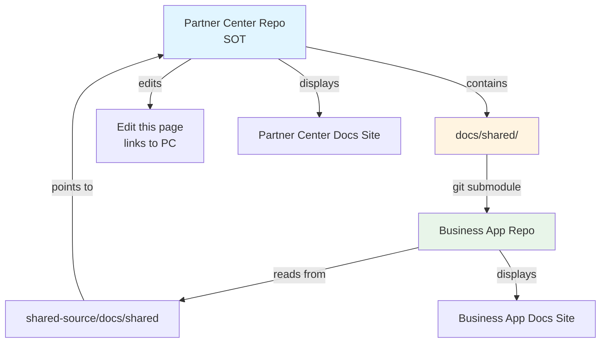

# Shared Documentation Submodule Setup Plan

## Architecture Overview

This plan implements a hybrid approach: **folder-based initially** with **article-by-article extensibility** built into the architecture. Partner Center (`vendasta/partnercenter-docs`) is the Single Source of Truth (SOT). Business App (`vendasta/businessapp-docs`) consumes shared content via git submodule.



## Phase 1: Folder-Based Implementation (Initial)

### 1.1 Partner Center Setup (SOT)

**Create shared documentation folder structure:**
- Create `docusaurus/docs/shared/` directory
- Add `_category_.json` with `"label": "Shared Documentation"` (hidden from main sidebar)
- Create initial shared markdown file(s) with proper frontmatter
- Configure Docusaurus to exclude shared folder from main sidebar (via sidebar configuration)

**Files to create/modify:**
- `docusaurus/docs/shared/_category_.json` - Category metadata (hidden: true or excluded from sidebar)
- `docusaurus/docs/shared/index.mdx` - Landing page for shared docs (optional)
- `docusaurus/docs/shared/example-shared-page.mdx` - Initial shared content example
- `docusaurus/sidebars.ts` - Modify to exclude shared folder from mainSidebar

**Docusaurus configuration:**
- Shared docs remain accessible via direct URL but hidden from main navigation
- No separate docs plugin needed in Partner Center (shared docs are part of main docs but excluded from sidebar)

### 1.2 Business App Setup (Consumer)

**Add Partner Center as git submodule:**
- Create branch: `chore/add-partnercenter-submodule`
- Add submodule: `git submodule add -b main https://github.com/vendasta/partnercenter-docs.git shared-source`
- Commit `.gitmodules` and submodule pointer

**Configure Docusaurus for shared docs:**
- Add second `@docusaurus/plugin-content-docs` instance in `docusaurus.config.js`
- Configure with:
  - `id: 'shared'`
  - `path: 'shared-source/docusaurus/docs/shared'`
  - `routeBasePath: 'shared'`
  - `sidebarPath: './sidebarsShared.js'`
  - `editUrl: 'https://github.com/vendasta/partnercenter-docs/edit/main/docusaurus/docs/shared/'`
- Create `sidebarsShared.js` for shared docs sidebar (auto-generated or manual)

**Files to create/modify:**
- `.gitmodules` - Git submodule configuration (auto-generated)
- `docusaurus/docusaurus.config.js` - Add shared docs plugin configuration
- `docusaurus/sidebarsShared.js` - Sidebar configuration for shared docs

**CI/CD updates:**
- Update GitHub Actions workflow to fetch submodules:
  ```yaml
  - uses: actions/checkout@v4
    with:
      submodules: recursive
      fetch-depth: 0  # Full history for submodule updates
  ```

### 1.3 Validation & Testing

**Local validation:**
- Initialize submodule: `git submodule update --init --recursive`
- Verify shared docs appear at `/shared` route in Business App
- Verify "Edit this page" links to Partner Center repo
- Test that Partner Center shared docs are accessible but hidden from sidebar

**PR validation:**
- Open PRs in both repos
- Validate preview builds
- Confirm submodule pointer updates correctly

## Phase 2: Article-by-Article Support (Future Extensibility)

### 2.1 Architecture Design

**Support multiple shared paths:**
- Design Docusaurus config to support multiple docs plugin instances
- Each shared path can have its own plugin instance with unique `id` and `routeBasePath`
- Example structure:
  ```typescript
  plugins: [
    ['@docusaurus/plugin-content-docs', { /* shared folder */ }],
    ['@docusaurus/plugin-content-docs', { /* accounts/shared-article */ }],
    ['@docusaurus/plugin-content-docs', { /* marketing/shared-guide */ }],
  ]
  ```

**Path mapping configuration:**
- Create `shared-docs-config.json` in Business App to map Partner Center paths to Business App routes
- Example:
  ```json
  {
    "shared-folder": {
      "sourcePath": "shared-source/docusaurus/docs/shared",
      "routeBasePath": "shared"
    },
    "accounts-guide": {
      "sourcePath": "shared-source/docusaurus/docs/accounts/shared-guide.mdx",
      "routeBasePath": "shared/accounts"
    }
  }
  ```

### 2.2 Implementation Strategy

**When adding article-by-article support:**
- Add new plugin instance for each shared path
- Update `shared-docs-config.json` with new mappings
- Create corresponding sidebar configuration
- Document the process for adding new shared articles

## Best Practices & Governance

### 3.1 Partner Center (SOT) Governance

**CODEOWNERS file:**
- Create `.github/CODEOWNERS` requiring doc-team review for `docusaurus/docs/shared/**`
- Protect `main` branch for shared docs folder

**Branch naming:**
- `feat/shared/<topic>` - New shared content
- `fix/shared/<topic>` - Fixes to shared content
- `docs/shared/<topic>` - Documentation updates

**Content guidelines:**
- Shared docs must be evergreen (no Partner Center-specific references)
- Use relative paths for internal links within shared docs
- Follow existing documentation style guide

### 3.2 Business App (Consumer) Governance

**Submodule update workflow:**
- Branch naming: `chore/update/shared-submodule-to-<commit-short-sha>`
- Always test locally before opening PR
- Include commit message with Partner Center PR link
- Review content changes in preview before merging

**Automation (optional):**
- Scheduled GitHub Action to check for submodule updates weekly
- Auto-create PR when Partner Center shared docs change
- Manual approval required for merge

### 3.3 Documentation

**Create workflow documentation:**
- `docs/SHARED_DOCS_WORKFLOW.md` in Partner Center
- `docs/SHARED_DOCS_CONSUMPTION.md` in Business App
- Include:
  - How to add new shared content
  - How to update submodule pointer
  - Troubleshooting common issues
  - CI/CD considerations

## CI/CD Considerations

### 4.1 Partner Center CI

**No changes needed** - Shared docs build as part of normal docs build process.

### 4.2 Business App CI

**Required changes:**
- Update checkout action to fetch submodules recursively
- Ensure submodule initialization happens before build
- Consider caching submodule content for faster builds

**Optional enhancements:**
- Add step to verify submodule is at expected commit
- Add step to check for submodule updates and warn if outdated
- Add build-time validation that shared docs are accessible

## File Structure Summary

### Partner Center (`vendasta/partnercenter-docs`)
```
docusaurus/
  docs/
    shared/                    # NEW: Shared documentation folder
      _category_.json         # Category metadata (hidden from sidebar)
      index.mdx               # Optional landing page
      example-shared-page.mdx # Example shared content
  sidebars.ts                 # MODIFY: Exclude shared from mainSidebar
.github/
  CODEOWNERS                  # NEW: Protect shared docs folder
docs/
  SHARED_DOCS_WORKFLOW.md     # NEW: Workflow documentation
```

### Business App (`vendasta/businessapp-docs`)
```
shared-source/                # NEW: Git submodule (Partner Center repo)
  docusaurus/
    docs/
      shared/                 # Shared docs from Partner Center
.gitmodules                   # NEW: Submodule configuration
docusaurus/
  docusaurus.config.js        # MODIFY: Add shared docs plugin
  sidebarsShared.js           # NEW: Sidebar for shared docs
.github/
  workflows/
    build.yml                 # MODIFY: Fetch submodules
docs/
  SHARED_DOCS_CONSUMPTION.md  # NEW: Consumption workflow docs
```

## Acceptance Criteria

- [ ] Shared folder exists in Partner Center at `docusaurus/docs/shared/`
- [ ] Shared docs are accessible in Partner Center but hidden from main sidebar
- [ ] Business App has Partner Center as submodule at `shared-source/`
- [ ] Business App displays shared docs at `/shared` route
- [ ] "Edit this page" in Business App opens Partner Center repo
- [ ] CI builds succeed with submodule fetching
- [ ] Submodule pointer updates work correctly
- [ ] CODEOWNERS protects shared docs folder
- [ ] Workflow documentation exists in both repos
- [ ] Architecture supports future article-by-article expansion

## Common Issues & Solutions

**Empty submodule folder:** Run `git submodule update --init --recursive`

**CI fails to find shared files:** Ensure checkout action has `submodules: recursive`

**Wrong edit URL:** Verify `editUrl` in Docusaurus config points to Partner Center

**Stale content:** Update submodule pointer: `git submodule update --remote shared-source`

**Authentication errors:** Use HTTPS URLs and ensure GITHUB_TOKEN has appropriate permissions

## Future Enhancements

- Automated submodule update PRs via GitHub Actions
- Shared docs versioning strategy
- Cross-repo link validation
- Shared docs analytics and usage tracking
- Support for shared assets (images, PDFs) via submodule
