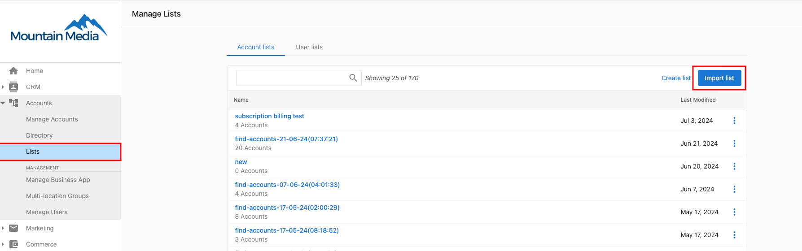
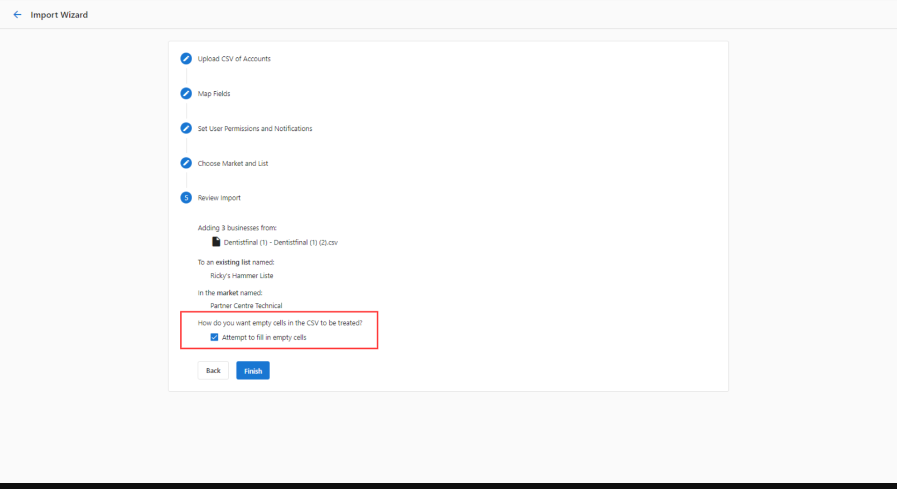

# Import account Lists

To import an existing account list into Partner Center:

1. Go to the **Partner Center** > **Accounts** > [**Lists**](https://partners.vendasta.com/action-lists/manage).
2. Click **Import Lists** in the upper right corner of the screen.

   

3. Download the CSV Template, or Choose the File.
4. Map Fields.
5. Set User Permissions and Notifications with options to select:
   1. Allow full access to Business App. (You can configure the permissions for each user at any time.)
   2. Turn on all notifications. (This setting only applies to new users. You can configure the notifications for each user at any time).
   3. Send a Welcome Email.

:::note
When filling out the CSV template, you'll want to pay special attention to the following:

**Required Fields: CompanyName and Zip**

- **CompanyName**
  - Make sure the business names are represented properly:
    - Confirm the business names have the correct capitalization and spelling.
    - Do not include any additional information about the business, such as its specialty or store code.

- **UserEmail**
  - **The user emails must be formatted correctly (no spaces or apostrophes).**
  - **Avoid using emails that are likely accessed by multiple people. This affects open rates and will likely increase the number of unsubscribes.**
    - **Some examples include info@domain.com, sales@domain.com, and support@domain.com.**

- **Other Notes**
  - **Leave any unknown fields empty (except for CompanyName and Zip). Our system will attempt to fill in any empty fields by searching online _provided_ you check the box at the bottom of the upload wizard called 'Attempt to fill in empty cells'.**
    
  - **You cannot provide an email address for a salesperson that does not exist in the system yet.**
    - **If you are unsure how to create salespeople, you can find instructions [here](/accounts/company-salespeople/managing-salespeople).**
    - **Ensure you set the salesperson's market prior to associating them via account list uploads or updates.**
:::

  <a 
    style={{ 
      fontSize: '16px', 
      fontWeight: 'bold', 
      color: '#ffffff', 
      backgroundColor: '#33ace2', 
      textDecoration: 'none', 
      borderRadius: '5px', 
      padding: '10px 30px 9px 30px', 
      border: '1px solid #33ACE2', 
      display: 'inline-block', 
      textAlign: 'center' 
    }} 
    href="https://partners.vendasta.com/action-lists/manage" 
    target="_blank" 
    rel="noopener"
  >
    Import Lists 
  </a>

To learn how to **export** account data, click [here](/accounts/accounts-lists/list-actions).

## Walkthrough Video

<iframe 
  src="https://drive.google.com/file/d/1-d_Aq75HBc5nhU1BRTXagI8KGg4tuz0b/preview" 
  width="640" 
  height="480" 
  allowFullScreen
></iframe>