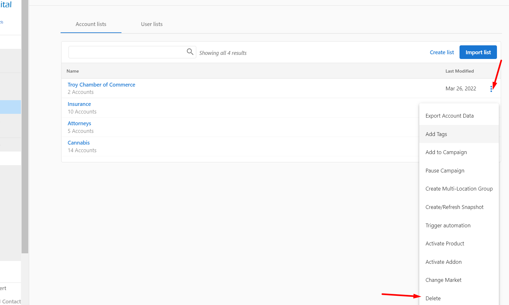

At this time there is no option to edit a list name in Partner Center.

The best workaround would be to delete the list and recreate it with the correct name.

**Note:** Deleting a List doesn't affect the accounts on the List. After deleting a List, all accounts within that list will still remain on the platform.

