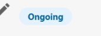
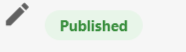

The following List actions are available from **Partner Center > Accounts > [Lists](https://partners.vendasta.com/action-lists/manage)** by clicking the **Menu** icon  next to the List.

   [Export Account Data](#export-account-data)

   [Add Tags](#add-tags)

   [Add to Campaign](#add-to-campaign)

   [Pause Campaigns](#pause-campaigns)

   [Create Multi-Location Group](#create-multi-location-group)

   [Create/Refresh Snapshot](#createrefresh-snapshot)

   [Trigger Automation](#trigger-automation)

   [Activate Product](#activate-product)

   [Activate Addon](#activate-add-on)

   [Change Market](#change-market)

   [Delete](#delete)

## Export Account Data

Creates a downloadable CSV with the current data of all accounts in the List. This export contains the following information:

- Company Name
- Address
- City
- State
- Country Code
- Zip/Postal Code
- Work Number(s)
- Website
- Salesperson Email
- Customer Identifier
- Active Products (Listing Builder, Social Marketing, Reputation Management)
- Account Identifier
- Tags
- Toll-free Number
- Description
- Short Description
- Landmark
- Payment Methods
- Services
- Brands
- Hours of Operation
- Healthcare fields (if applicable)

After selecting **Export Account Data**, you will be taken to the List's **History** page. Once the export has finished, you will be able to download the CSV by clicking the **Menu** icon , then **Account NAP/Product CSV**.

## Add Tags

Allows you to add tags to every account in the List. This is useful should you wish to use tags to filter accounts later.

## Add To Campaign

Allows you to add the List to an email marketing campaign. This will add all the users and contacts that are assigned to the accounts in the List to that campaign. [Learn more](/accounts/email-marketing/campaigns)

## Pause Campaigns

Allows you to pause a currently active campaign for all the users and contacts that are assigned to the accounts in the List.  
It's little confusing with the status when it's paused. "Paused" will not appear as a separate status, but if there is a campaign in "ongoing" status, pausing it will change the status to "published".

## Create Multi-Location Group

Allows you to create a Multi-location group based on the List. After selecting this option, you will be given the choice of how you would like to segment the group. Here, you can choose either **Geographic Region** or **Account Tag(s)**.

## Create/Refresh Snapshot

Depending on the state of the account, one of three things will happen:

- If there has never been a Snapshot Report created for the account, a new Snapshot Report will be created.
- If an account has previously had a Snapshot Report that has expired, that Snapshot Report will be refreshed.
- If an account currently has an active Snapshot Report (created in the last 7 days), that account will be skipped.

## Trigger Automation

Allows you to trigger a specific automation for each account within the List. There are a number of useful ways you can utilize automations within Lists. To learn more about this [click here](/accounts/automation#trigger-automation-on-a-list).

## Activate Product

Allows you to activate a single product on each account within the List. If an account already has the selected product active, that account will be skipped. However, you can do a fresh activation and not and edition change with this functionality.

:::note
Please be aware that activating a product will result in a charge appearing on your next bill. For this reason, please be sure that only accounts you wish to activate the product for are in the List.
:::

## Activate Add-On

Allows you to activate a single addon on each account within the List. If an account already has the selected addon active, that account will be skipped.

:::note
Please be aware that activating an addon will result in a charge appearing on your next bill. For this reason, please be sure that only accounts you wish to activate the addon for are in the List.
:::

## Change Market

Allows you to change the market the accounts in the List are assigned to. This is useful if you have created a new market and are looking to move accounts to it.

## Delete

Allows you to delete the List. Please be aware that the accounts in the List itself will not be removed; only the List the accounts are assigned to will be deleted. This action is irreversible, so please be sure you wish to fully remove the List before selecting.