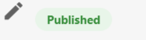

To run an action on an account list in Partner Center, go to `Accounts` → `Lists` and click the three dots next to the list. You can export account data, add tags, add the list to a campaign, create Snapshot Reports, trigger automations, activate products, change market, or delete the list.

## Customizing a static list view

You can change which columns appear in your list view to surface the information that matters most to you (email, phone, tags, etc.):

1. Open your list in `Partner Center` → `Accounts` → `Lists`
2. Click the **gear icon** in the upper-right corner of the list table
3. Check or uncheck the columns you want to show or hide (e.g., Email, Phone, Tags)
4. Close the panel — the view saves automatically

Customized column views are per-user and per-list, so each team member can set up their own preferred view.

## Account list limits

| Limit | Value | Workaround |
|-------|-------|------------|
| Maximum accounts per list | 5,000 | Create multiple lists and apply a shared tag to all accounts across lists. Use the tag to filter and work with the full set. |
| Bulk product activation cap | 500 accounts per action | Split accounts into multiple lists and activate in batches. |

   [Export Account Data](#export-account-data)

   [Add Tags](#add-tags)

   [Add to Campaign](#add-to-campaign)

   [Pause Campaigns](#pause-campaigns)

   [Create Multi-Location Group](#create-multi-location-group)

   [Create/Refresh Snapshot](#createrefresh-snapshot)

   [Trigger Automation](#trigger-automation)

   [Activate Product](#activate-product)

   [Activate Addon](#activate-add-on)

   [Change Market](#change-market)

   [Delete](#delete)

## Export Account Data

Creates a downloadable CSV with the current data of all accounts in the List. This export contains the following information:

- Company Name
- Address
- City
- State
- Country Code
- Zip/Postal Code
- Work Number(s)
- Website
- Salesperson Email
- Customer Identifier
- Active Products (Listing Builder, Social AI, Reputation AI)
- Account Identifier
- Tags
- Toll-free Number
- Description
- Short Description
- Landmark
- Payment Methods
- Services
- Brands
- Hours of Operation
- Healthcare fields (if applicable)

After selecting **Export Account Data**, you will be taken to the List's **History** page. Once the export has finished, you will be able to download the CSV by clicking the **Menu** icon , then **Account NAP/Product CSV**.

:::note Export limitations
The exported CSV is informational data only. It does **not** include clickable links back to the account records in Partner Center — you cannot click directly into an account from the spreadsheet.
:::

### Exporting user details (names and emails)

The standard Export Account Data export contains account/business data (NAP + products), not individual user names and email addresses. To export a list of users associated with your accounts, contact Support and request a user details export.

## Add Tags

Adds a tag to every account in the list. This is useful for filtering accounts later or for merging multiple lists into a logical group.

**To bulk-add a tag without overwriting existing tags:**

1. Go to `Partner Center` → `Accounts` → `Lists`.
2. Click the three dots next to the list.
3. Select **Add Tags**.
4. Choose an existing tag or create a new one.
5. Click **Apply**.

Tags are appended — existing tags on accounts are not removed.

## Add To Campaign

Allows you to add the List to an email marketing campaign. This will add all the users and contacts that are assigned to the accounts in the List to that campaign. [Learn more](../../marketing/campaigns)

## Pause Campaigns

Allows you to pause an active campaign for all the users and contacts that are assigned to the accounts in the List.  
"Paused" doesn't appear as a separate status. If a campaign is in "ongoing" status, pausing it changes the status to "published".

## Create Multi-Location Group

Allows you to create a Multi-location group based on the List. After selecting this option, you will be given the choice of how you would like to segment the group. Here, you can choose either **Geographic Region** or **Account Tag(s)**.

## Create/Refresh Snapshot

Depending on the state of the account, one of three things will happen:

- If there has never been a Snapshot Report created for the account, a new Snapshot Report will be created.
- If an account has previously had a Snapshot Report that has expired, that Snapshot Report will be refreshed.
- If an account has an active Snapshot Report (created in the last 7 days), that account will be skipped.

## Trigger Automation

Allows you to trigger a specific automation for each account within the List. There are a number of useful ways you can utilize automations within Lists. See the [Manual triggers](../../automations/my-automations/automation-triggers-reference.mdx#manual) section of the automation triggers reference.

## Merge Two Lists (Using Tags)

To merge lists:

1. Add a common tag to all accounts in the first list.
2. Add the same tag to all accounts in the second list.
3. Go to `Accounts` → `Manage Accounts`, filter by the tag, select accounts, and add to a new list.

## FAQs

Can I change a list name?

There isn’t an edit-name option. Delete and recreate the list. Deleting a list does not remove its accounts.

How do I export the accounts in a list?

Click the three dots next to the list and select **Export Account Data**. You're taken to the list's **History** page. When the export finishes, click the **Menu** icon, then **Account NAP/Product CSV** to download the CSV.

Does the account data export include user names and email addresses?

No. **Export Account Data** contains account and business data (NAP and products), not individual user names and email addresses. To export users associated with your accounts, contact Support and request a user details export.

Can I add a tag to every account in a list?

Yes. Click the three dots next to the list, select **Add Tags**, choose an existing tag or create a new one, and click **Apply**. The tag is added to each account without removing its existing tags.

How many accounts can a list hold?

A list can hold up to 5,000 accounts, and bulk product activation is capped at 500 accounts per action. For larger sets, create multiple lists and apply a shared tag to all of their accounts.

Can I create Snapshot Reports for a whole list?

Yes. Use **Create/Refresh Snapshot**. Accounts with no Snapshot Report get a new one, expired reports are refreshed, and accounts with an active report (created in the last 7 days) are skipped.

## Activate Product

Allows you to activate a single product on each account within the List. If an account already has the selected product active, that account will be skipped. However, you can do a fresh activation and not an edition change with this functionality.

:::note
Please be aware that activating a product will result in a charge appearing on your next bill. For this reason, please be sure that only accounts you wish to activate the product for are in the List.
:::

## Activate Add-On

Allows you to activate a single addon on each account within the List. If an account already has the selected addon active, that account will be skipped.

:::note
Please be aware that activating an addon will result in a charge appearing on your next bill. For this reason, please be sure that only accounts you wish to activate the addon for are in the List.
:::

## Change Market

Allows you to change the market the accounts in the List are assigned to. This is useful if you have created a new market and are looking to move accounts to it.

## Delete

Allows you to delete the List. Please be aware that the accounts in the List itself will not be removed; only the List the accounts are assigned to will be deleted. This action is irreversible, so please be sure you wish to fully remove the List before selecting.