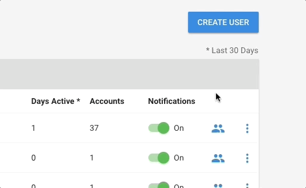
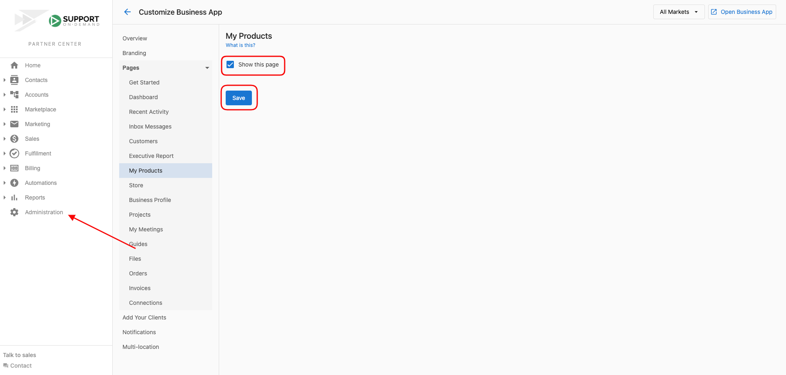
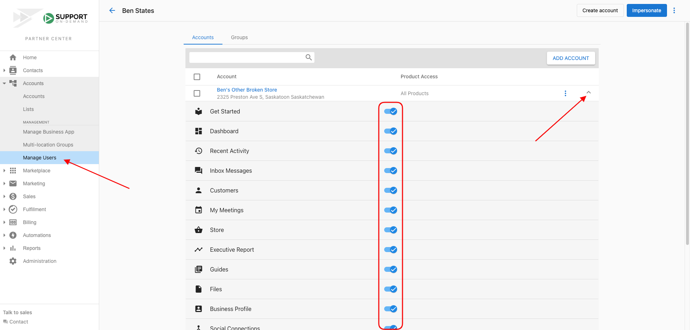
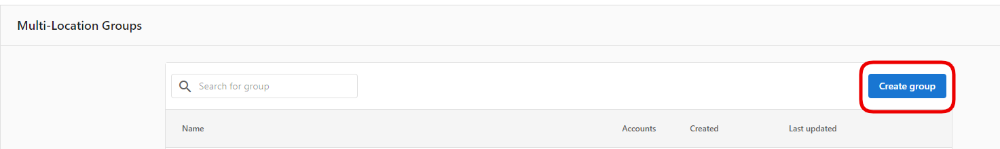
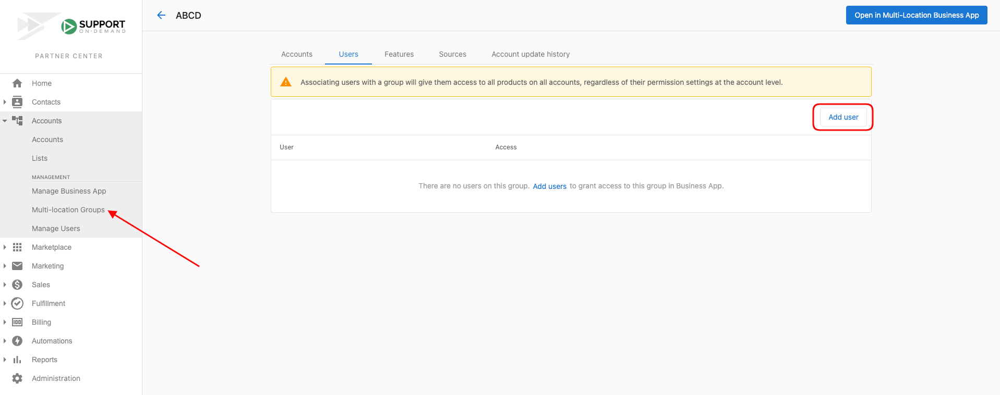
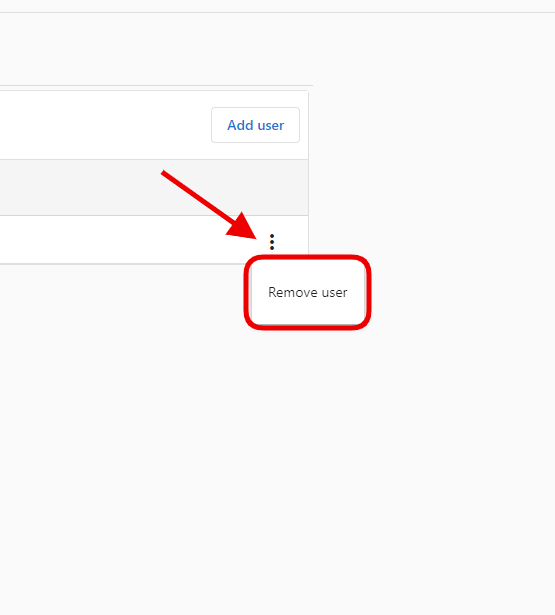

- [Configuring User Permissions](#configuring-user-permissions)
- [Granting User Access to an Account](#granting-user-access-to-an-account)
- [Revoking User Access to an Account](#revoking-user-access-to-an-account)
- [Setting Product Access for a User](#setting-product-access-for-a-user)
- [Granting User Access to a Multi-Location Group](#granting-user-access-to-a-multi-location-group)

Sometimes, you may find it necessary to restrict a Business App user's access to certain accounts or features. You may wish to do so for the following reasons:

- A regional manager should only see the stores they manage.
- A website developer should only have access to website products and not other aspects of the company's business.
- A single business owner needs to only see their account.

## Configuring User Permissions

### Method 1:

1. From **Partner Center > Accounts > Manage Users**, find the user you wish to edit permissions for.
   - This can also be accessed from **Partner Center > Accounts > Manage Accounts > *Account Name* > Users**.

2. Click  **> Edit Permissions**.
   
   

- Please note that changes made here only apply to users that are already in the system.

### Method 2:

To enable/disable any tab in the Business App for *all users* - both existing and subsequently new users, navigate to Partner Center > Accounts > Manage Business App > Customize Business App 

OR

Partner Center > Administration > Customize Business App > From each of the page tabs, you can check the 'show this page' box to either enable or disable the page from Business App for **all users**. 

## Granting User Access to an Account

1. From **Partner Center > Accounts > Manage Users >** click  **> Edit Permissions**

2. Click **Add Account** and find the business or businesses you would like the user to have access to through Business App.

3. Check the box beside each of the businesses.

4. Click **Add Accounts (#)**.

## Revoking User Access to an Account

1. From **Partner Center > Accounts > Manage Users >** click  **> Edit Permissions**

2. Find the account you wish to keep the user from accessing.

3. Click  **> Remove Access**.

## Setting Product Access for a User

1. From **Partner Center > Accounts > Manage Users >** click  **> Edit Permissions**

2. Find the account you wish to modify product access for.

3. Click  to show the products and Business App tabs available to that user.

4. Toggle on any products/tabs that the user needs access to.

5. If they should not have access to a tab, go ahead and toggle it off. 

## Granting User Access to a Multi-Location Group

1. From the **Multi-Location Groups** tab, click '**Create Group**'. Learn more about creating multi-location groups [here](/accounts/accounts-manage-users/create-groups).
   
   

2. Once the group is created, click into the group and go to the 'users' tab.

3. Click 'add user' 

4. Add the desired user to the entire group, or select a subgroup.

5. Click **Done**.

## Revoking User Access to a Multi-Location Group

1. From the desired multi-location group, click the 3 dots next to the user you would like to remove and select 'remove user.'
   
   