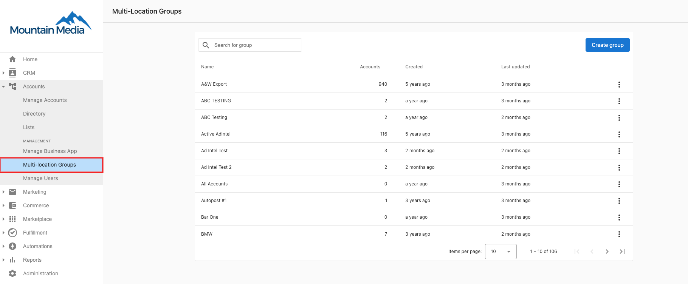
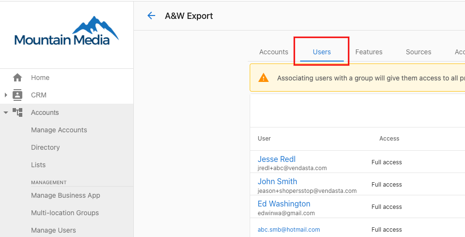
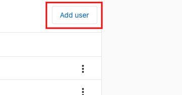
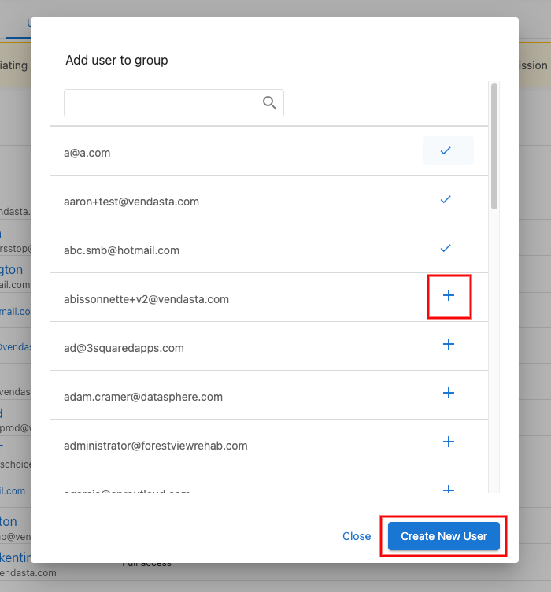

# Add users to a multi-location group

Adding users to a multi-location group will allow them to be viewed in Multi-Location Business App.

1. Go to [**Partner Center.**](https://partners.vendasta.com/brands/manage?marketId=default)
2. Go to [**Accounts > Multi-location Groups.**](https://partners.vendasta.com/brands/manage)
   
3. Select the Multi-Location Group you wish to add a user to, and click the **Users** tab.
   
4. Click **Add user.**
   
5. Click the **add button** or create a new user.
   