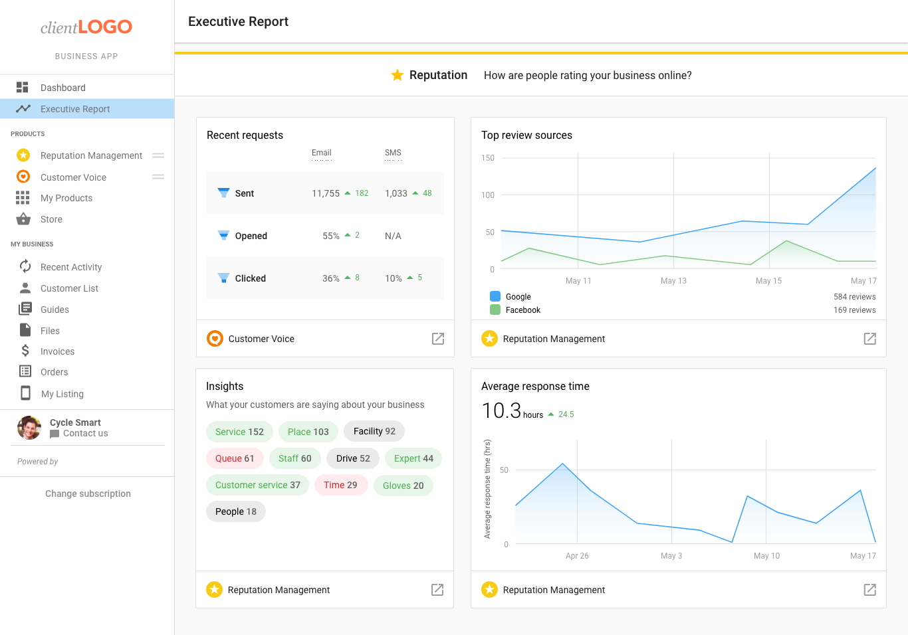

# Executive Report and Multi-Location

The Executive Report shows your clients how their businesses are performing across a variety of marketing categories including Reputation. **We have added the following essential data to the Executive Report:**

- Top Review Sources
- Recent Requests (Customer Voice)
- Average Response Time

The Multi-Location Executive Report is a powerful roll-up of metrics across any number of business locations. With a custom date selector and filtering, it's easy to slice the data to see trends in marketing performance across a brand, or group of businesses. **We have added the following essential data to the Multi-Location Executive Report:**

- Top Review Sources
- Average Response Time
- Keywords Insights
- Most Recent Reviews
- Average Review Rating

### **Who receives this data?**

All Vendasta Partners who have clients using Reputation Management or Customer Voice, as well as all Partners with Multi-Location businesses using Multi-Location Business App's Reputation. 

### **A look at the data** 

