## Overview

Tracking customer sentiment across multiple business locations is essential for understanding overall performance and identifying areas for improvement. The multi-location NPS (Net Promoter Score) overview provides a consolidated view of customer satisfaction, helping businesses analyze trends, compare performance, and take action to enhance customer loyalty.

## How to Access Net Promoter Score in Multi-Location

### Step 1: Navigate to Multi-Location Business App.

Access the Net Promoter Score by logging into the Multi-Location Business App.

### Step 2: Open the Reputation Tab

Once inside the platform, click on the **Reputation** tab. 

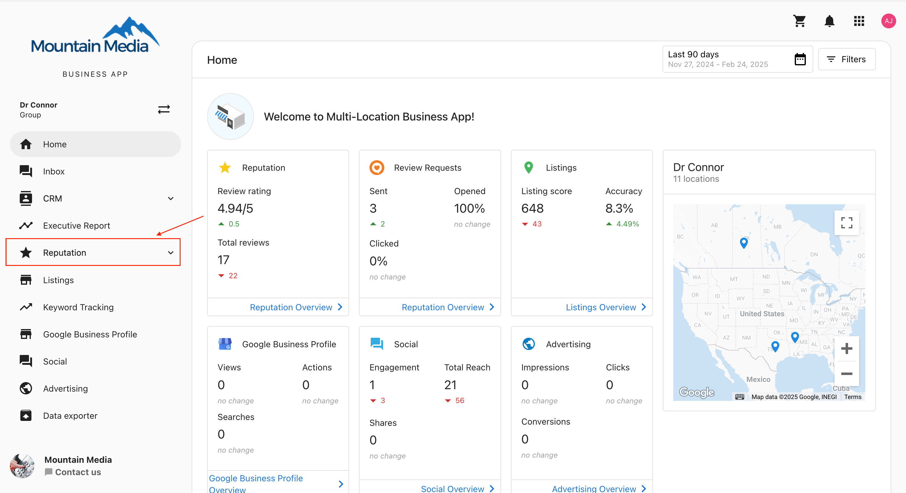

### Step 3: Locate the "Net Promoter Score" Sub-Menu

Within the **Reputation** tab, find and click on the **Net Promoter Score** sub-menu to access NPS insights.

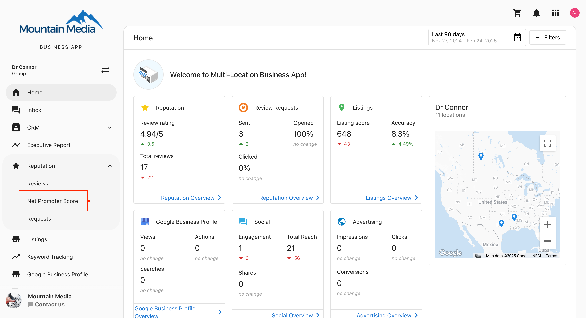

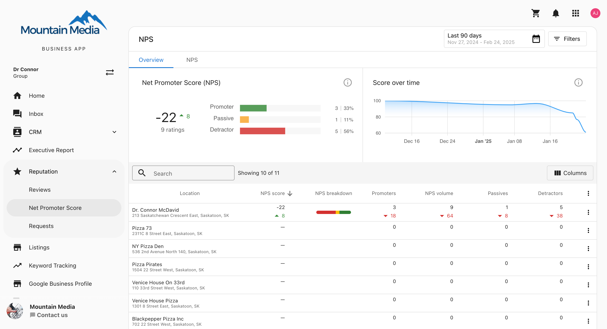

## Understanding the NPS Overview

The NPS Overview provides insights into overall customer sentiment by displaying:

- **Overall NPS score** for all locations.
- **Score-over-time graph** to track trends across all locations.

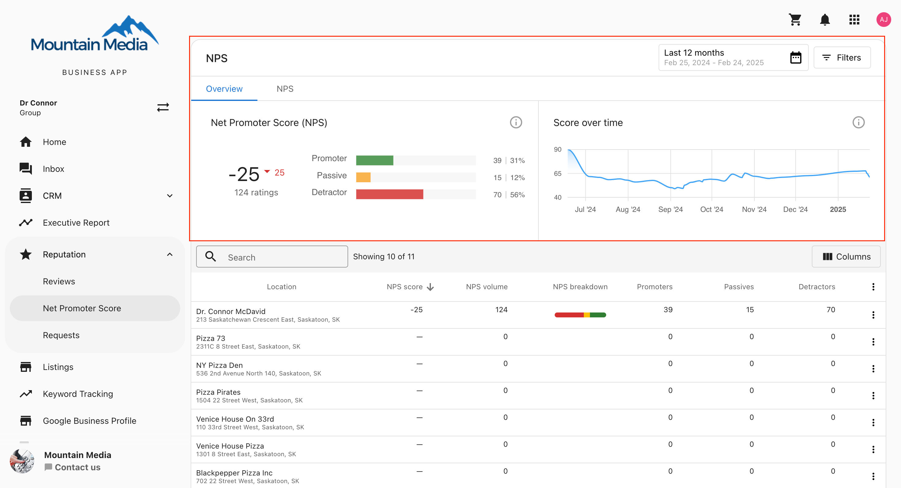

## How Net Promoter Score is Calculated

NPS is determined using the following formula:

**NPS = % Promoters - % Detractors**

- **Promoters (9-10):** Customers who would recommend your brand.
- **Passives (7-8):** Neutral customers who are satisfied but not enthusiastic.
- **Detractors (0-6):** Customers who would not recommend your brand.

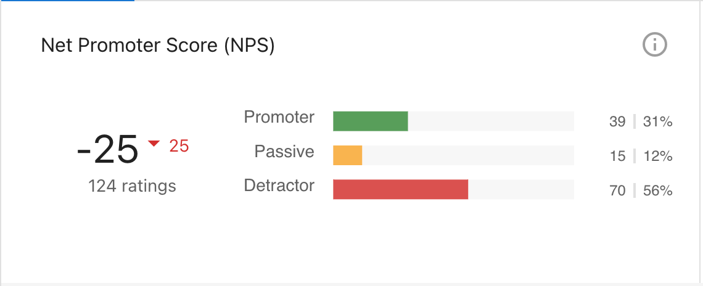

## Tracking NPS Trends Over Time

The **Score Over Time** feature allows businesses to track NPS trends over a specified period. A timeline graph illustrates how customer sentiment evolves across all locations.

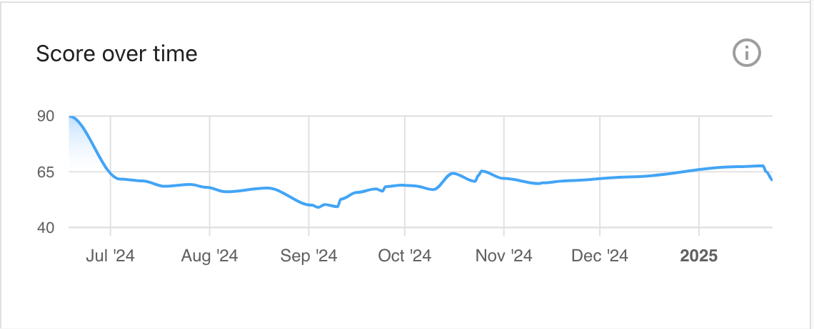

## NPS Metrics Breakdown by Location

Each location's NPS data is available in a detailed overview table, including:

- **NPS Score**: The calculated NPS for that specific location.
- **NPS Breakdown**: A visual representation of Promoters, Passives, and Detractors.
- **Promoters**: Number of promoters at the location.
- **Passives**: Number of passives at the location.
- **Detractors**: Number of detractors at the location.
- **NPS Volume**: Total number of NPS responses received for the location.

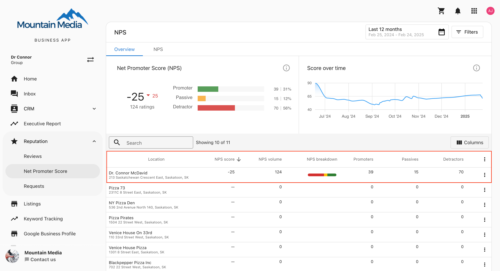

## Understanding the Delta Comparison

The delta comparison highlights performance changes with:

- **Green Up Arrow**: Indicates an increase in the metric.
- **Red Down Arrow**: Indicates a decrease.
- **No Icon**: No change in performance.

## Executive Report for Single Location

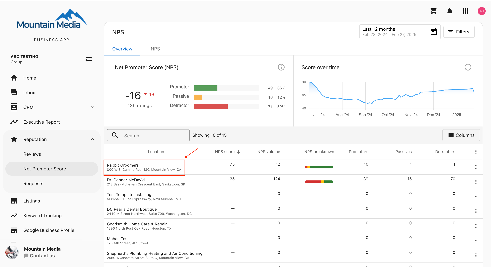

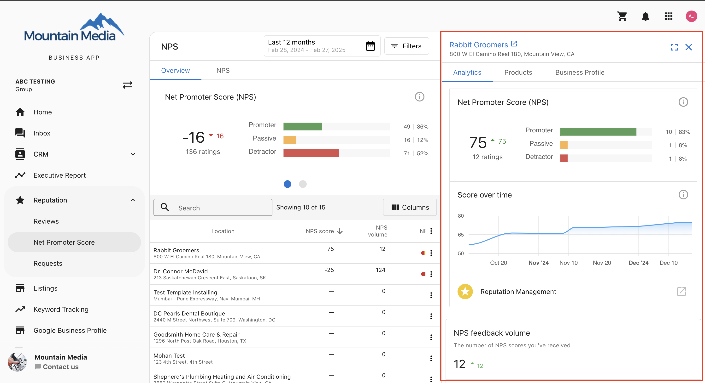

When a user selects a location, a side panel provides specific insights, including:

### Card 1: NPS Score & Score Over Time

- Displays the NPS score for the selected location.
- Includes a **Score Over Time** graph to track NPS trends.

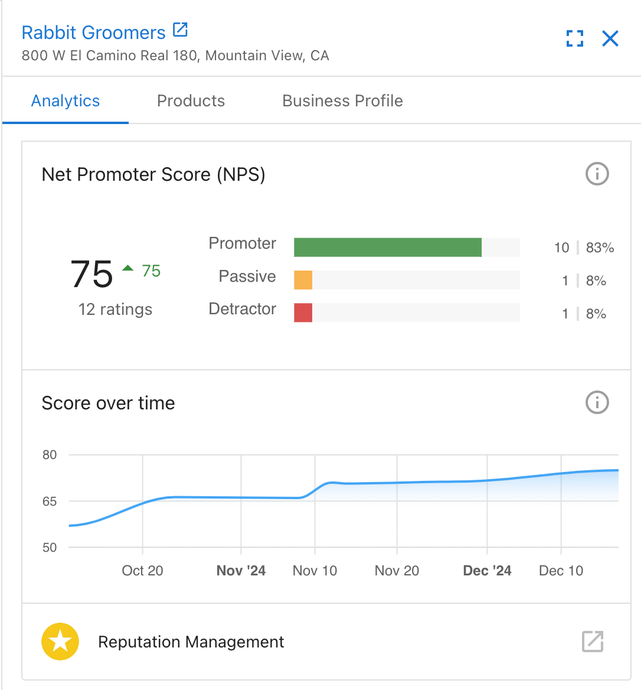

### Card 2: NPS Feedback Volume

- Shows the total number of feedback responses received for the selected location over the past **six months**.

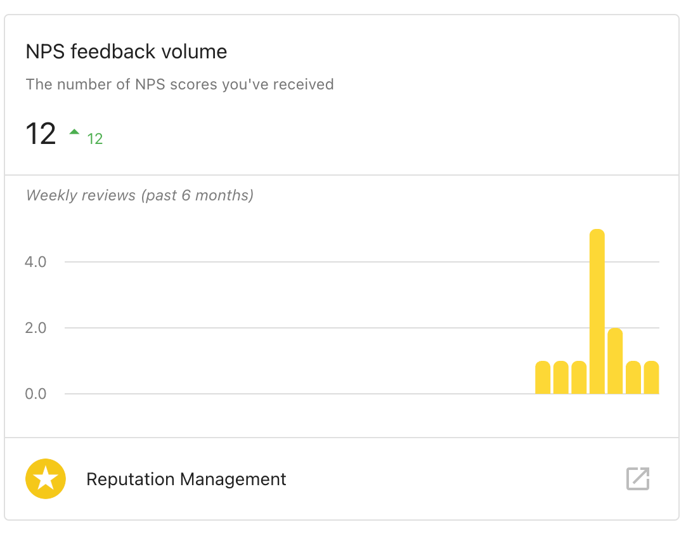

### Card 3: Most Recent NPS Feedback

- Displays the latest customer feedback received within the selected date range.

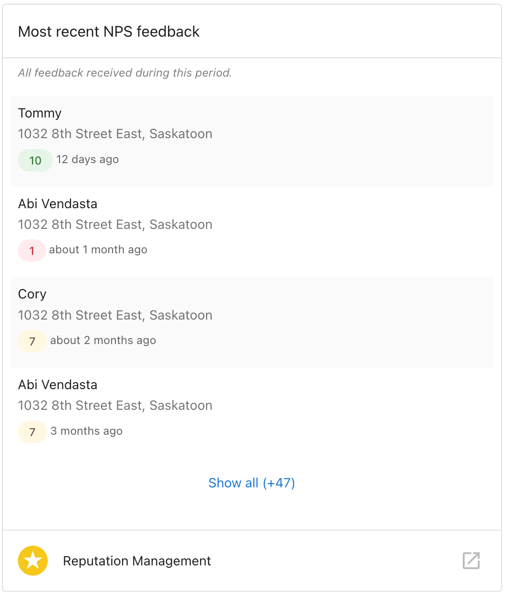

## Accessing the Full NPS Page

On the **NPS page**, users can view all customer feedback across all locations.

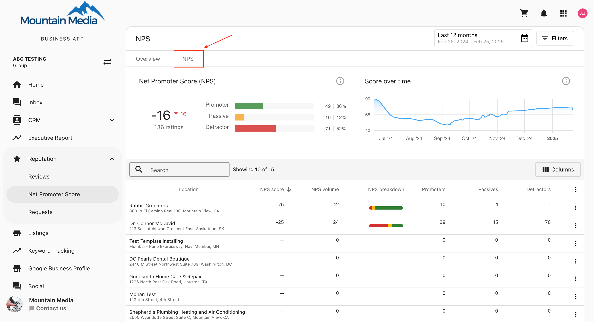

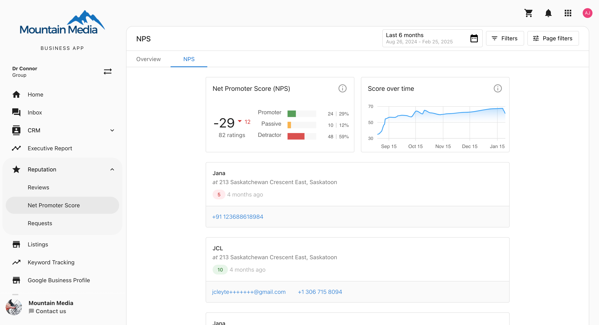

## Understanding the Feedback Card

Each feedback card contains:

- **NPS score given by the customer.**
- **Customer feedback.**
- **Contact details**, including email and phone number.
- **Location associated with the feedback.**

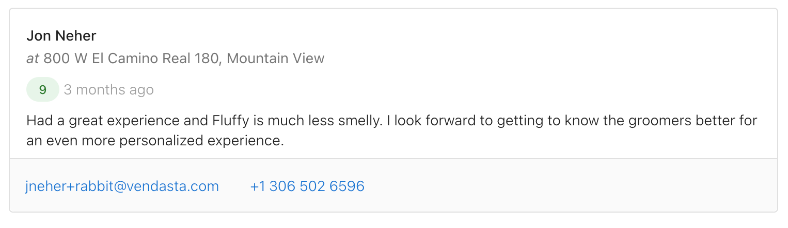

## Resending an NPS Request

Users can resend an NPS request to a contact **only once** via email. The resend will use the default template set by the user, and SMS resends are not available.

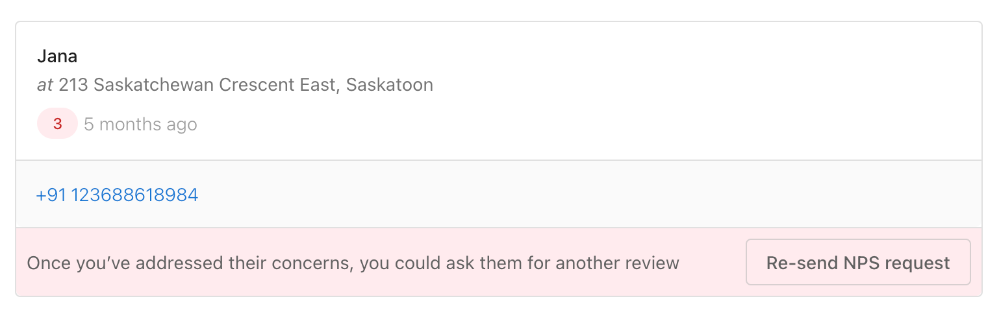

## Filtering NPS Feedback

Users can filter feedback based on customer sentiment:

- **Promoters (9-10)**
- **Passives (7-8)**
- **Detractors (0-6)**

With the multi-location NPS overview, businesses can now make data-driven decisions to improve customer experience and strengthen their reputation across all locations.