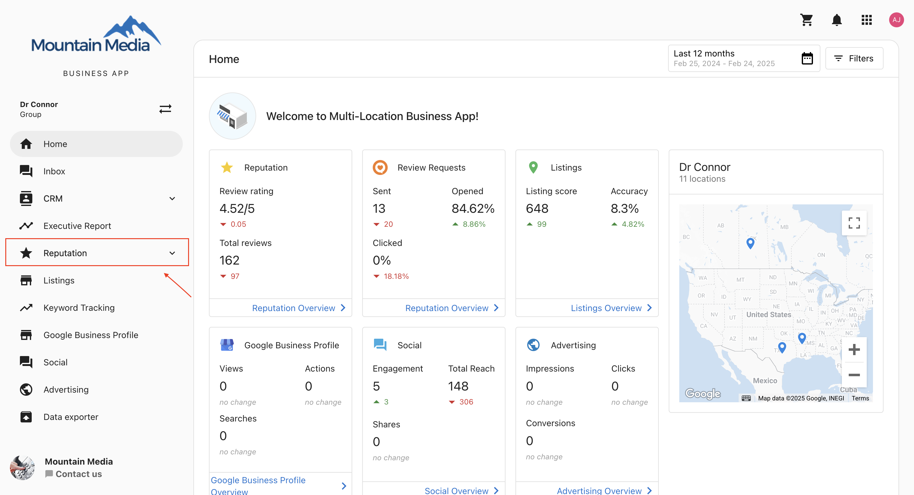
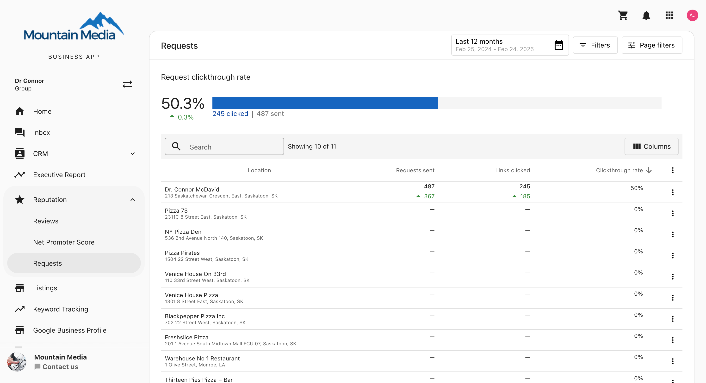

# Tracking Request Performance Metrics for Multi-Location Businesses

Understanding how your customer review and Net Promoter Score (NPS) requests are performing is essential for improving engagement and optimizing outreach strategies. With the **Multi-Location Request Performance Metrics**, businesses with multiple locations can now track the effectiveness of their review and feedback requests in a centralized dashboard.

This feature provides key insights, such as the **total number of requests sent, clickthrough rates, and individual location performance**, helping you refine your approach and maximize customer responses.

## Why Track Request Performance?

Monitoring request performance allows multi-location businesses to:

- Measure the total number of review and NPS requests sent across locations.
- Track customer engagement with **clickthrough rates and link clicks**.
- Compare the performance of different locations to identify trends.
- Optimize their review and feedback generation strategies for better results.

## How to Access Request Performance Metrics

Follow these simple steps to find your request performance insights:

**Step 1: Open the Multi-Location Business App**

Log in to your **Multi-Location Business App** to get started.

**Step 2: Navigate to the Reputation Tab**

Click on the **Reputation** tab in the left-hand menu.

**Step 3: Locate the "Requests" Sub-Menu**

Under the **Reputation** tab, select the **Requests** sub-menu to access performance metrics.

## Understanding the Request Performance Metrics

Once inside the **Requests** section, you'll find key metrics that provide a detailed breakdown of your outreach performance:

**1. Requests Clickthrough Rate**

The **percentage of requests clicked by customers** across all locations.

**2. Sent**

The **total number of review and NPS requests** sent via **Email and SMS** across all locations.

**3. Clicked**

The **total number of link clicks** received for review and NPS requests across all locations.

## Breaking Down Metrics by Location

Each location's performance is displayed in an easy-to-read table, showing:

- **Requests Sent** – The total number of review and NPS requests sent via Email and SMS for that location.
- **Links Clicked** – The number of times customers clicked on the request links.
- **Clickthrough Rate** – The percentage of sent requests that were clicked for that location.

## Understanding Delta Comparisons

Next to each metric, you'll see a **delta icon** that indicates performance trends compared to the previous period:

- **Green Up Arrow** – Indicates an **increase** in performance.
- **Red Down Arrow** – Indicates a **decrease** in performance.
- **No icon** – Means there has been **no change** in performance.

## Using Filters to Analyze Performance

The **filter options** allow you to analyze metrics based on the communication channel used:

- **Email Filter** – Displays request metrics only for emails.
- **SMS Filter** – Displays request metrics only for SMS messages.

By utilizing these insights, multi-location businesses can make **data-driven decisions** to improve their review and feedback request strategies, ensuring better engagement and stronger customer relationships.