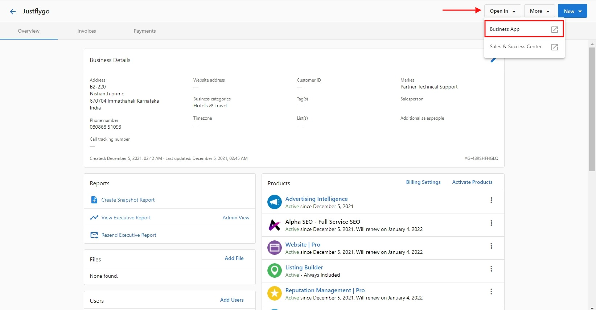

# Accessing Business App as a Partner Center admin

To access Business App as an admin, go to **Partner Center > Accounts > Manage Accounts > Account Name >** **Open in**and select **Business App**.

This will open Business App for the account you selected. In Business App, admins will be able to navigate it just as a user would, but there are some key differences:

* Admins will not be restricted to the tabs and products any particular user is restricted to. Should the admin wish to see Business App in the same way as a specific user, we recommend using the impersonate option.
  * This is done from **Partner Center > Accounts > Manage Users**.
* Admins can access any account they have access to in Partner Center using the location switcher in the top-left of Business App.