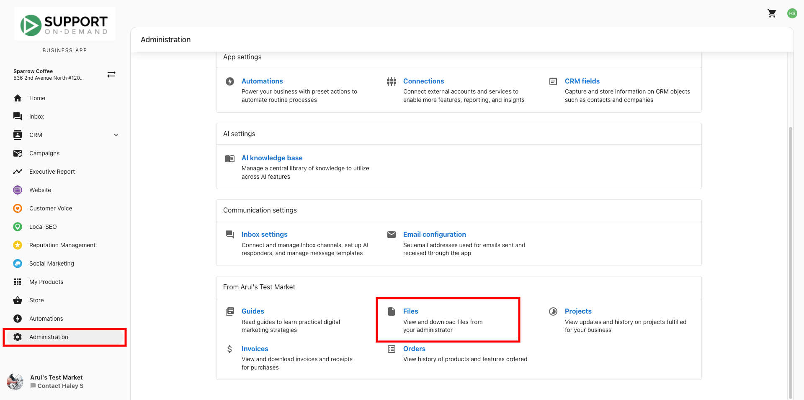
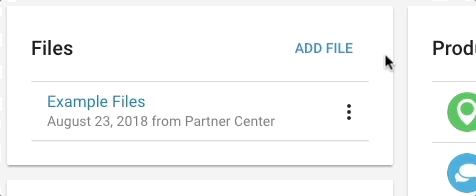
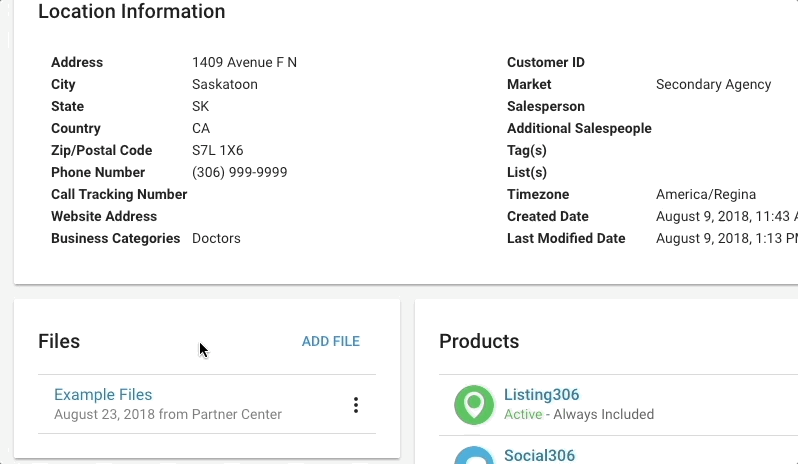

# Account Files

You can upload files through Partner Center that your clients can download in Business App. This is a great tool for sharing any custom reporting, proofs, or documents that you would want to share with your clients and ensure they are all easily accessible in one location.

## In this article
- [Uploading Files](#uploading-files)
- [Deleting Files](#deleting-files)
- [Downloading Files](#downloading-files)
  - [From Partner Center](#from-partner-center)
  - [From Business App](#from-business-app)

Through Partner Center's **File Uploader**, you are able to provide your clients with direct access within Business App to important documents relevant to their business.

## Uploading Files

1. From **Partner Center > Accounts > Manage Accounts**, click on the name of the account you wish to upload files for.
2. Under the "Files" heading, click **Add File**.
3. Enter a title for the upload under the **Upload Title** field. This is what the files you are uploading will appear under.
   - You can also add a **description** to the files so that users have context on what they should be used for.
4. Choose your files. Each set of files can contain up to five individual files. The maximum file size is 10 MB.
5. Click **Save**.

## Deleting Files

1. From **Partner Center > Accounts > Manage Accounts**, click on the name of the account you wish to remove files from.
2. Under the "Files" heading, find the file you wish to remove.
3. Select the menu icon  **> Remove File**.
4. Click **Delete**.

## Downloading Files

### From Partner Center

1. From **Partner Center > Accounts > Manage Accounts**, click on the name of the account you wish to download files from.
2. Under the "Files" heading, find the files you wish to download.
3. Click the name of the file, then select **Download** next to the file you wish to download.

### From Business App

1. From **Business App > Administration > Files**, click the title of the files you uploaded.
2. Click **Download**.