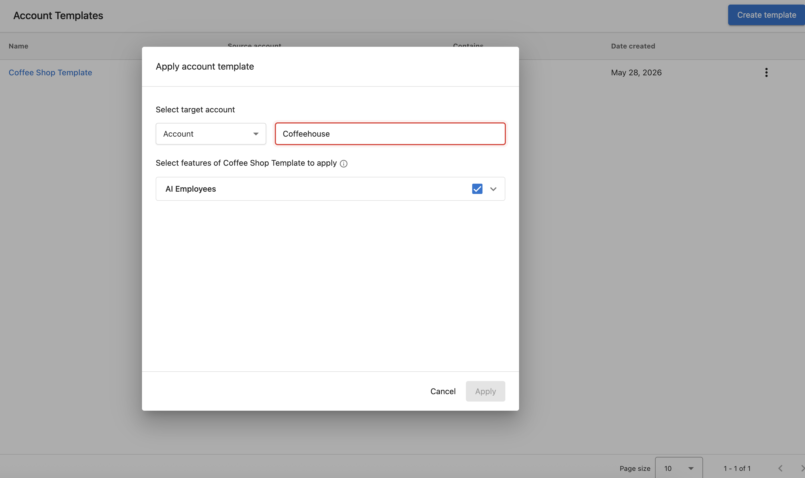

# Account templates

Account templates let you configure an account once and reuse that setup everywhere. When a template is applied, it rolls out AI employees, web chat settings, CRM fields, campaigns, automations, forms, and more to the target account in seconds, without any manual steps.

Templates are especially useful for partners onboarding clients at scale, standardizing setup across an industry vertical, or offering SMB self-signup.

## What account templates include

A template captures the full configuration of a source account, including:

- AI employees
- Web chat widgets and settings
- Forms
- CRM fields
- Campaigns
- Automations

## How to access

To view, create, update, or manually apply templates, go to Partner Center → **Accounts** → **Account Templates**.

## Manually applying a template

To apply a template directly to an account, open the template from Partner Center → **Accounts** → **Account Templates**, select a target account, choose which features to apply, and click **Apply**.

## Applying templates automatically

### Link a template to a business category

Link an account template to a business category and any new account created in that category, via API, manually, or through SMB self-signup, automatically gets the matching template applied. No manual setup required.

### Use the "Apply an account template" automation action

Templates can also be applied from inside an automation, giving you full control over when and how they are triggered.

To set this up:

1. Go to Partner Center → **Automations**.
2. Select or create an automation.
3. Add the **Apply account template** action.
4. Select the template to apply.

This lets you apply or re-apply a template based on any condition an automation can evaluate.

## Including forms and web chat widgets

Forms and web chat widgets configured on the source account can be included in the template and rolled out to every account the template is applied to. This is particularly useful when:

- An initial web chat message needs to be in another language.
- Privacy statements differ by region.

## Updating accounts in bulk

After improving the source account a template was built from, click **Update template** to refresh the template with the latest changes. No rebuild required. The updates are applied the next time the template is used.

## Using template application as an automation trigger

When a template finishes applying, the target account receives an activity log entry. Automations can listen for that entry and chain downstream work off a completed template application, such as rep assignment or coupon form setup.

## Custom object limits

Each account can have up to 3 [CRM custom objects](/crm/custom-objects). If applying a template would push a target account past this limit, the application fails for that account and Partner Center shows an error identifying the cause, rather than failing silently.

## Who this is for

- Partners onboarding accounts at scale (enterprise rollouts, reseller channels, migrations)
- Partners standardizing setup across multiple accounts in the same industry vertical
- Partners offering SMB self-signup
