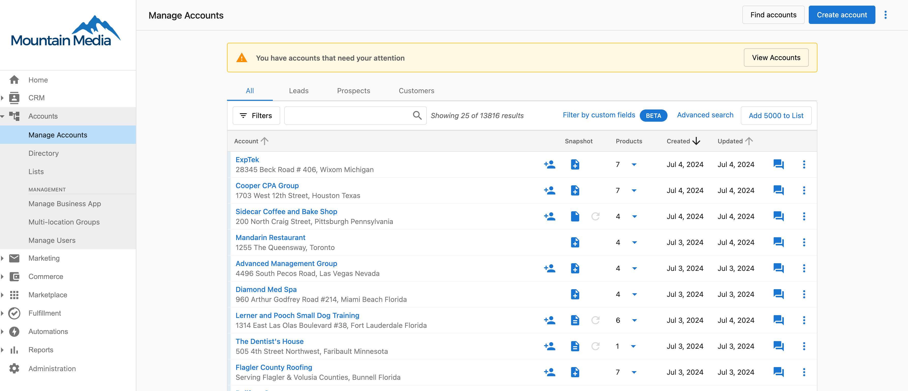
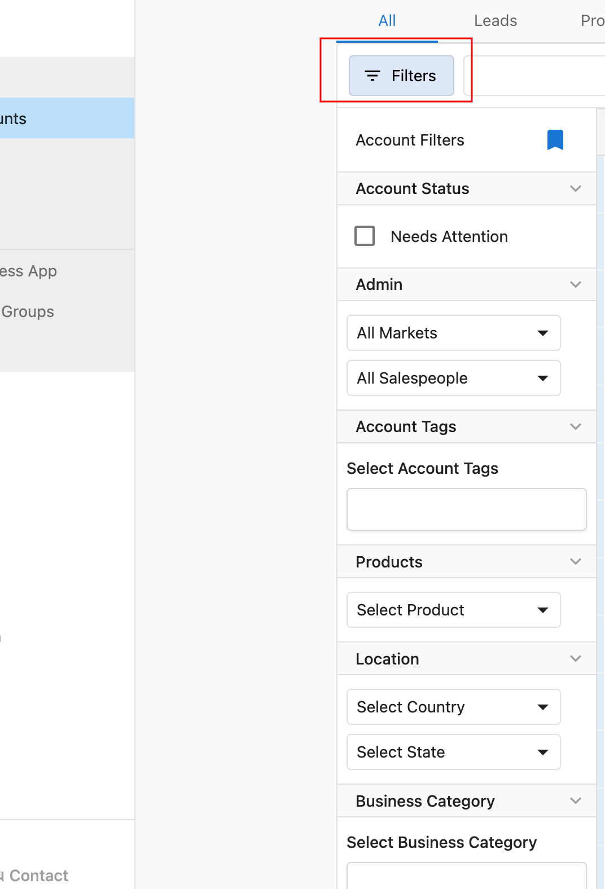

In Partner Center, an "account" refers to any individual business location. Under **Accounts > Manage Accounts**, you will be able to manage all of the businesses you have added.

As most features within the system require accounts, it is important that you add your businesses and their locations to the system.

**The Manage Accounts screen allows you to:**

- Filter, sort, and search accounts.

In order to filter a list of accounts, go to **Partner Center > Accounts > Manage Accounts**, then click on the filters button to see all available options.

- Create, edit, and delete accounts.
- Bulk create and update accounts*.
- Add accounts to lists*.
- Identify accounts without users.
- View active products.
- Activate new products.

_* May only be available on select [subscription levels](https://www.vendasta.com/pricing)._