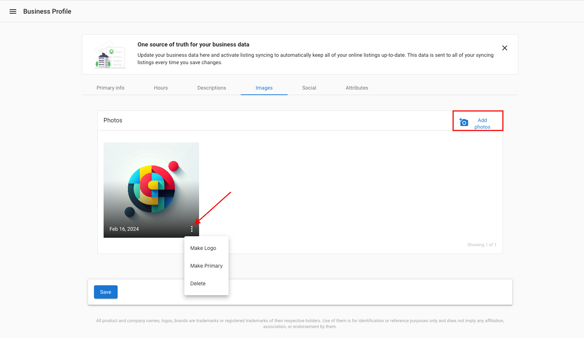

When selecting a logo in the Business Profile, it is important to select an image file that has square dimensions. If the logo is not a square, it will be reformatted to become a square. This can cause it to become distorted or zoomed in. Our system is designed to take **square images** due to the image requirements of social and listing sites for logo photos.

### **To update the logo for an account**

Navigate to **Partner Center > Accounts > Manage Accounts > Select Account > Edit > Images > Add Photos.** Upload and save the desired photo, and then click the 3 dots to set the photo as a logo.

