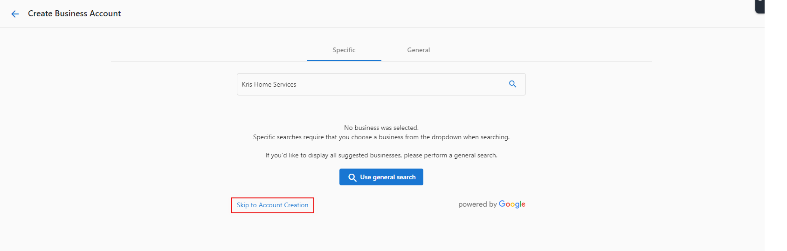

When one of your customers creates an account from your Store, we leverage Google Search to quickly and easily gather their business information.

If the '**Create Account**' search bar is not finding the business you are searching for, it's most likely because it's a "**Service Area Business (SAB)**".

Service area businesses do not show up on the account creation page due to a limitation with the Google API that powers our listing search. To have the Google listing pulled into the Snapshot Report, please connect it directly in Reputation Management.

You can add the business manually by clicking '**Skip to Account Creation**'.

