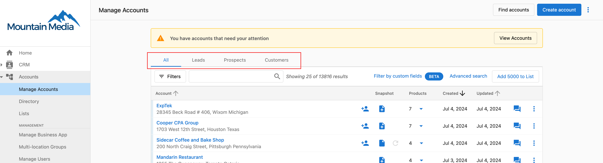
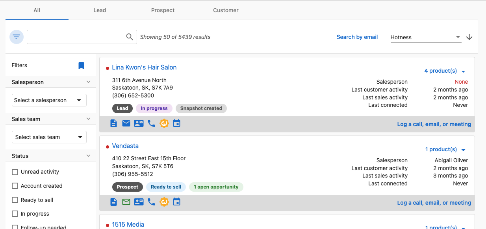
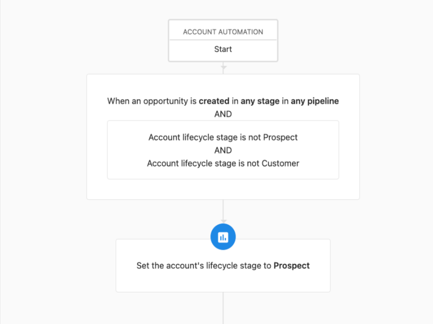
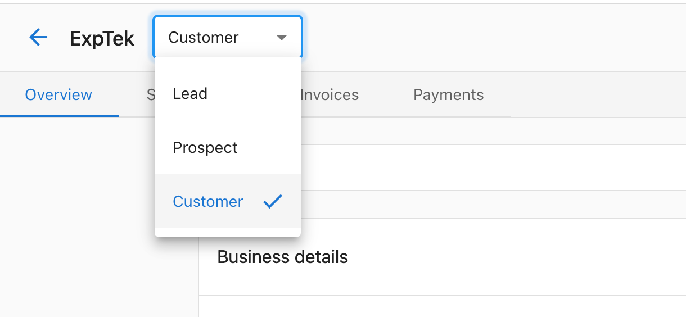
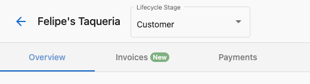
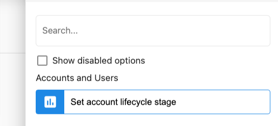

# Customer Lifecycle Stages

Customer Lifecycle Stages allow you to quickly identify where a customer is in their journey with you. Each stage represents a different phase of the customer relationship, from initial lead to long-term client, helping your team prioritize action and provide the right level of engagement at the right time.

## What are Customer Lifecycle Stages used for?

Lifecycle stages are powerful tools that help your team:

- **Track customer progression** through their journey with your business
- **Segment your customers** for targeted communications and campaigns
- **Focus your team's attention** on accounts that need specific types of engagement
- **Automate workflows** based on a customer's current stage
- **Measure conversion rates** between stages to identify opportunities for improvement

## How Customer Lifecycle Stages Work

The customer lifecycle in Vendasta follows a natural progression from new leads to established customers:

1. **Lead**: A potential customer who has shown interest but hasn't yet purchased
2. **Opportunity**: A qualified lead actively considering your solutions
3. **Customer**: An active client currently using your products or services
4. **At Risk**: A customer showing signs of possible churn
5. **Churned**: A former customer who has stopped their business relationship

Each stage helps your team quickly understand what type of engagement is appropriate for different accounts.

## Manually Changing a Customer's Lifecycle Stage

You can manually update a customer's lifecycle stage at any time:

1. Navigate to the customer's account
2. Click on the current lifecycle stage dropdown near the customer name
3. Select the appropriate new stage from the options
4. The change will be applied immediately

## Automating Lifecycle Stage Changes

For more efficiency, you can set up automation rules that change lifecycle stages based on specific triggers or conditions.

To configure automated lifecycle changes:

1. Go to the Automation section in your dashboard
2. Create a new rule or edit an existing one
3. Set the trigger conditions (e.g., "When a customer purchases a product")
4. Choose "Update Lifecycle Stage" as the action
5. Select which stage the customer should move to
6. Save your automation rule

## Best Practices for Customer Lifecycle Stages

- **Regularly review** your customers' lifecycle stages to ensure accuracy
- **Train your team** on what each stage means and what actions are appropriate
- **Use consistent criteria** for moving customers between stages
- **Integrate lifecycle stages** with your marketing and sales processes
- **Analyze progression patterns** to identify bottlenecks in your customer journey

By effectively utilizing customer lifecycle stages, you can improve customer retention, optimize resource allocation, and create more personalized experiences throughout the customer journey.