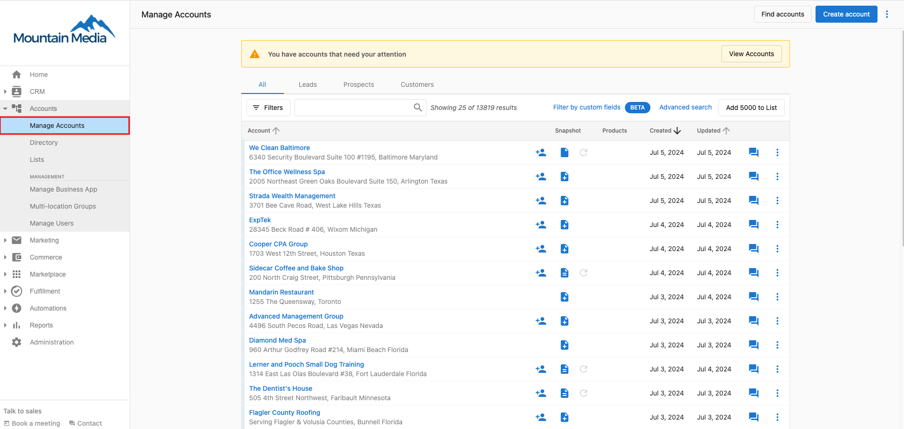
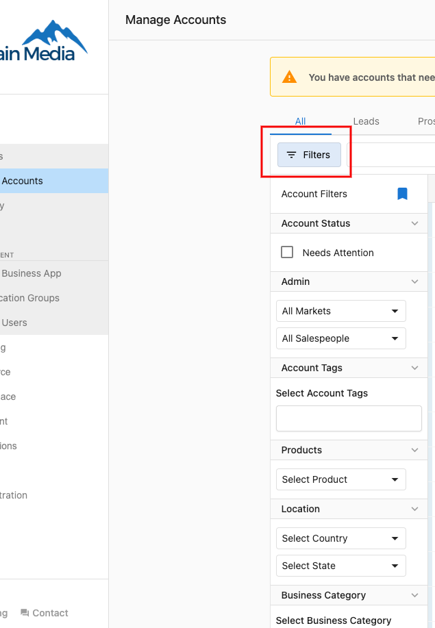
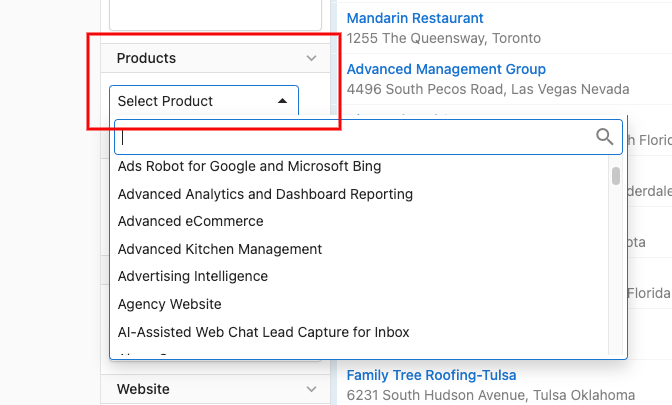
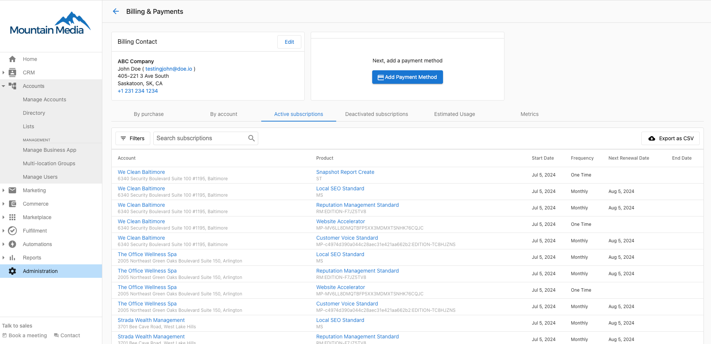

# Is it possible to filter accounts by active products?

Yes! To filter accounts in Partner Center by an active (or inactive) product:

1) Go to **Accounts > Manage Accounts.**

2) Click on the **Filters** option at the top left of the screen.

3) Under '**Products**', select the product you would like to filter by, then select 'Active' or Inactive'.

**Note**: At this time, it is not possible to filter by product edition. (Ex. Reputation Management Standard)

If you would like to see accounts with a specific product edition, you can see this information under **Partner Center > Administration > My Billing**, then click on **Active Subscriptions**. You will be able to use the search bar to find the specific product edition, ex. Reputation Management Standard.

