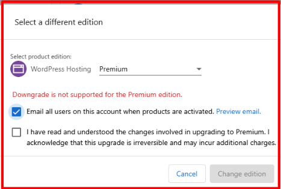

To change a product edition for your customer:

1. Go to **Partner Center > Accounts > Manage Accounts.**
2. Select the desired account.
3. Within the Products section, click the kebab menu beside the product you want to change.
4. Click **Change Edition.**
5. Select the desired edition, and click **Change edition**.

**Note:** Upgrading to a higher edition may incur additional charges.

Please be aware that downgrading WordPress Premium is not supported. 

