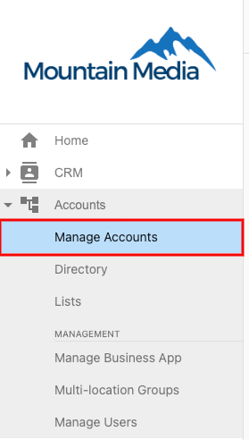
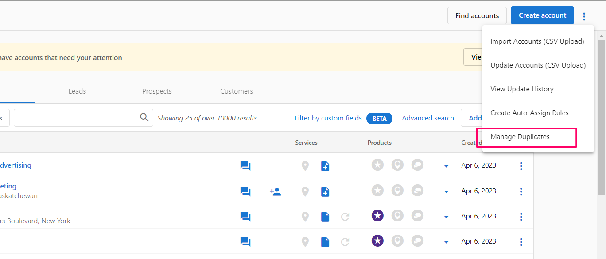
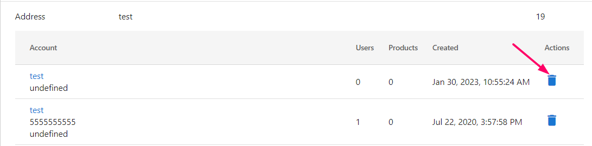

In Partner Center, you can manage duplicate accounts and easily delete them. The platform will identify possible duplicates based on account data.

1. In Partner Center go to **Accounts > Manage Accounts.**
   

2. Click the three-dot menu at the top right corner, select **Manage Duplicates**.
   

3. In the **Duplicate Manager** you can identify possible duplicates and delete them without leaving the page. Click on the trashcan icon on the right side to delete the account.
   

**Note:** The 'manage duplicate' checker dashboard has a maximum limit of 100, therefore if the duplicate list contains entries of more than 100, it will not be displayed on the list. It is an unsorted aggregation. As the duplicates here start to be managed, (removing the old duplicates) you will see new results starting to appear.