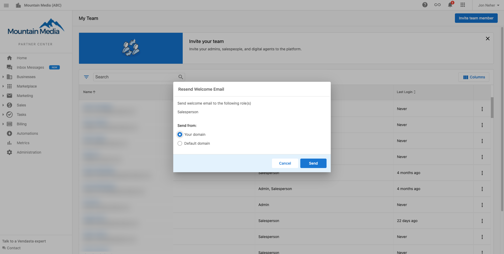
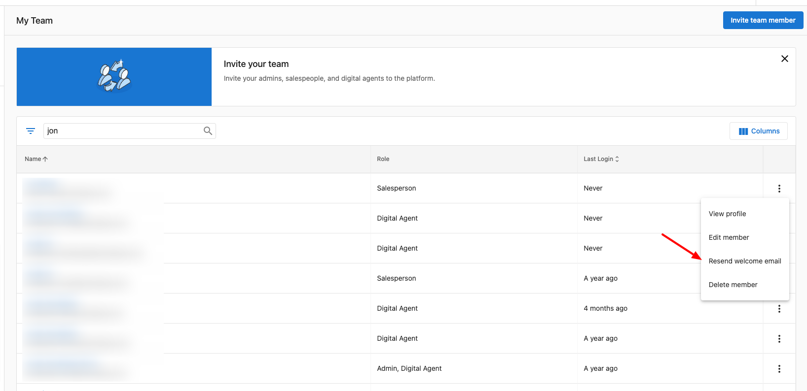

When resending a Welcome Email to one of your Admins, Salesperson, or Digital Agent members have the ability to choose to send the Welcome Email from:

- Your domain set up in Vendasta
- Our default domain, ex. welcome.businessmail.io

### Why does the 'send from' option matter?

Getting a [Welcome Email](https://support.vendasta.com/hc/en-us/articles/4406959920791) is the first step to getting your team members to use Vendasta, but if your [**Email Settings**](https://support.vendasta.com/hc/en-us/articles/4406951758871) aren't configured properly it's very possible the Welcome Email may end up flagged by the email provider as suspicious.

By offering you the ability to send from our trusted default domain "smblogin.com" you can rest easy knowing that even if your Email Settings are not configured, you are able to invite a team member and be confident the email will be found in their inbox.

### How to resend the Welcome Email

1. Navigate to **Partner Center > Administration > My Team.**
2. Click on the three-dot icon next to the team member who needs a new welcome email and then select "Resend welcome email."
3. Choose which domain you would like to send the email from.