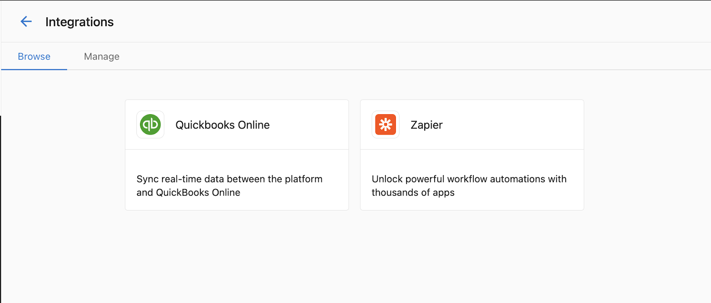
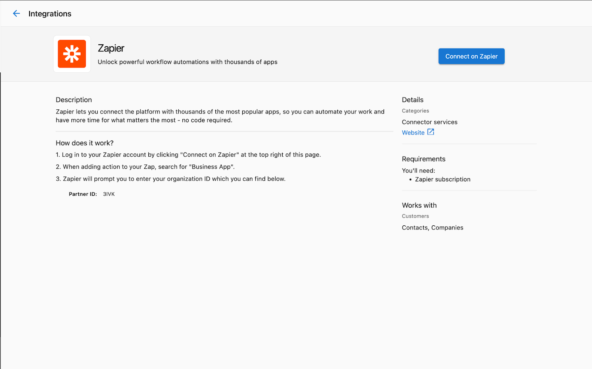
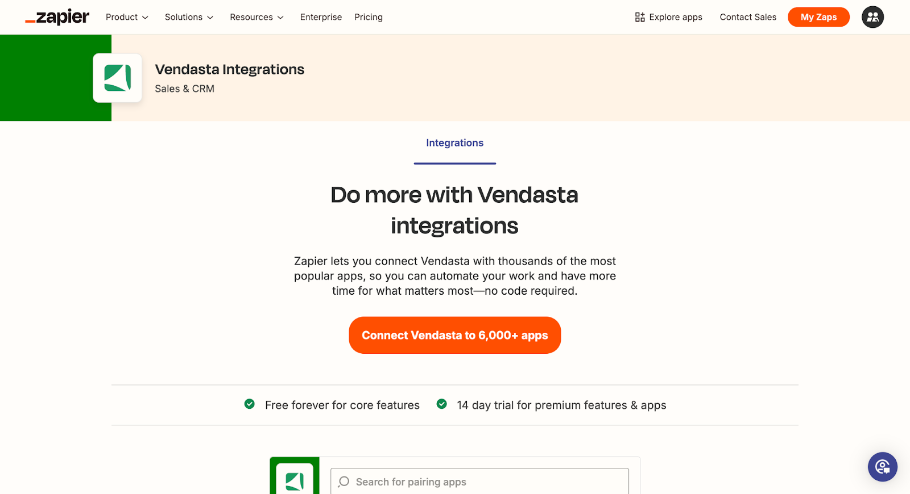
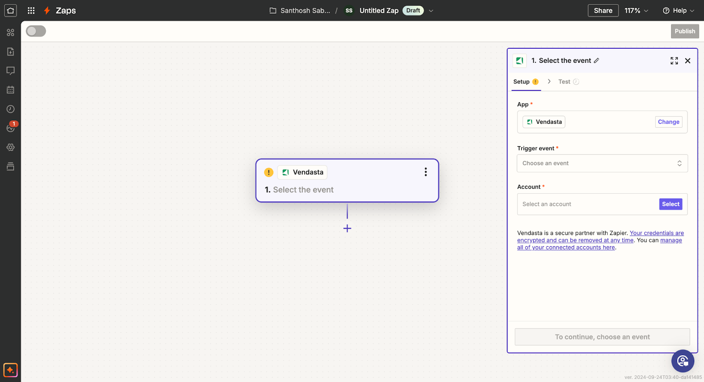
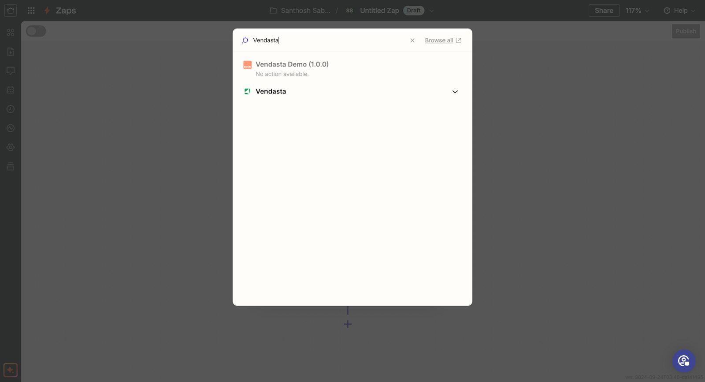
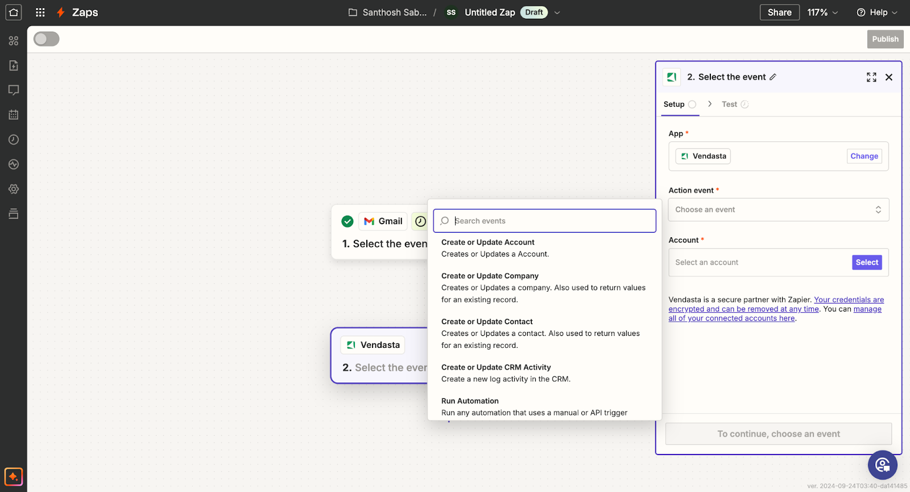
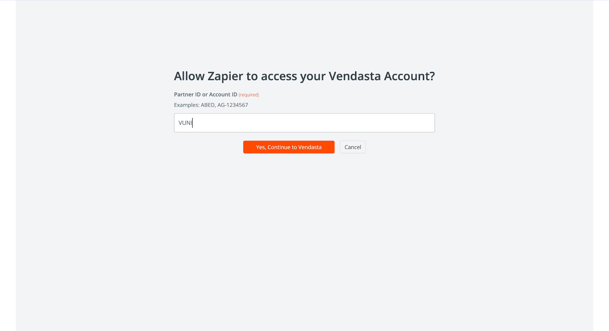

# Zapier Integration

Vendasta's Zapier Integration enables you to connect your Vendasta account with thousands of other applications through Zapier's automation platform.

## Overview

With the Vendasta Zapier Integration, you can automate workflows between Vendasta and other applications you use daily. For example, you can automatically:

- Create a business in Vendasta when a new lead comes in from another system
- Update customer data in Vendasta when it changes in your CRM
- Trigger actions in other applications when changes occur in Vendasta

## How to Access Zapier Integration

1. Log in to your Vendasta account
2. Navigate to **Administration** > **Integrations**
3. Locate the Zapier integration tile

4. Click **Connect** to be directed to Zapier

## Connecting Vendasta to Zapier

Once you're on the Zapier website, you can start creating automations (Zaps) between Vendasta and other applications.

## Creating a Zap

### Step 1: Set up your Trigger
First, select the app and event that will trigger your automation.

### Step 2: Connect to Vendasta

1. Select Vendasta as your action app

2. Choose the Vendasta action you want to perform

3. Connect your Vendasta account if you haven't already

4. Complete the setup by configuring the action details

## Available Triggers and Actions

### Triggers (Events in Vendasta that can start a Zap)
- New Business Created
- Business Updated
- New Order Placed
- Order Status Changed

### Actions (Things Zapier can do in Vendasta)
- Create a Business
- Update a Business
- Create a Task
- Add a Note to Business

## Best Practices

- Test your Zaps thoroughly before relying on them for critical business processes
- Monitor your Zaps regularly to ensure they continue to work as expected
- Use error notifications in Zapier to be alerted if a Zap fails
- Review Zapier's usage limits to ensure your automation needs fall within your plan's constraints

## Troubleshooting

If you encounter issues with your Vendasta-Zapier integration:

1. Verify your Vendasta account has the necessary permissions
2. Ensure your Zapier account is active and on an appropriate plan
3. Check that the data being passed between apps is formatted correctly
4. Review the Zap History in Zapier to identify where failures might be occurring

For additional support, contact Vendasta Customer Support.