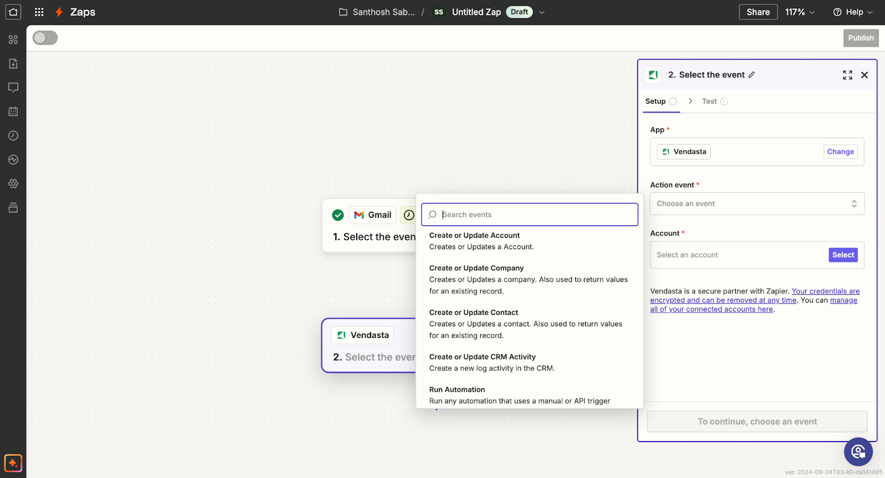
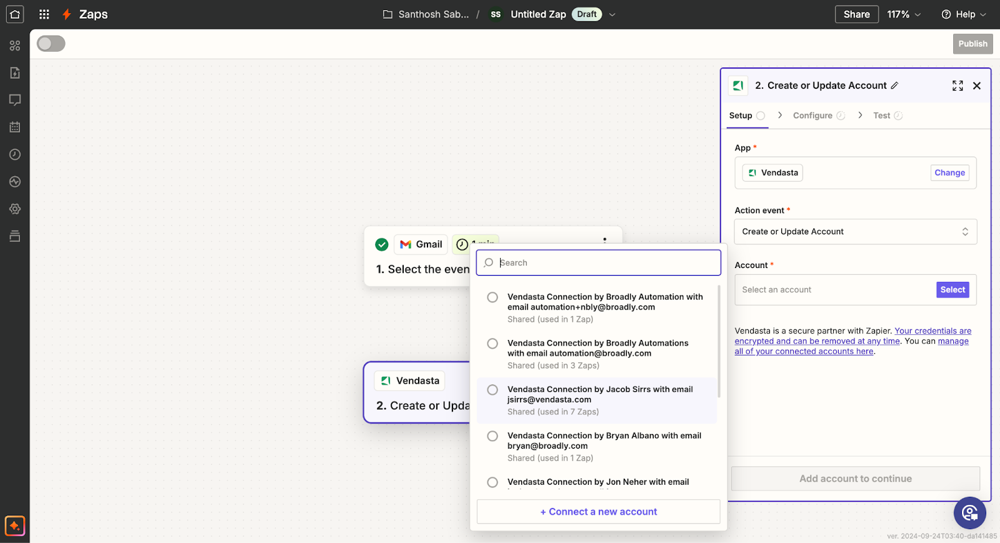
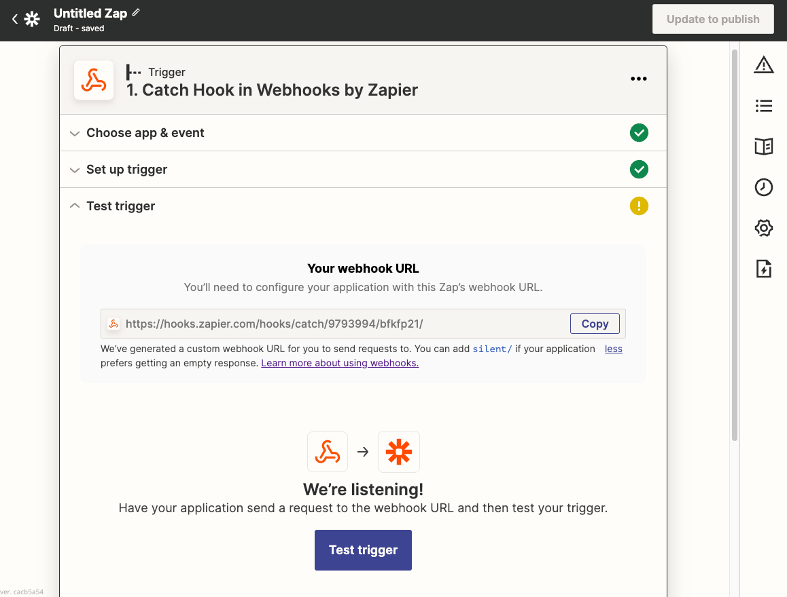

## What is Zapier Integration?

Vendasta's Zapier Integration enables you to connect your Vendasta account with thousands of other applications through Zapier's automation platform. This powerful integration allows you to automate workflows between Vendasta and other applications you use daily, extending your platform's capabilities.

## Why is Zapier Integration Important?

Zapier integration helps you:
- Automate repetitive tasks between applications
- Synchronize data across multiple platforms
- Create seamless workflows without custom coding
- Connect Vendasta to over 6,000+ supported applications
- Reduce manual data entry and human error
- Scale your operations with automated processes

## What You Can Do with Zapier Integration

| Feature | Description |
|---------|-------------|
| **App Connectivity** | Connect Vendasta to thousands of applications |
| **CRM Integration** | Sync contacts and companies with external CRMs |
| **Automation Triggers** | Use Vendasta automations to trigger Zapier workflows |
| **Activity Logging** | Log activities like notes, calls, and meetings in Vendasta CRM |
| **Workflow Automation** | Create complex multi-step automated processes |

## How to Set Up Zapier Integration

### Accessing the Integration

1. Log in to your Vendasta account
2. Navigate to **Administration > Integrations**
3. Locate the Zapier integration tile

4. Click **Connect** to be directed to Zapier

### Connecting Vendasta to Zapier

Once you're on the Zapier website, you can start creating automations (Zaps) between Vendasta and other applications.

### Creating Your First Zap

#### Step 1: Set up your Trigger

First, select the app and event that will trigger your automation.

If you want your Zap to start from Vendasta data, select **Business App** as the trigger app in Zapier, choose the available trigger event, connect your account, and complete the **Setup instructions** shown in Zapier before testing the trigger.

#### Step 2: Connect to Vendasta

1. Select Vendasta as your action app

2. Choose the Vendasta action you want to perform

3. Connect your Vendasta account if you haven't already

4. Complete the setup by configuring the action details

## Available Triggers and Actions

### Triggers (Events in Vendasta that can start a Zap)

- **New Business Created** - When a new business is added to Vendasta
- **Business Updated** - When business information is modified
- **New Order Placed** - When a new order is created
- **Order Status Changed** - When an order status is updated

### Actions (Things Zapier can do in Vendasta)

- **Create a Business** - Add new businesses to Vendasta CRM
- **Update a Business** - Modify existing business information
- **Create a Task** - Add tasks to Vendasta's task management
- **Add a Note to Business** - Log notes against business records
- **Create or Update CRM Contact** - Manage contact records in Vendasta CRM
- **Create or Update CRM Companies** - Manage company records in Vendasta CRM
- **Log CRM Activity** - Record notes, emails, calls, meetings, and tasks

:::tip Coming Soon Features
- Associate contacts with companies
- Grey labeling of Zapier App
- Run automations for an account or an order
:::

## How to Trigger Zapier Zaps Using Vendasta Automations

### Prerequisites

- A Vendasta Partner account with access to Automations
- A Zapier account
- Basic understanding of webhooks

### Setting up the Zap for Automation Triggers

1. Go to [Zapier](https://zapier.com/) and log in to your account
2. Click on **Create Zap**

3. Search for and select **Webhooks by Zapier** as the trigger app

4. Select **Catch Hook** as the trigger event, then click **Continue**

5. Copy the webhook URL. You'll need this for setting up the Automation in Vendasta

6. Click **Continue** and then **Test trigger**. Don't worry that the test will fail at this point

### Setting up the Automation in Vendasta

1. Log in to your Vendasta Partner Center
2. Navigate to **Administration > Automations**
3. Create a new Automation or edit an existing one
4. Add a **Webhook** action to your Automation
5. In the webhook configuration, paste the URL you copied from Zapier

6. Configure any additional data you want to send to Zapier in the **Body** field
7. Save your Automation

### Testing the Integration

1. Trigger your Automation in Vendasta
2. Go back to Zapier and you should see that the test was successful

3. Continue setting up the rest of your Zap, adding actions that should happen when the webhook is triggered

4. Name your Zap, test it, and turn it on

## Zapier App Information and FAQ

### What is Beta Mode?

We know our Partners are eager to start using this! While our development team is still bringing some exciting new features to the Zapier integration, the Beta tag will be used to signify this.

:::note Subscription Requirement
This feature is currently available only to Partners on a subscription tier that includes integrations.
:::

### Who Can Use the App?

The app can be used by Partners, Salespeople, and their clients as it uses the permissions of the user that set up the Zap. It should be noted that the app is Vendasta branded so if you wish to white-label the platform, you won't be able to offer this currently. You may instead choose to build the zaps on behalf of your clients.

### App Store Availability

The Zapier app will be available in the Zapier app store soon!

### How Companies Relate to Accounts

An account will be created as a copy of the company data the first time that an account is needed on the platform. Once created, updating the company record will only update the assigned Salesperson and all custom fields on the account. When a client updates their account most fields will update the company record.

## Best Practices

### Planning Your Integrations

- **Start Simple** - Begin with basic integrations before building complex workflows
- **Map Your Data** - Understand how data flows between applications
- **Test Thoroughly** - Test your Zaps thoroughly before relying on them for critical business processes
- **Monitor Regularly** - Monitor your Zaps regularly to ensure they continue to work as expected

### Optimization Tips

- **Use Error Notifications** - Set up error notifications in Zapier to be alerted if a Zap fails
- **Review Usage Limits** - Review Zapier's usage limits to ensure your automation needs fall within your plan's constraints
- **Batch Operations** - Where possible, use batch operations to reduce API calls
- **Data Validation** - Implement data validation to ensure clean data transfer

### Security Considerations

- **Permissions** - Ensure your Vendasta account has the necessary permissions
- **Account Security** - Keep your Zapier and Vendasta accounts secure
- **Data Privacy** - Consider data privacy implications when connecting systems
- **Access Control** - Limit Zap access to necessary team members only

## Troubleshooting

### Common Issues

**Zap Not Triggering**
1. Verify your Vendasta account has the necessary permissions
2. Ensure your Zapier account is active and on an appropriate plan
3. Check that the trigger conditions are being met in Vendasta

**Data Transfer Issues**
1. Check that the data being passed between apps is formatted correctly
2. Verify field mappings in your Zap configuration
3. Review the Zap History in Zapier to identify where failures might be occurring

**App Greyed Out**
Use the correct app for your workflow:

- **Vendasta app**: use this as an **action** app
- **Business App app**: use this as a **trigger** app, then complete the **Setup instructions** shown in Zapier
- **Webhooks by Zapier**: use this when you want to trigger from Vendasta Automations webhook events

### Getting Support

For additional support with Zapier integration:
1. Check Zapier's documentation for general Zapier issues
2. Review Vendasta's API documentation for data format requirements
3. Contact Vendasta Customer Support for platform-specific issues
4. Use Zapier's support resources for Zapier-specific problems

## Use Cases and Examples

### CRM Synchronization

**Example**: Automatically create Vendasta CRM contacts when new leads are added to your external CRM
- **Trigger**: New contact in external CRM (e.g., HubSpot, Salesforce)
- **Action**: Create or update CRM contact in Vendasta

### Review Management Integration

Once automations are released in Business App, users will be able to set up an automation with the 'Send Review Request' option to a contact action that is triggered via Zapier or a CRM activity. We will have a template available to do so.

### Task Management Workflow

**Example**: Create Vendasta tasks when specific events occur in other systems
- **Trigger**: New support ticket in help desk system
- **Action**: Create task in Vendasta for follow-up

### Data Backup and Reporting

**Example**: Automatically export Vendasta data to spreadsheets for reporting
- **Trigger**: Scheduled trigger in Zapier
- **Action**: Export data from Vendasta to Google Sheets

## FAQs

What does the Zapier app do?

The Zapier app allows you to:
1. Create or update CRM contacts in Vendasta
2. Create or update CRM companies in Vendasta
3. Log CRM activities (notes, emails, calls, meetings, tasks)
4. Run Vendasta automations using API triggers
5. Connect Vendasta to 6000+ apps that Zapier supports

Who can use the Zapier app?

The app can be used by Partners, Salespeople, and their clients. It uses the permissions of the user who set up the Zap. Note that the app is currently Vendasta branded, so white-labeling options are limited (grey-labeling is coming soon).

Is the app available in the Zapier app store?

The app will be available in the Zapier app store soon! Currently, it's in Beta mode with active development ongoing.

How does this affect Reputation AI review requesting?

Once automations are released in Business App, users will be able to set up an automation with the 'Send Review Request' option that can be triggered via Zapier or CRM activity. Templates will be available.

Why is the app greyed out when I try to add it?

You're likely using the wrong app type for the step:

- Use **Vendasta** when configuring Zap **actions**
- Use **Business App** when configuring Zap **triggers** and follow the in-app **Setup instructions**
- Use **Webhooks by Zapier** when triggering from Vendasta Automations webhooks

What are the usage limits for Zapier integration?

Both Vendasta Automations and Zapier have their own usage limits and pricing. Check both platforms' documentation for specific details about limits and costs.

Can I use webhooks to trigger Zaps from Vendasta automations?

Yes! You can use Vendasta automations with webhook actions to trigger Zapier workflows. Use "Webhooks by Zapier" as your trigger app and configure the webhook URL in your Vendasta automation.

What subscription level do I need for Zapier integration?

Zapier integration is available only to Partners on a subscription tier that includes integrations. Check your subscription details or contact support for more information.

