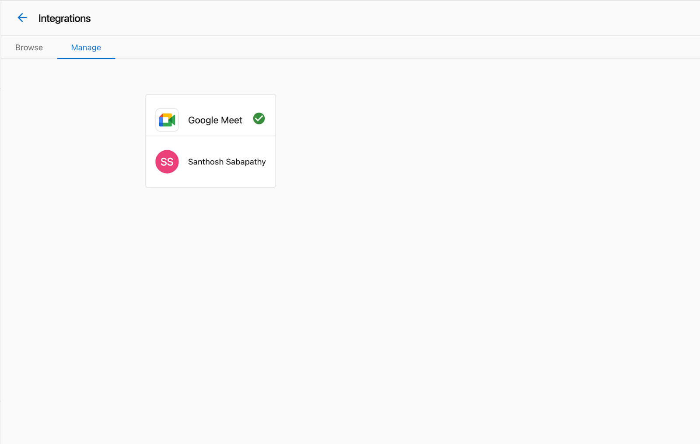

Vendasta's Google Meet and Zoom integrations allow Partners to integrate their Google Meet or Zoom accounts with Partner Center.

Once you enable either the Google Meet or Zoom integration, you'll notice a few changes in Partner Center when communicating with a customer:

- When viewing a contact record, you'll see a new option next to the `Call` and `Email` buttons to start or schedule a meeting.
- When composing an email to a contact, you'll see new options to include a meeting link and suggest meeting time slots.

## Google Meet considerations

- To use the Google Meet integration, you must have a Google Workspace account with Google Meet enabled.
- All Partner Center users share the same Google Meet connection. When a user sets up the Google Meet integration, it's available to all users in that Partner account.
- You will not need to log in separately to your Google account to use this integration.

## Zoom considerations

- Unlike Google Meet, each Partner Center user needs to connect their own Zoom account.
- Both free and paid Zoom accounts are supported, but free accounts have some meeting limitations (e.g., 40-minute time limit for group meetings).

## Setting up the Google Meet integration

To enable the Google Meet integration for your Partner Center account:

1. Navigate to the `Integrations` page from the left navigation menu in Partner Center.
2. Find the `Google Meet` tile and click `Connect`.
3. Follow the Google authentication flow to grant Partner Center access to your Google account.

Once completed, you should see a `Connection Completed` message:

## Setting up the Zoom integration

Each Partner Center user needs to set up their own Zoom integration:

1. Navigate to the `Manage` tab in your user profile (click your user icon in the top right).

2. Select `Connected Apps` from the left menu.
3. Find the Zoom tile and click `Connect`.
4. Follow the Zoom authentication flow to grant Partner Center access to your Zoom account.

## Managing integration settings

Administrators can manage integration settings and connections through the Integrations page:

1. Navigate to the `Integrations` page from the left navigation menu.
2. Find the integration tile (Google Meet or Zoom).
3. Click `Manage` to view and adjust connection settings.

## Scheduling meetings

Once integrated, scheduling meetings with customers is simple:

1. Navigate to a customer contact record.
2. Click the meeting button next to 'Call' and 'Email'.
3. Choose to start an immediate meeting or schedule one for later.
4. When scheduling, select available times and add meeting details.
5. Send the invitation to the contact.

Alternatively, when composing an email:

1. Click the meeting button in the email composer.
2. Choose to add a meeting link or suggest time slots.
3. Complete the meeting setup and send the email.

## Troubleshooting

If you encounter issues with the Google Meet or Zoom integrations:

- Ensure your Google Workspace or Zoom account is active and properly configured.
- Check that you've granted all necessary permissions during the connection process.
- For Google Meet issues, ask your administrator to verify the connection on the Integrations page.
- For Zoom issues, try disconnecting and reconnecting your account.

For additional assistance, contact Vendasta Support.