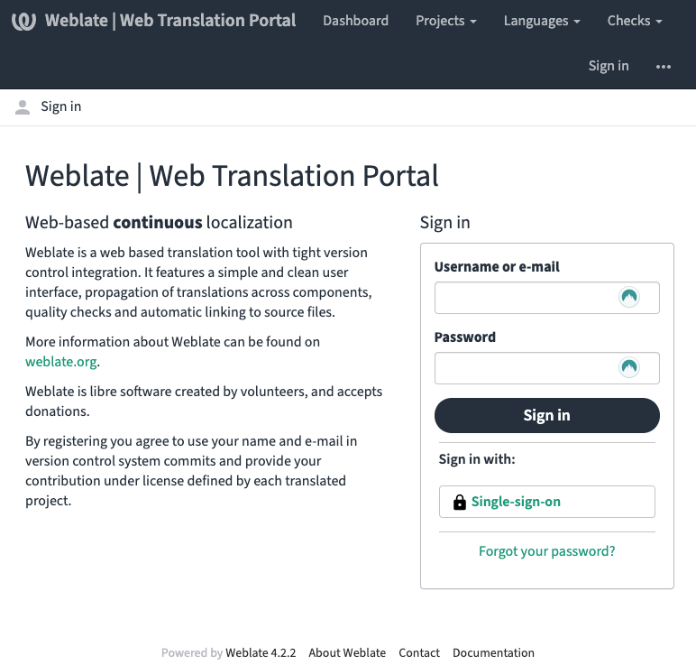

# Translate and Customize with Weblate

## What is Weblate?

Weblate is a centralized database for all of Vendasta's text content which will allow you, as a partner, to contribute translations to the Vendasta ecosystem. You can get more details about the copylefted libre software [here](https://weblate.org/en/).

## Why should I use Weblate?

The translator experience can be painful, prone to errors, slow, and manual. Weblate focuses on automation where source text and translations are automatically synced between apps and Weblate.

## Which languages are supported?

We have wide coverage in the following languages:

- Czech
- Dutch
- French
- German
- Spanish

View the status of supported languages, including coverage statistics, on [Weblate](https://weblate.apigateway.co/languages/).

## What can I translate

- Business App 
- O&O products 
- Partner Center 
- Task Manager 

## Translating Text using Weblate

When it comes to providing a flawless customer experience, Multilingual Support is an important piece of the puzzle. By leveraging Weblate, a powerful online Content Management System, you can reach international markets and build trust with your customers.

## Sign in to Weblate

First, access the Weblate tool at [https://weblate.apigateway.co](https://weblate.apigateway.co/), or by following these steps:

1. Go to the [Partner Center](http://partners.vendasta.com/).
2. From the **Administration** page, click **Translate and customize**.

Then, log into weblate using your Vendasta credentials.

1. Click **Single-sign-on** and follow the instructions that display.

## Search for a language

Next, search for a language.

1. Using the menu > **Languages** > **Browse all languages**
2. Click on a language you want to translate.

## Look for a project you would like to translate

Next, search for a project.

1. Click on the **project** your wish to translate (e.g. Business App)
2. Click on the **component** you wish to work on (e.g. Executive Report)
3. Click the **Translate** button on the right side of the screen

The next page is where you would be working on your translation.

## Start translating

The translation box is where you will be working on your translation. You will see the original word in English, and beneath it, you will see another text box. This is where you input the translation.

After each word has been entered, click **Save** or **Suggest** (depending on your permission level). You will automatically move to the next text unit in the queue.

Learn more about translation workflows in the official [Weblate Documentation](https://docs.weblate.org/en/weblate-4.2.2/user/translating.html).

## Customizing Text using Weblate

When it comes to serving your customers a great experience, you're the expert. You know they need to know. By leveraging Weblate, a powerful online Content Management System, you can customize and fine-tune every piece of text content in the Vendasta ecosystem, so that your customers have the best experience possible.

## Look for the project you would like to customize

Next, search for a project.

1. Click on the **project** you wish to customize (e.g. Business App)
2. Click on the **component** you wish to work on (e.g. Executive Report)

## Create a white-labeled translation

Next, select a language from the list.

1. Click **Create white-labeled translation** button at the bottom of the language list.
2. Select a language from the list of existing translations.
3. Click **Customize**.

After a brief moment, the new translation will be created. You can access it from the component page from step 5.

## FAQs

**Q: What languages are supported in the platform?**

A: Click "Browse All Languages" in Weblate to see up-to-date statistics on supported languages. 

**Q: How can I add a language?**

A: Contact your Vendasta representative with any unmet translation requirements.

**Q: What parts of the platform support translations?**

A: Click "Browse All Projects" in Weblate to see what parts of the platform are available for translation.

**Q: How can I contribute to a translation?**

A: Follow the quick-start video tour to make your first contribution. Additional documentation is available in the Quick Links.

**Q: Do I need special permissions to translate?**

A: There are two tiers of translation permissions. As a Viewer, you have permission to view all Global translations and make suggestions. You also have permission to make a copy of the Global translations that only your customers will see. At the Trusted Translator level, you have all the privileges of a Viewer, plus you can review suggestions made by Viewers and contribute to Global translations.
Contact us to learn more about becoming a Trusted Translator!

**Q: When are the translation suggestions reviewed?**

A: Typically within 30 days.

**Q: What happens if only part of the site is translated into my language?**

A: A language may not have 100% coverage throughout the site. In case a piece of content is not translated, English is used as a fallback language.

**Q: What protections are in place to prevent other people from adding bad words in another language?**

A: Only Trusted Translators can update Global translations - the content that every user can see. 

**Q: Can I limit my users to only specific languages?**

A: Not at this time

**Q: Why is there HTML in the text content?**

A: In order to help translators read and understand the content, some HTML is kept inline so that sentences aren't split.

**Q: Why are there \{\{curly braces\}\} in the text content?**

A: Curly braces are used in text content to identify where dynamic or parameterized content can be substituted in. The text inside braces should not be modified.

**Q: How do I translate emails?**

A: You can see translatable email templates in the Email Templates project in Weblate.

**Q: How do I translate videos?**

A: You can see translatable video subtitle files in the Video Captions project in Weblate.

**Q: How does Weblate handle plurals, genders, and other declensions?**

A: The tech we are presently using for internationalization does not fully support declensions. We understand the need to support them, and we are actively exploring new technologies that allow us to meet translator requirements.

**Q: What incentives do I get when I help Vendasta translate their platform?**

A: We are exploring how we can reward you for contributing to translations. Be on the lookout for more information in the coming months.

**Q: How can I see how text content is used in the platform in order to suggest better translations?**

A: We know it's challenging to translate text without context, descriptions, and screenshots. We're actively exploring ways to get you the information you need to translate.