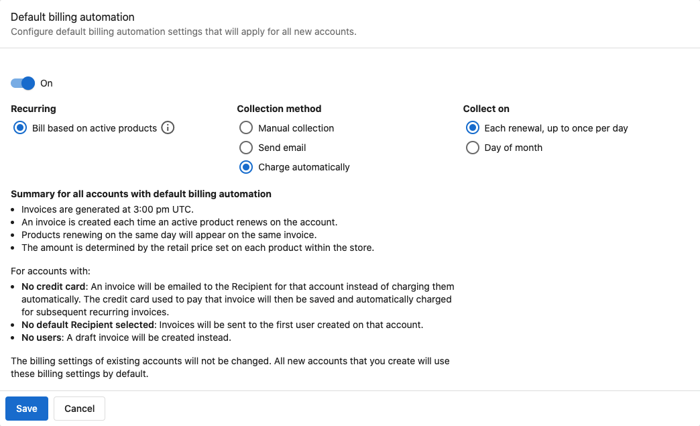

## What is Billing Automation?

Billing automation streamlines your customer billing process by automatically creating and sending invoices or charging saved payment methods for recurring subscriptions. You can configure default settings that apply to all new accounts you create, ensuring consistent billing practices.

## Why is Billing Automation important?

Billing automation eliminates manual billing tasks, reduces the risk of missed payments, and ensures consistent billing practices across all customer accounts. By setting defaults, you save time on account setup while maintaining professional billing standards.

## What's Included with Billing Automation?

### Default Configuration Options
- **Collection methods**: Choose between automatic charging and invoice generation
- **Collection timing**: Set specific days for billing cycles
- **Market-specific settings**: Different defaults for different markets (if applicable)
- **Automatic application**: Settings apply to all new accounts automatically

### Collection Method Types
- **Automatic charging**: Charges customers' saved credit cards automatically
- **Invoice generation**: Creates and sends invoices for manual payment
- **Hybrid approaches**: Combine methods based on customer preferences or account types

### Timing and Scheduling
- **Custom day selection**: Choose specific days of the month for billing
- **Flexible scheduling**: Set different collection schedules per market
- **Recurring frequencies**: Support for monthly, yearly, and custom billing intervals

## How Default Billing Automation Works

New accounts are created without billing settings unless you define defaults. When you configure default billing automation, those settings are applied automatically to the Billing settings of every new account you create.

- Configure defaults at `Administration` > `Default Billing Settings`
- Defaults can be set per market, if applicable
- Changing defaults does not modify any existing accounts; only accounts created after saving will use the new defaults
- You can still edit Billing settings on any individual account at any time

## How to Configure Default Billing Automation

### Initial Setup Process

The default billing automation system simplifies account management by applying your chosen billing settings to every new account automatically. This eliminates the need to manually configure billing settings for each new customer.

Previously, billing automation had to be configured individually for each account through the account's billing settings. Now you can establish these preferences once and have them applied consistently to all new accounts.

### Step-by-Step Configuration

1. Navigate to `Administration` > `Default Billing Settings`
2. Select a market (if your business operates in multiple markets)
3. Toggle the automation switch from `Off` to `On` to begin configuration
4. Configure your collection preferences:
   - **Collection method**: Select how you want to collect payments from customers
   - **Collection timing**: Choose which days of the month to collect payments
5. Review the configuration summary at the bottom of the page
6. Click `Save` to apply your default settings

:::warning
These default settings only affect accounts created after you save the configuration. Existing accounts will retain their current billing settings and will not be automatically updated.
:::

### Understanding the Configuration Impact

When you configure default billing automation:
- **New accounts**: Automatically receive your default billing settings
- **Existing accounts**: Retain their current settings unchanged
- **Individual overrides**: Specific accounts can still have their billing settings modified manually
- **Market variations**: Different markets can have different default settings

### Example Workflow Summary

1. Define your desired collection method (automatic charge vs. invoice) and collection timing once.
2. Save the configuration under `Default Billing Settings`.
3. Create new accounts as usual; their Billing settings will reflect your defaults automatically.
4. For exceptions, open an individual account and adjust its Billing settings as needed.

## Managing Billing Settings After Configuration

### Override Settings for Individual Accounts

Even with default automation enabled, you can modify billing settings for specific accounts when needed:

1. Go to `Accounts` > `Manage Accounts`
2. Select the specific account you want to modify
3. Navigate to the `Products` section on the account page
4. Modify the billing settings as required for that account

This flexibility allows you to accommodate special billing requirements for specific customers while maintaining consistency for most accounts.

### Market-Specific Configuration

If you operate in multiple markets, you can set different default billing automation settings for each market. This accommodates:
- **Regional billing practices**: Different standard practices across markets
- **Regulatory requirements**: Compliance with local billing regulations
- **Currency considerations**: Different billing cycles for different currencies
- **Customer expectations**: Varying customer preferences across regions

### Integration with Product Pricing

For billing automation to function effectively, ensure that:
- **Retail prices are configured**: All products must have retail prices manually set
- **Subscription settings are correct**: Recurring products need proper subscription configuration
- **Billing triggers are active**: Automation depends on properly configured product billing triggers

:::info
To automatically bill accounts based on their active products, you must manually set retail prices for each product in your catalog. Without proper pricing, the automation cannot calculate billing amounts.
:::

## Monitoring and Optimization

### Performance Tracking

After implementing default billing automation, monitor:
- **New account setup**: Verify that default settings are being applied correctly
- **Billing success rates**: Track successful automated billing cycles
- **Customer feedback**: Monitor customer responses to automated billing
- **Error rates**: Identify and resolve any billing automation issues

### Adjusting Default Settings

You can modify your default billing automation settings at any time:
- **Rate changes**: Update collection timing or methods as business needs change
- **Market adjustments**: Modify settings for specific markets based on performance
- **Process improvements**: Refine automation based on operational experience
- **Compliance updates**: Adjust settings to meet changing regulatory requirements

## Common Questions About Billing Automation

Do default billing settings affect my existing customer accounts?

No, default billing automation settings only apply to accounts created after you save the configuration. Existing accounts keep their current billing settings unchanged.

Can I modify billing settings for individual accounts after applying defaults?

Yes, you can modify billing settings for any specific account by navigating to the account's Products section under Manage Accounts, regardless of the default settings.

Do I need to set product prices for automation to work?

Yes, you must manually set retail prices for each product to enable automatic billing based on active products. Without pricing, the automation cannot calculate billing amounts.

Can I have different default settings for different markets?

Yes, if you operate in multiple markets, you can configure different default billing automation settings for each market to accommodate regional requirements.

What collection methods are available for automation?

You can choose automatic credit card charging, invoice generation for manual payment, or hybrid approaches depending on your business needs and customer preferences.

Can I disable billing automation after setting it up?

Yes, you can return to the Default Billing Settings page and toggle the automation switch back to `Off`. This stops applying defaults to new accounts but doesn't affect existing accounts.

