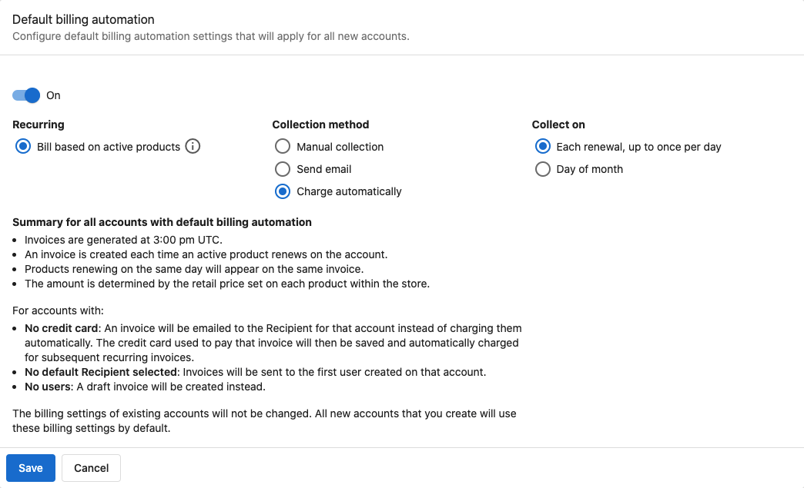

# Set default billing automation settings for all new accounts

We've simplified the process of ensuring that your customers are charged or invoiced consistently by allowing partners to specify default billing automation settings for every new account they create. Now every new account created will automatically use the billing settings you've chosen under **Partner Center > Administration > Default Billing Settings**.

When invoicing a customer for products and services with recurring subscriptions (i.e. monthly, yearly), you may want to automate creating and sending invoices, or automate the charging of an account's saved credit card. Previously, you could only manage these settings on a per-account basis by turning on **Billing Automation** under an account's **Billing settings**.

Typically, these settings were changed manually when a new account was created. Now partners can save time and effort and ensure that new accounts are being billed in a consistent fashion by applying default billing automation settings to every new account (per Market, if applicable) automatically.

### **How does the default billing automation work?**

By default, a new account will have no **Billing settings**. If you would prefer new accounts to be created with certain billing automation settings already enabled, these defaults can be changed for all new accounts (per Market, if applicable) under **Partner Center > Administration > Default billing settings**.

Note that setting or changing your **Default billing automation** settings will not override the billing settings of any accounts that already exist—only accounts created after you save these settings will use the defaults you specify here.

Follow these steps to set or change your preferred Default billing automation settings for new accounts:

- Go to **Partner Center > Administration > Default Billing Settings**
- Select a Market (if applicable)
- By default, these settings will be **Off**. Switch the toggle to **On** to begin changing these settings.
- Select your preferences for **Collection method** (how you will notify and collect payment from an account) and **Collect on** (what day or days you will collect payment from an account)
- Review the summary at the bottom of the page
- Hit **Save** to apply your changes

Once you have finished configuring these settings, they will be automatically applied to the **Billing settings** of all new accounts.

Whether or not an account is already using **Default billing automation** settings, an individual account's **Billing settings** can be changed at any time. To edit these settings for a particular account, go to the **Products** section on the account's page under **Partner Center > Accounts > Manage Accounts.**

To learn more about configuring the billing settings of individual accounts, read our article on [invoicing and product subscriptions](/administration/administration-platform-settings/default-billing-settings/invoicing-and-product-subscriptions).

Note that to automatically bill an account based on their active products, [retail prices must be manually set](/administration/administration-platform-settings/default-billing-settings/manual-retail-prices) for each product.