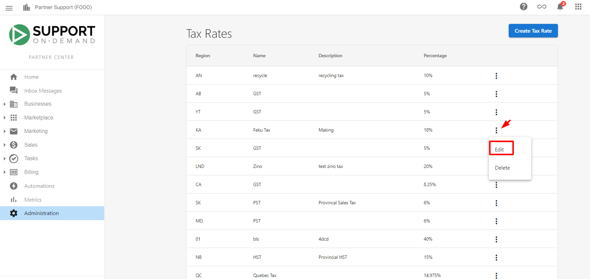
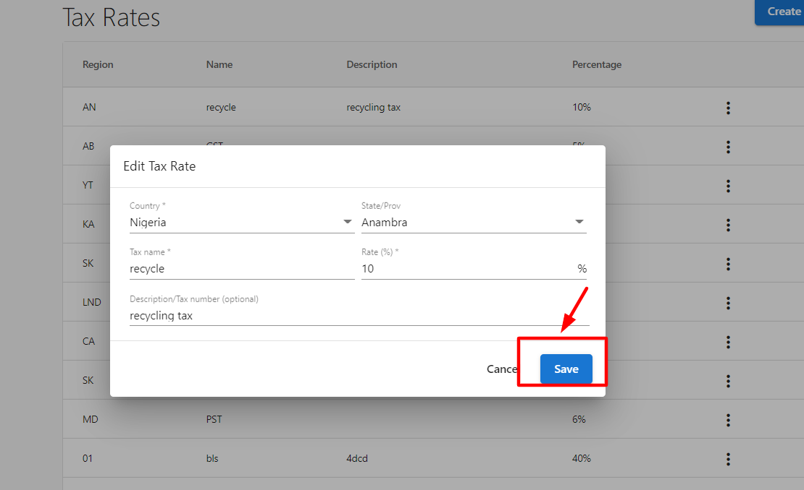

Configure tax rates, apply exemptions, and ensure accurate tax calculations on invoices, sales orders, subscription billing, and shopping cart purchases. The system applies tax rules automatically based on customer addresses and exemption status.

## What you can configure

- **Tax rates** – Set and edit rates by region; system applies them from customer addresses
- **Item exemptions** – Exclude specific products or packages from selected tax rates
- **Account exemptions** – Exempt entire accounts (e.g. government, tribal, NGO, education, religious)
- **Address-based logic** – Tax is determined by postal code; no address/postal code means no tax shown in opportunities

## Create a tax rate

1. Go to `Partner Center` → `Administration` → `Tax Rates`
2. Click `Create Tax Rate`
3. Enter the country, state or province, name, and rate, plus an optional description
4. Click `Save`

## Edit tax rates

1. Go to `Partner Center` → `Administration` → `Tax Rates`
2. Find the tax rate to change and open the `kebab menu` (three dots)
3. Choose `Edit`, update the fields, then click `Save`

Changes apply to new transactions only; existing invoices keep their original tax.

## Address requirements for tax

Tax calculations require a complete customer address with postal code. If an account has no address with postal code, the system will not show any tax rate in opportunities. Keep addresses complete and up to date so the correct jurisdiction and rates apply.

## Item exemptions

Exclude specific products or packages from selected tax rates:

1. Go to `Partner Center` → `Administration` → `Tax Rates`
2. Open `Item Exemptions` and click `Add Items`
3. Select the products or packages to exempt and choose which tax rates they are exempt from
4. Click `Save`

Exempted items automatically skip those taxes on sales orders and subscription billing.

## Account exemptions

For tax-exempt customers (e.g. government agencies, tribal councils, NGOs):

1. Go to `Partner Center` → `Administration` → `Tax Rates`
2. Open `Account Exemptions` and click `Add Account`
3. Select the account and choose which tax rates to exempt (only rates applicable to the account's location are shown)
4. Click `Save`

The account is then exempt from the selected taxes on all products and services.

## Complex scenarios

- **Digital products** – Rules can differ by product type, delivery method, and jurisdiction; configure rates and exemptions to match your rules.
- **Multiple jurisdictions** – Use different rates and exemption rules per region; keep exemption certificates where required.
- **Tax-exempt organizations** – Use account exemptions for government, tribal, NGO, education, and religious entities as appropriate.

## Frequently asked questions

What if a customer account has no address?

Without an address that includes a postal code, the system does not display any tax rates in opportunities, so no tax is applied until the address is complete.

Can I exempt specific products from all taxes?

Yes. Use **Item Exemptions** to select products or packages and choose which tax rates they are exempt from.

How do I handle tax-exempt customers like government agencies?

Use **Account Exemptions** under **Tax Rates**. Add the account and select which tax rates to exempt based on their status and location.

Do exemptions apply to recurring billing?

Yes. Item and account exemptions apply automatically to sales orders and subscription billing once configured.

Can I change tax rates after invoices exist?

Yes. Edits apply only to new transactions; existing invoices keep their original tax calculations.

What if tax rates change in my jurisdiction?

Edit the rate under `Administration` → `Tax Rates` (kebab menu → `Edit`). New rates apply to future transactions only.

## Video: Apply tax exemptions

<iframe src="https://www.youtube-nocookie.com/embed/zEUKJFFfh1k" width="560" height="315" frameBorder="0" allow="accelerometer; autoplay; clipboard-write; encrypted-media; gyroscope; picture-in-picture" allowFullScreen></iframe>
