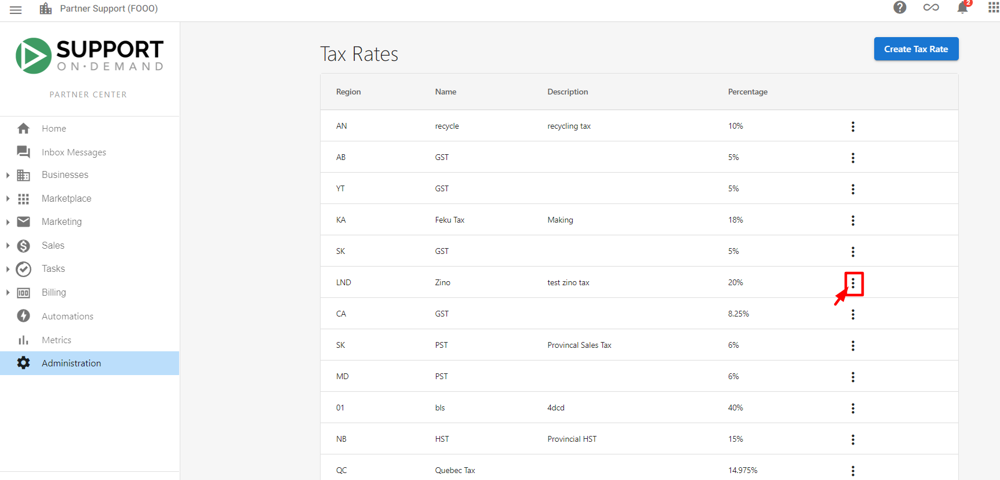
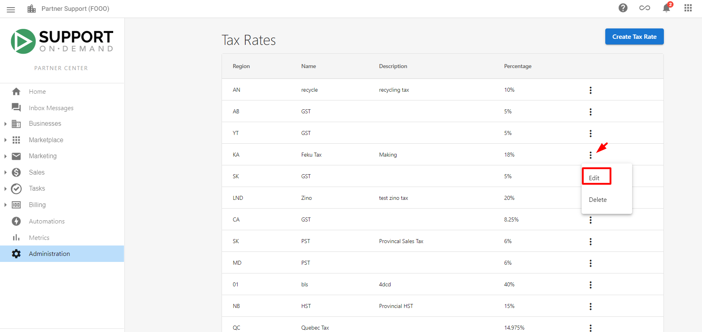
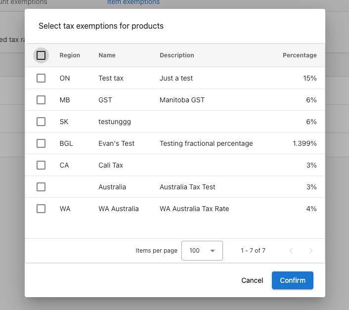

## What is Tax Configuration?

Tax configuration enables you to set up tax rates, manage exemptions, and ensure accurate tax calculations on invoices, sales orders, and subscription billing. The system handles complex tax rules and automatically applies them based on customer locations and exemption status.

## Why is Tax Configuration important?

Proper tax configuration ensures compliance with local tax regulations while accommodating special circumstances like tax-exempt organizations or non-taxable products. Automated tax calculations reduce errors, save time, and maintain accurate financial records.

## What's Included with Tax Configuration?

### Tax Rate Management
- **Custom tax rates**: Set specific percentages for different regions or jurisdictions
- **Automatic application**: Taxes apply automatically based on customer addresses
- **Rate modifications**: Update existing tax rates as regulations change
- **Multi-jurisdiction support**: Handle different tax rates for various locations

### Tax Exemption Options
- **Item exemptions**: Exclude specific products or services from taxation
- **Account exemptions**: Exempt entire customer accounts from tax collection
- **Selective exemption**: Choose which tax rates apply to specific items or accounts
- **Government exemptions**: Special handling for government and non-profit organizations

### Address-Based Logic
- **Postal code detection**: System determines applicable tax rates from customer addresses
- **No address handling**: Accounts without complete addresses show no tax rates
- **Location verification**: Ensures tax calculations match customer jurisdiction

## How to Configure Tax Rates

### Edit Existing Tax Rates

1. Navigate to `Administration` > `Tax Rates`
2. Locate the tax rate you want to modify
3. Click the kebab menu (three dots) next to the tax rate
4. Select `Edit` from the dropdown menu
5. Update the rate information in the required fields
6. Click `Save` to apply your changes

### Address Requirements for Tax Calculation

Tax calculations require complete customer addresses with postal codes. If an account lacks address information with postal code, the system will not display any tax rate in opportunities. This prevents incorrect tax calculations and ensures compliance accuracy.

#### Best Practices for Address Management
- **Verify completeness**: Ensure all customer accounts have complete addresses
- **Regular updates**: Keep address information current as customers relocate
- **Postal code requirements**: Confirm postal codes are accurate for tax jurisdiction determination

## How to Manage Tax Exemptions

### Configure Item Exemptions

When certain products or services should not be taxed, you can exempt them from specific tax rates:

1. Go to `Administration` > `Tax Rates`
2. Select `Item Exemptions`
3. Click `Add Items` to select products or packages for exemption
4. Choose which tax rates the item should be exempt from
5. Click `Save` to apply the exemptions

Exempted items will automatically exclude applicable taxes in sales orders and subscription billing.

### Set Up Account Exemptions

For tax-exempt customers such as government agencies, tribal councils, and NGOs:

1. Navigate to `Administration` > `Tax Rates`
2. Select `Account Exemptions`
3. Click `Add Account` to select the customer account
4. Choose which tax rates to exempt (only rates applicable to the customer's location will be displayed)
5. Click `Save` to apply the exemptions

The account will be exempt from selected taxes on all products and services.

## Managing Complex Tax Scenarios

### Tax-Exempt Organizations
Special exemption categories that commonly require tax exemptions include:
- **Government agencies**: Federal, state, and local government entities
- **Tribal councils**: Indigenous organizations and tribal governments
- **Non-governmental organizations**: Registered NGOs and charitable organizations
- **Educational institutions**: Schools, universities, and educational foundations
- **Religious organizations**: Churches and religious institutions

### Digital Product Taxation
Different tax rules may apply to digital products based on:
- **Product type**: Software, services, or digital content
- **Delivery method**: Downloaded vs. cloud-based services
- **Jurisdiction rules**: Local regulations on digital taxation
- **Business classification**: How your business is classified for tax purposes

### Multi-Jurisdiction Considerations
When operating across multiple tax jurisdictions:
- **Rate variations**: Different regions may have different tax rates
- **Exemption rules**: Tax exemptions may vary by location
- **Compliance requirements**: Each jurisdiction may have specific compliance needs
- **Documentation**: Maintain appropriate tax exemption certificates

## Common Questions About Tax Configuration

What happens when a customer account has no address information?

If an account lacks an address with postal code, the system will not display any tax rates in opportunities. This prevents incorrect tax calculations and ensures accurate billing.

Can I exempt specific products from all taxes?

Yes, you can set item exemptions for specific products or packages. Use the Item Exemptions feature to select which tax rates the item should be exempt from.

How do I handle tax-exempt customers like government agencies?

Use account exemptions by navigating to Tax Rates > Account Exemptions. Add the customer account and select which tax rates to exempt based on their exemption status and location.

Do tax exemptions apply automatically to recurring billing?

Yes, both item and account exemptions automatically apply to sales orders and subscription billing. Once configured, the system handles exemptions without manual intervention.

Can I modify tax rates after they've been applied to existing invoices?

Yes, you can modify tax rates at any time. However, changes only affect new transactions. Previously generated invoices retain their original tax calculations.

What should I do if tax rates change in my jurisdiction?

Edit the existing tax rates through Administration > Tax Rates using the kebab menu. Update the rates as needed and save changes. New rates will apply to future transactions.

## Screenshots or Videos

<iframe src="https://www.youtube-nocookie.com/embed/zEUKJFFfh1k" width="560" height="315" frameBorder="0" allow="accelerometer; autoplay; clipboard-write; encrypted-media; gyroscope; picture-in-picture" allowFullScreen></iframe>