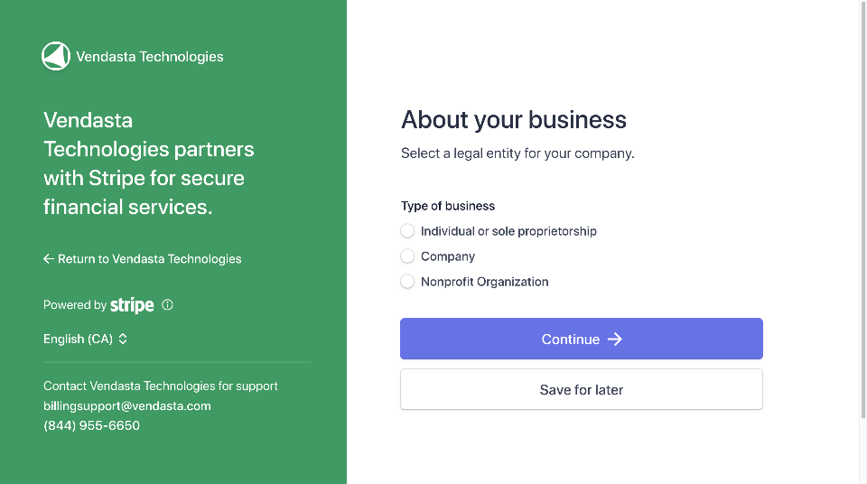

## What is Vendasta Payments?

Invoice, bill, and collect payment for all of your services through a single, integrated platform. Provide your local business clients with a seamless buying experience—all in one place, and all under your brand.

:::info Payment security
Vendasta maintains a current SOC 2® Type 2 report covering its security controls, and payments are processed through Stripe. For details on how payment and platform data is secured, see [Security and privacy](/getting-started/security-and-privacy) or visit the [Vendasta Trust Center](https://trust.vendasta.com/).
:::

  

    <iframe
      src="https://fast.wistia.net/embed/iframe/ayjibivt6o?web_component=true&seo=true"
      title="Vendasta Payments and Billing Setup Walkthrough"
      allow="autoplay; fullscreen"
      allowTransparency
      frameBorder="0"
      scrolling="no"
      className="wistia_embed"
      name="wistia_embed"
      width="100%"
      height="100%"
    ></iframe>
  

## What's included with Vendasta Payments setup?

### Account configuration options
- **New Vendasta Payments account**: Create a new Vendasta Payments processing account
- **Stripe account connection**: Connect your existing Stripe Standard account
- **Account verification**: Complete identity verification requirements
- **Banking setup**: Configure payout destinations and financial details

### Supported payment methods
- Credit and debit cards (Visa, Mastercard, American Express, Discover)
- ACH transfers
- Pre-Authorized Debits (PADs)

### Regional availability
Vendasta Payments is available in:
- USA, Canada, New Zealand, Australia, United Kingdom, Czech Republic
- Additional countries with sales assistance: Germany, Belgium, Netherlands, Poland, Switzerland

## How to set up Vendasta Payments

### Prerequisites: My Billing setup

Before setting up Vendasta Payments, ensure your billing information is properly configured in **Partner Center > Administration > My Billing**. The following settings must be complete:

- **Billing Contact**: Your business contact information
- **Payment Method**: Credit card on file (not required if currently billed by Vendasta via invoice)

These settings are necessary to be billed the wholesale costs associated with activating products and services.

### Standard Vendasta Payments account setup

<iframe src="https://www.loom.com/embed/df6a770f5aef4db2935b81683559f7e9" frameborder="0" width="100%" height="400px" allowfullscreen></iframe>

Before beginning the setup process, partners must review and agree to the additional [Terms of Service](https://www.vendasta.com/terms/terms-of-service/) associated with using Vendasta Payments.

To create a new Vendasta Payments account:

1. Navigate to `Administration` > `Commerce Settings` > `Vendasta Payments`
2. Click **Set up Vendasta Payments** to create your Stripe account
3. Provide the following required information:
   - **Legal business name** (must exactly match the name associated with your tax ID)
   - **Business Number**
     - For US companies: Employer Identification Number (EIN)
     - For Canadian companies: Canada Revenue Agency (CRA) Business Number
     - [Learn more about identity verification](https://stripe.com/docs/connect/identity-verification)
   - **Operating name** of your company (your "Doing business as" name, if different from legal name)
   - **Registered business address** or home address (if you don't have a business address)
   - **Account representative information**:
     - Legal name
     - Home address
     - ID verification (Full Social Security number for U.S., and Government-issued ID via webcam, phone, or file upload)
4. Complete the account application with all required documentation
5. Configure banking details for payouts
6. Wait for account approval (typically 1-2 business days)

:::warning
Vendasta Payments is not available for Free or Trial subscription tiers. This restriction applies to new users and current non-users on these tiers due to fraud prevention measures.
:::

#### Accept online payments

By default, the currency that you accept for online payments is the currency that you use in your billing relationship with Vendasta (your contract currency).

Vendasta Payments can currently accept payments from Visa, Mastercard, American Express, and Discover credit cards.

Payments that you have received will be displayed under the **Partner Center > Commerce > Payments** tab.

After your first payment has been received, Stripe will hold the payments you receive for up to a week. At the end of this period, Stripe will begin paying out a portion of the balance you've accumulated, on a 7-day rolling basis, into the bank account that you add in the payout settings.

If payment has failed, partners can hover their cursor over the ⓘ **Information** icon next to the status for more information.

#### Customer statement description

The customer statement description that you set when setting up Vendasta Payments is shown on your customers' credit card statements and is used to clarify a payment they have made for your products or services.

Using a clear, accurate, and recognizable statement descriptor reduces the likelihood of chargebacks and disputes, as it helps your customers to remember where a particular charge or payment originated from.

By default, "Vendasta" appears on customer credit card statements when they make a payment. Partners can replace this statement descriptor with their own business name by entering this information when setting up Vendasta Payments. You may use up to 22 characters for your statement description.

### Connect your existing Stripe account

If you're a Partner with an existing Stripe Standard account, you can connect it to Vendasta Payments to take advantage of comprehensive billing features, including invoicing, subscriptions, and payments.

#### Requirements for Stripe connection
- You already use Stripe to collect payments from customers
- You bill in a currency supported by Vendasta Payments
- You have not completed a transaction using a custom connect account from Vendasta
- Your connected Stripe account is registered in a country supported by Vendasta Payments

#### Supported payment methods with Stripe connection
- Credit and Debit Cards
- ACH Transfers
- Pre-Authorized Debits (PADs)

#### Processing fees with connected Stripe account
- **Credit/Debit/Bank Debit**: Your existing Stripe fees remain unchanged
- **Platform Fee**: 0.75% of the transaction amount

#### Connection process
1. Navigate to `Administration` > `Commerce Settings` > `Vendasta Payments`
2. Select the option to `Connect Stripe Account`

3. Choose the Stripe account you wish to connect to Vendasta Payments. If you have multiple Stripe accounts, you'll be prompted to select the one you want to connect.

4. Review and accept connection terms
5. Complete the integration process

:::info
This feature is currently only available for new users who haven't completed transactions with platform-generated accounts.
:::

## How to set up payouts

To access your payout settings, navigate to `Partner Center` > `Commerce` > `Payouts` or `Administration` > `Commerce Settings` > `Vendasta Payments`.

### How to set up bank accounts

Partners can receive payouts from online credit card payments in one or more bank accounts by entering their account details in Stripe.

If you do not have a banking relationship in every country where you operate, but you'd like to add a bank account in a different country, contact [support@vendasta.com](mailto:support@vendasta.com) for more information.

When configuring your first bank account for payouts:

1. Go to the `Administration` tab
2. Navigate to `Commerce Settings` > `Vendasta Payments`
3. Click on `Add Bank Account` under Receiving Payout
4. Enter your bank account details:
   - Account holder type (Individual or Company)
   - Individual's name (if Individual is selected) or company name (if Company is selected)
   - Bank account number
   - Bank routing number
5. Set this account as your default for payouts

:::tip
If you already have one bank account connected and want to replace it, you must add a new bank account first. Once the new account is added, you can set it as the default, then remove the old bank account.
:::

### Setting a default bank account

If you add more than one bank account to receive payouts, you need to select a default account to specify which account receives your payouts. You can change your default bank account at any time within the Stripe dashboard.

### How to set up multiple currency bank accounts

In supported countries, you can add multiple bank accounts to receive payouts in different currencies without conversion fees:

1. Add one bank account per supported settlement currency
2. Select a default settlement currency (which you can change at any time)
3. Payments received in configured currencies settle without conversion
4. Payments in unconfigured currencies automatically convert to your default currency

**Example:** A UK-based account with both GBP and USD bank accounts (GBP as default):
- USD payments go to the USD account without conversion
- GBP payments go to the GBP account
- All other currencies convert to GBP and go to the GBP account

### Changing your payout currency

By default, payouts will be made to your bank account in your default currency. However, you can add a new payout destination and choose to convert your funds to a different currency before the funds are deposited into a bank account. Stripe may charge a fee for currency conversion; visit the [Stripe Docs](https://stripe.com/docs/payouts) to learn more.

## Understanding your Vendasta Payments Stripe account

When you set up Vendasta Payments, a Stripe account is created and linked to your Vendasta account. This is separate from any personal Stripe account you may already have.

### Vendasta Payments Stripe account vs. personal Stripe account

- Your **Vendasta Payments Stripe account** can only be used within Vendasta. It cannot be used with other platforms.
- If you have a **personal Stripe account**, that account can be used both inside and outside Vendasta.

### Stripe dashboard access

Partners do not have direct access to the Stripe dashboard. Payment and payout reporting is available in Partner Center under **Commerce > Payments** and **Commerce > Payouts**.

### Changing your business type

If you selected the wrong business type when setting up Vendasta Payments (for example, Company vs. Individual), contact [billingsupport@vendasta.com](mailto:billingsupport@vendasta.com) to have this corrected.

## Managing account information

### Update your business name

There are two separate business name settings for Vendasta Payments, and they control different things:

| Setting | What it controls | Where to change it |
|---|---|---|
| **Stripe legal business name** | Your legal name for payouts, compliance, and tax reporting | Stripe Dashboard > Settings > Account details |
| **Partner Center display name** | The name shown to clients on invoice payment screens and credit card statements | `Partner Center` > `Administration` > `Business Profile` |

Keeping these two settings aligned avoids confusion where clients see a different name when paying an invoice than they expect.

**To update your legal business name in Stripe:**

1. Log in to your Stripe account via the link in `Administration` > `Commerce Settings` > `Vendasta Payments` > `Manage Account`
2. Go to **Settings > Account details**
3. Update the **Legal business name** field
4. Save your changes

:::warning
Changing your legal business name in Stripe may trigger an identity re-verification review. Payouts may be briefly paused while Stripe reviews the change.
:::

**To update the name shown on client invoice payment screens:**

1. Navigate to `Partner Center` > `Administration` > `Business Profile`
2. Update the **Business name** field
3. Save your changes

### Update ownership information
To replace ownership details in your payment account:

1. Navigate to `Administration` > `Commerce Settings` > `Vendasta Payments`
2. In the `Accepting Payments` section, click `Manage Account`
3. On the Identity Verification page, click `Update` beside the current owner
4. Complete the new owner information form
5. Remove the previous owner by clicking `Remove Person` > `Done`

### Update invoice address
To change the address appearing on customer invoices:

1. Go to `Administration` > `My Billing`
2. Click on `Billing Contact`
3. Update the address information as needed
4. Save changes

Updated addresses will appear on all future customer invoices.

## Customer-facing Terms of Service for payment processing

Your customers need to accept the Terms of Service that apply to payment processing when they pay for a Service Order. These terms explain that Vendasta is facilitating payment collection on your behalf, and provides information about how refunds, disputes, and other payment-specific details are handled.

This helps limit your liability in case of payment disputes with your customers. In most jurisdictions, you are legally required to have terms that apply specifically to payment processing when accepting payments.

The Terms have been created with partner protection and minimizing your liability in mind. All partners using Vendasta Payments should leave this setting switched on so that these Terms will be displayed when the customer makes a payment. Disabling these Terms is not recommended, as it may increase your liability.

## Troubleshooting setup issues

### "Unsupported in Your Area" Error
If you see this message despite being in a supported region:

1. Navigate to `Administration` > `My Billing`
2. Check that your billing contact information is complete
3. Ensure your billing address is fully filled out with postal code
4. Save any missing information and retry setup

Missing billing address information prevents Vendasta Payments activation even in supported regions.

### No setup option available
If you don't see Vendasta Payments setup options, this typically indicates:
- Your account is on a Free or Trial tier (upgrade required)
- You're in an unsupported geographic region
- Your account has restrictions that prevent Vendasta Payments

### Stripe account country not supported
If your Stripe account connection is unavailable or fails during setup:

1. Confirm that your connected Stripe account is registered in a supported Vendasta Payments country
2. If needed, connect a Stripe account registered in a supported country
3. If you are unsure which countries are supported for your setup, contact [support@vendasta.com](mailto:support@vendasta.com)

## Video walkthrough guides

This section contains two sets of videos to help you get set up with Vendasta Payments and understand how the different components work.

### Setup walkthrough videos

Watch the following videos for a step-by-step guide to setting up all components of Vendasta Payments:

#### 1. Set Up Payments

<iframe src="//fast.wistia.com/embed/iframe/6ar0gt02w5" width="560" height="315" frameBorder="0" allowFullScreen></iframe>

#### 2. Set Currency & Retail Price

<iframe src="//fast.wistia.com/embed/iframe/1v9ge9w7cy" width="560" height="315" frameBorder="0" allowFullScreen></iframe>

#### 3. Update Existing Packages

<iframe src="//fast.wistia.com/embed/iframe/sbzyunnepn" width="560" height="315" frameBorder="0" allowFullScreen></iframe>

#### 4. Configure Packages for Buy-It-Yourself

<iframe src="//fast.wistia.com/embed/iframe/zz1xdea7bj" width="560" height="315" frameBorder="0" allowFullScreen></iframe>

#### 5. Apply Taxes

<iframe src="//fast.wistia.com/embed/iframe/57z3ynyeba" width="560" height="315" frameBOrder="0" allowFullScreen></iframe>

### Understanding Vendasta Payments components

These videos help explain how different elements within Vendasta Payments work:

#### How does BIY work with Business App?

<iframe src="//fast.wistia.com/embed/iframe/7fh8sbaf2e" width="560" height="315" frameBorder="0" allowFullScreen></iframe>

#### How does BIY work with the Store?

<iframe src="//fast.wistia.com/embed/iframe/7nyr2st4i0" width="560" height="315" frameBorder="0" allowFullScreen></iframe>

#### How does Invoicing work?

<iframe src="//fast.wistia.com/embed/iframe/dpkqrtbr41" width="560" height="315" frameBorder="0" allowFullScreen></iframe>

#### How do Payments and Payouts work?

<iframe src="//fast.wistia.com/embed/iframe/23ixlvylkr" width="560" height="315" frameBorder="0" allowFullScreen></iframe>

## Common questions about Vendasta Payments setup

What are the fees for connecting my own Stripe account?

You'll pay a 0.75% platform fee in addition to your existing negotiated Stripe fees. Your current Stripe rates remain unchanged.

Can I transfer customer payment details from my existing Stripe account?

Currently, automatic transfer of customer payment information is not available. You'll need to manually input payment details into the platform.

Will I be able to view payments after connecting my Stripe account?

Yes, you can view payment details processed through the platform. However, payout information must be accessed directly in your Stripe account.

Can I add my own Stripe account if I'm already using a platform account?

This feature is currently only available for new users who haven't completed transactions with platform-generated accounts.

Does Vendasta charge additional Stripe fees when I connect my own Stripe account?

No, you'll keep your negotiated Stripe fees. Vendasta only charges a 0.75% platform fee on the transaction amount.

If I need support with my personal Stripe account, can I contact Vendasta?

Due to limited account access, all support for personal Stripe accounts must be handled directly with Stripe.

Why is Vendasta Payments unavailable on Free and Trial tiers?

Due to increased fraudulent transactions, Vendasta Payments is restricted on Free and Trial tiers. Existing users on these tiers who already use the service retain access.

If I create a Stripe connection through Vendasta Payments, can I access my Stripe account?

No, Stripe access is restricted to Billing Support. If you need assistance with your Vendasta Payments account please submit a ticket to billingsupport@vendasta.com.

