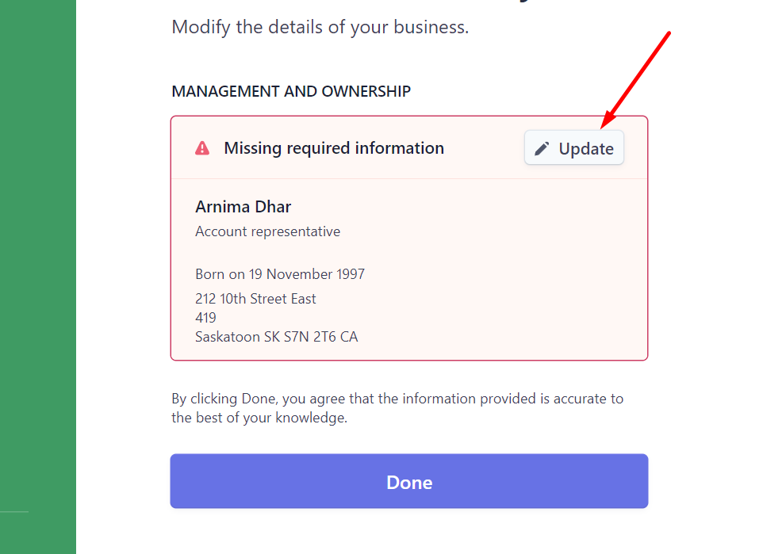
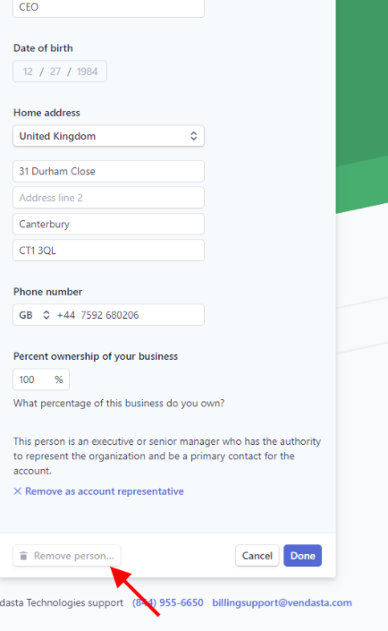

## What is Vendasta Payments Setup?

Vendasta Payments setup enables you to configure payment processing for collecting payments from customers. This includes connecting existing Stripe accounts, configuring new Vendasta Payments processing, and managing account settings for secure transaction handling.

## Why is Vendasta Payments Setup important?

Proper Vendasta Payments setup ensures secure, reliable payment collection while maintaining compliance with financial regulations. It streamlines your billing process and provides customers with trusted payment options.

## What's Included with Vendasta Payments Setup?

### Account Configuration Options
- **New Vendasta Payments account**: Create a new Vendasta Payments processing account
- **Stripe account connection**: Connect your existing Stripe Standard account
- **Account verification**: Complete identity verification requirements
- **Banking setup**: Configure payout destinations and financial details

### Supported Payment Methods
- Credit and debit cards (Visa, Mastercard, American Express, Discover)
- ACH transfers
- Pre-Authorized Debits (PADs)

### Regional Availability
Vendasta Payments is available in:
- USA, Canada, New Zealand, Australia, United Kingdom, Czech Republic
- Additional countries with sales assistance: UAE, Germany, Belgium, Netherlands, Poland, Switzerland

## How to Set Up Vendasta Payments

### Standard Vendasta Payments Account Setup
1. Navigate to `Administration` > `Vendasta Payments`
2. Complete the account application with business information
3. Provide required documentation for verification
4. Configure banking details for payouts
5. Wait for account approval (typically 1-2 business days)

:::warning
Vendasta Payments is not available for Free or Trial subscription tiers. This restriction applies to new users and current non-users on these tiers due to fraud prevention measures.
:::

### Connect Your Existing Stripe Account

If you already use Stripe Standard for payment processing:

#### Requirements
- Active Stripe Standard account in good standing
- Billing currency supported by the platform
- No previous transactions using platform-generated payment accounts

#### Connection Process
1. Go to `Administration` > `Vendasta Payments`
2. Select `Connect Stripe Account`
3. Choose your Stripe account from the authentication flow
4. Review and accept connection terms
5. Complete the integration process

## Managing Account Information

### Update Ownership Information
To replace ownership details in your payment account:

1. Navigate to `Administration` > `Vendasta Payments`
2. In the `Accepting Payments` section, click `Manage Account`
3. On the Identity Verification page, click `Update` beside the current owner
4. Complete the new owner information form
5. Remove the previous owner by clicking `Remove Person` > `Done`

### Update Invoice Address
To change the address appearing on customer invoices:

1. Go to `Administration` > `My Billing`
2. Click on `Billing Contact`
3. Update the address information as needed
4. Save changes

Updated addresses will appear on all future customer invoices.

## Troubleshooting Setup Issues

### "Unsupported in Your Area" Error
If you see this message despite being in a supported region:

1. Navigate to `Administration` > `My Billing`
2. Check that your billing contact information is complete
3. Ensure your billing address is fully filled out with postal code
4. Save any missing information and retry setup

Missing billing address information prevents Vendasta Payments activation even in supported regions.

### No Setup Option Available
If you don't see Vendasta Payments setup options, this typically indicates:
- Your account is on a Free or Trial tier (upgrade required)
- You're in an unsupported geographic region
- Your account has restrictions that prevent Vendasta Payments

## Common Questions About Vendasta Payments Setup

What are the fees for connecting my own Stripe account?

You'll pay a 0.75% platform fee in addition to your existing negotiated Stripe fees. Your current Stripe rates remain unchanged.

Can I transfer customer payment details from my existing Stripe account?

Currently, automatic transfer of customer payment information is not available. You'll need to manually input payment details into the platform.

Will I be able to view payments after connecting my Stripe account?

Yes, you can view payment details processed through the platform. However, payout information must be accessed directly in your Stripe account.

Can I add my own Stripe account if I'm already using a platform account?

This feature is currently only available for new users who haven't completed transactions with platform-generated accounts.

Why is Vendasta Payments unavailable on Free and Trial tiers?

Due to increased fraudulent transactions, Vendasta Payments is restricted on Free and Trial tiers. Existing users on these tiers who already use the service retain access.

