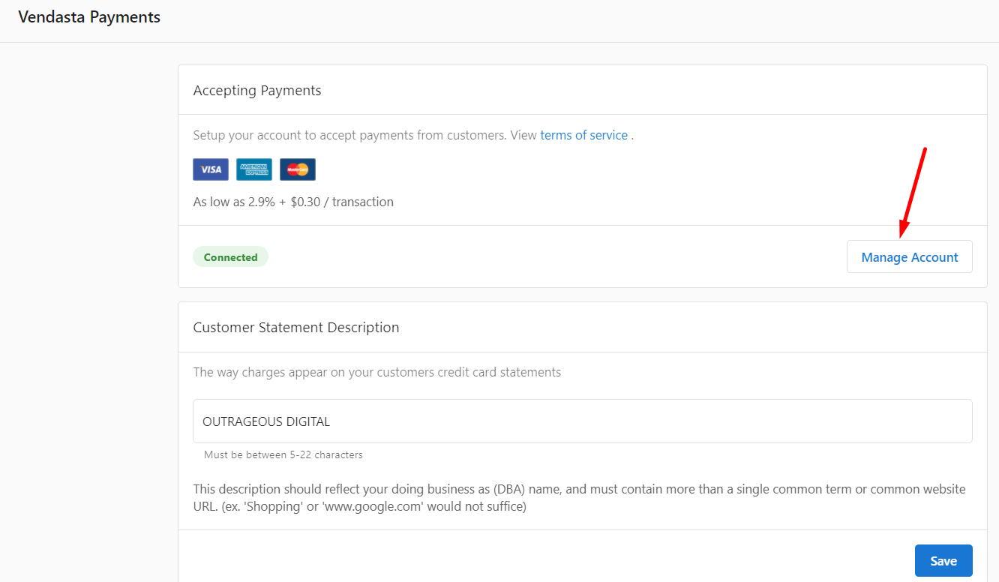
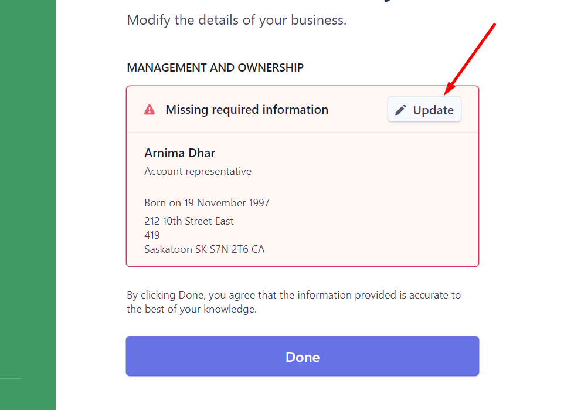
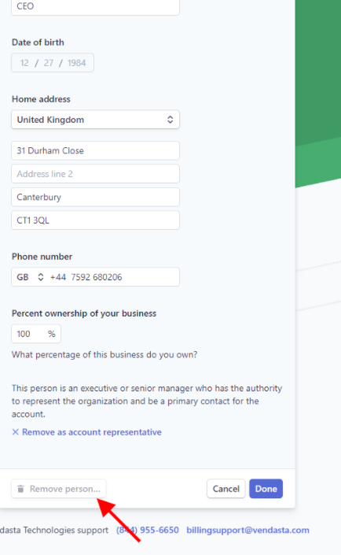

Go to **Partner Center > Administration > Vendasta Payments.**

## Step 1
In the **Accepting Payments** block, click on **Manage Account.**

## Step 2
On the **Identity Verification by Stripe** page, click on **Update** beside the owner.

## Step 3
Scroll to the bottom of the form and click **Remove Person > Done.**

