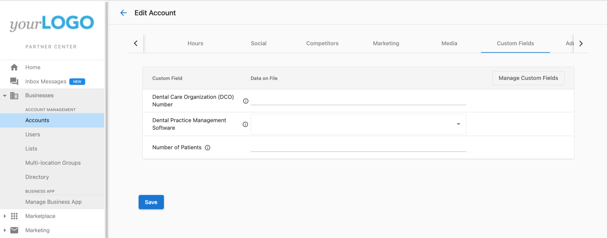
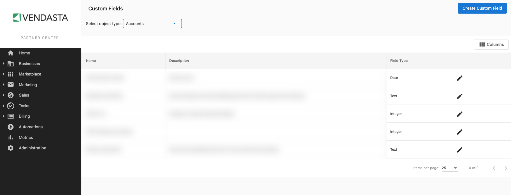
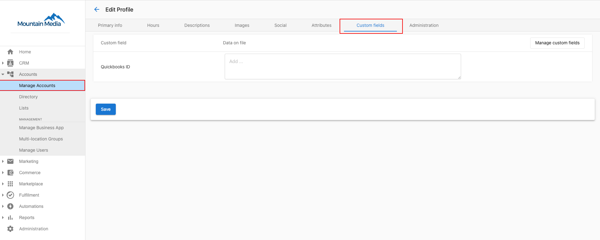

# CRM Objects

CRM objects and custom fields let you store and use business-specific data on accounts, users, orders, and products. Define fields once, then use them to segment marketing, automate sales, and manage data via imports or the API.

## What are custom fields?

<iframe src="//fast.wistia.com/embed/iframe/3vkidhas6i" width="560" height="315" frameborder="0" allowfullscreen=""></iframe>

Custom fields let you create unique fields for the information that matters to you on accounts, users, orders, and products. You can then segment and personalize marketing, automate sales processes, and fulfill work with less effort.

## Why custom fields matter

Different businesses need different data. Custom fields let you define only what you use day to day. For example:

- Send a "starter" campaign to dental offices with fewer than 100 patients and an "established" campaign to those with more
- Store a user's favorite football team for sales icebreakers
- Automatically assign a salesperson or team to an account based on estimated revenue

## How custom fields work

**Define fields first**

Before you can store data, define the field in `Partner Center` → `Administration` → `Custom Fields`. Choose which object type the data belongs to (account, user, order, or product). For example, "number of hotel rooms" fits on an account, not on individual users.

After you click **Create Custom Field**, enter a **Name** and **Field Type**. Field type determines what values can be stored and how the field can be filtered and sorted in automations.

## Field types

| Field type | Example names | Example values | Automation filter types |
| --- | --- | --- | --- |
| Text | favorite dog breed, last event type, first content download | golden retriever, basketball, rule book | Is any value, Is missing, Contains, Does not contain, Is one of, Is not one of |
| Integer | number of employees, customer touchpoint score, number of locations | 4, -2, 100 | Less than or equal to, Equals, Greater than |
| Date | birthday, best single-day sales date, manually remove-by | Aug 13, 1991, Feb 14, 2022, Mar 22, 2233 | After, Before |
| Dropdown | service level, initially purchased package, call priority | Silver, Gold, Platinum | Is, Is not |
| Currency | preferred monthly budget, average revenue per customer, external spend | USD 1000, CAD 10.50, THB 50000 | Less than or equal to, Greater than |

## Entering custom data

You can fill custom fields:

- In bulk by importing an account list
- Via Vendasta's public API
- By editing records manually where the fields appear

## Account fields vs. company fields: sync behavior

Custom fields can be created for different object types. When working with **accounts** and **companies**, sync behavior differs in an important way:

- **Account fields** sync bidirectionally with linked company records — updates on the account appear on the company, and vice versa.
- **Company fields** do not sync down to accounts — data entered on a company's custom fields will not appear on linked account records.

If you need data to flow between accounts and companies, define the field as an **account** field.

### Archive a duplicate field

If you have created duplicate custom fields, archive the extras to keep your field list clean:

1. Go to `Partner Center` → `Administration` → `Custom Fields`
2. Select **Account** from the tabs at the top
3. Search for the duplicate field
4. Click **⋮** next to the field name
5. Select **Archive**

Archived fields are hidden from new records but their data is retained.

## Organize how fields appear on records

Creating a field controls what you can store. A **field layout** controls where it shows up. Group related fields into named sections, reorder them, choose how ungrouped fields are sorted, and hide fields you don't use without deleting their data.

To edit a layout, go to `Partner Center` → `Administration` → `Custom Fields`, select an object, and click **Organize layout**.

See [Field layouts](./field-layouts.mdx) for the full guide.

## Frequently asked questions

Can custom fields created in Partner Center be used in Business App?

No. Custom fields created in Partner Center are for use in Partner Center only. To have custom fields on accounts in Business App, create them in `Business App` → `Administration` → `CRM Objects` for each account.

Is there a character limit for the field description?

Yes. The limit is 4000 characters.

Why don't my company-level custom fields appear on accounts?

Company fields and account fields sync differently. Company fields do not sync down to account records. If you need data to appear on both the account and the company, create the field as an **account** field — account fields sync bidirectionally with linked companies.

