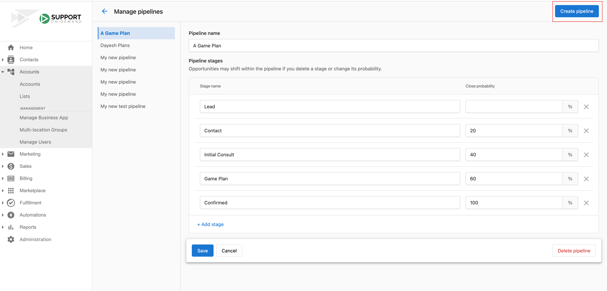

Sales pipelines let you track opportunity progression and revenue forecasts. Use the default four-stage pipeline or create custom pipelines with your own stages and forecast percentages.

## Default pipeline

The default pipeline has four stages: **Lead**, **Contact**, **Qualified**, and **Proposal**, with forecast percentages of 0%, 20%, 40%, and 60% respectively. Revenue forecasts are based on the probability you set for each stage. If the default doesn't fit your business, you can create custom pipelines and define your own stages and percentages.

## Pipeline management

- **Create pipelines** – Set up new sales and workflow pipelines
- **Pipeline stages** – Configure stages and progression rules
- **Pipeline automation** – Set up automated actions and triggers
- **Pipeline analytics** – Track performance and conversion rates across stages
- **Pipeline templates** – Use and create reusable templates

## How to create a pipeline

1. Go to `Partner Center` → `Administration`, then click `Pipelines`.

   

2. Edit the existing pipeline or click `Create pipeline` to add a new one. Stages appear in your pipeline in the order of the probability of success you assign them.

   

## Frequently asked questions

Can I enter the same value for multiple pipeline stages?

No. Each pipeline stage must have a unique numerical value for close probability. If you enter the same value for multiple stages, the system will show an error.

