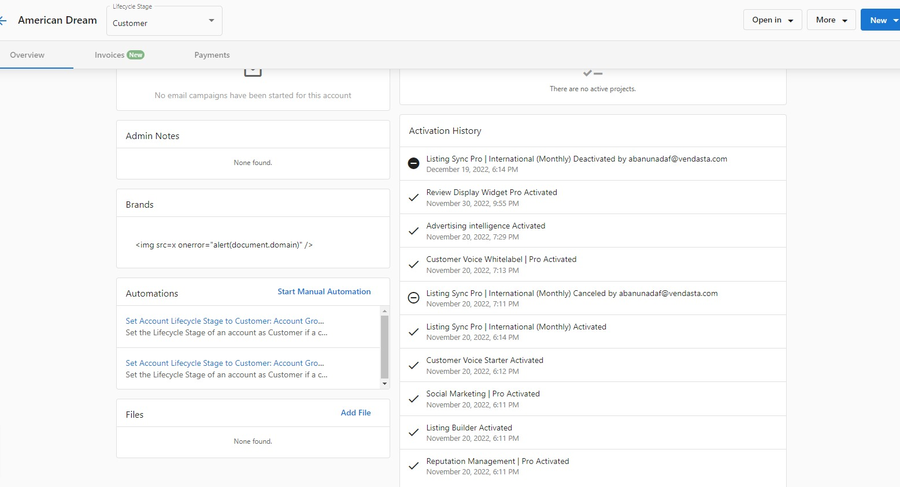

## What is Vendasta's Billing Model?

Vendasta's billing model gives you the freedom to activate and cancel products at any time of the month, and still get your money's worth. When you activate a product for an account (except for "one-time" products), that product will be scheduled to renew automatically based on its billing frequency (i.e., monthly or yearly).

If you cancel a product before its renewal date, that product will continue to remain active until the next renewal date, at which time it will deactivate automatically.

## Why is Understanding the Billing Model Important?

Understanding how Vendasta's billing works helps you:
- Manage client subscriptions effectively
- Predict and control your monthly costs
- Make informed decisions about product activations and cancellations
- Optimize your billing strategy based on your business needs

## What You Can Do with Billing in Partner Center

Each of the following options can be accessed from **Partner Center > Administration > My Billing**:

| Feature | Description |
|---------|-------------|
| **Billing Contact** | Set your company's information as it appears on invoices, including company name, business address, and contact |
| **Payment Method** | Change your payment method, add additional payment methods, or remove saved ones. We accept Visa, Mastercard, and Amex |
| **Billing Metrics** | View breakdown of how markets and products are performing for the month |
| **Estimated Usage** | See how much you'll pay at the end of the month based on currently active products |
| **Active Subscriptions** | View which products are part of the current billing cycle |

## How to Set Up Your Billing

### Understanding Billing Types

There are two billing strategies available to Vendasta Partners:

#### Instant Billed Partners (Default)
- All new Partners follow this strategy by default
- All new activations and renewals are "Prepaid" by your entered payment method
- Successful payment at the time of activation (or renewal) covers the product or service period until the next renewal date (monthly or annually)

#### Invoiced Partners
- Available to legacy Partners and large Enterprises who meet specific requirements
- All activations and renewals are reconciled into a monthly invoice
- Invoices are typically sent in the first few days following the closed month
- Most post-pay Partners have NET10 payment terms (10 days from invoice date to make payment)
- Payment options include credit card, ACH transfer, or mailed cheque

### How the Billing Model Works

**Example:**
If you activate Reputation AI for an account on June 24th, you get charged instantly and it will be scheduled to renew on July 24th.

If you cancel Reputation AI before its renewal date of July 24th, it will remain active until July 24th, and deactivate automatically.

If you don't cancel Reputation AI before its renewal date of July 24th, it will automatically renew, it will be scheduled to renew again automatically on August 24th, and we'll charge you for that one month of access upon renewal.

### How to Find Renewal Dates

When you activate a product, you will see the renewal date at that time. You can also find the renewal date for a product on the **Account Details** page within Partner Center.

### How to Cancel a Product

To cancel a product for an account:

1. Go to **Partner Center > Accounts > Manage Accounts**
2. Select an account
3. Click the three dots beside a product and select **Cancel Product**

### How to Find Deactivation Dates

When you cancel a product, you will see the deactivation date at that time. You can also find the deactivation date on the **Activation History** page on the account page:

### How to Undo a Cancellation

To undo the cancellation of a product before the deactivation date:

1. Go to **Partner Center > Accounts > Manage Accounts**
2. Select an account
3. Click the three dots beside the product and select **Undo Cancellation**

## Billing Metrics

On the **Metrics** tab, you can view a breakdown of how the markets and products you're selling are performing for the month. This is useful for analyzing which products are your best performers.

This screen is broken down as follows:

- **Market** - The market the product is assigned to (only available when the **Group by market** option is selected)
- **Product** - The product the row pertains to
- **Churn** - The percentage of accounts that have had the product deactivated that month
- **Retention** - The percentage of accounts that have retained their subscription to that product since the previous month
- **Starting Balance** - The number of accounts that had the product active at the start of the month
- **Activations** - The number of new activations of the product since the start of the month
- **Total Billable** - The sum of the starting balance and activations that month
- **Deactivations** - The number of subscriptions for the product that have expired or been canceled

## Estimated Usage

The **Estimated Usage** tab breaks down how much you'll pay at the end of the month based on the products currently active. Keep in mind that this estimate does not include any charges that pertain to managed services.

### Exporting Estimated Usage

Yes, you can export estimated usage data!

In Partner Center, navigate to **Administration > My Billing**, click on the **Estimated Usage** tab, then click on the current month highlighted in blue to download a CSV of product usage in the current month.

:::tip Important Notes
- This only shows active products and costs, not estimated usage within products
- Estimated usage view and estimated usage CSV downloads are different in values
- Estimated usage view in Partner Center displays the monthly estimated cost for the partner whereas the CSV download only counts up to the current date (download date) consumption
:::

## Active Subscriptions

The **Active Subscriptions** tab shows you which products are part of the current billing cycle. It allows you to easily see which products were active on an account during the month, as well as when those products will expire (if they are set to).

### By Account

Under the heading 'By Account' you can see the number of currently activated paid or free products under each Account as well as the monthly renewal total for that account. Clicking on an account will allow you to see the breakdown by product and which day of the month any given product is set to renew.

### By Purchase

When you activate a product for an account (except for "one-time" products), that product will be scheduled to renew automatically based on its billing frequency (i.e., monthly or yearly).

If you cancel a product before its renewal date, that product will continue to remain active until that date, at which time it will deactivate automatically.

At the beginning of each calendar month, we'll invoice you for all of the products that were activated or had automatically renewed in the previous calendar month.

## FAQs

What payment methods are accepted?

A credit card is required on file for all partners. We currently accept Visa, Mastercard, and Amex. For further concerns, feel free to direct them to billingsupport@vendasta.com.

How will I be invoiced?

Billing reports for the previous month are generated on the 1st of the month. Invoices are then sent to you by the 10th of the month.

The monthly invoice contains the following:
- One-time Snapshot Reports at $2 each
- Software and service fees for activated products (monthly, yearly, and one-time)
- Monthly and one-time Digital Ad campaign fees, if applicable
- Digital Advertising fees are pre-charged prior to any work beginning

To get a mid-month estimate on your upcoming invoice, check **Partner Center > Administration > Billing > Estimated Usage**. Need to double-check your cost of goods and services? Swing over to **Pricing** on the Administration page.

:::tip Pro Tip
Digital Agency is billed on a single line item and all markets are invoiced together by default. If you require a deeper accounting breakdown, please contact your Account Representative to discuss your options further.
:::

Please note that when activating products billed monthly, you will receive a full month of service even if you cancel. Because of this, we do not prorate pricing.

Will I be automatically charged?

Yes. Each month, we will send your agency invoice(s) that include your subscription and any active products and services. We will then charge the credit card on file.

If you have a dispute with your current invoice, please contact billingsupport@vendasta.com prior to the Due Date in the top-right corner.

What currency do you bill in?

Our prices reflect USD. If you're an agency outside of the U.S. and have questions about our pricing, please contact us.

Are there any separate email-sending fees?

Not at all! With Vendasta, you can send an unlimited amount of emails on campaigns at no charge. However, you can supercharge your prospecting efforts with Snapshot Report, which costs $2/account.

How will my first invoice be processed?

Your onboarding fee, if applicable, will be charged immediately.

Monthly invoices will be emailed around the **1st** of the month:
- Subscription is billed for the **current** month
- (For Invoiced partners, software fees are charged for the **previous** month)

**Important:** Your first invoice will also have a prorated subscription fee for your signing month plus a full subscription for the following month.

Is the wholesale cost of products charged on a per-client basis?

Our products are charged on a per-account basis, not per user. For example, you can activate Reputation AI once for the business *Joe's Flowers*, but grant unlimited access to everyone who works for Joe.

What if my product activation fails, will I still be charged?

The wholesale billing for instant billed partners happens when the product activation is initiated. In the event that your product activation fails, either due to an activation error or a billing error, the system will automatically trigger a refund for the product activation in question.

For monthly billed, or invoiced partners, the failed product activation will not be calculated on your monthly invoice.

