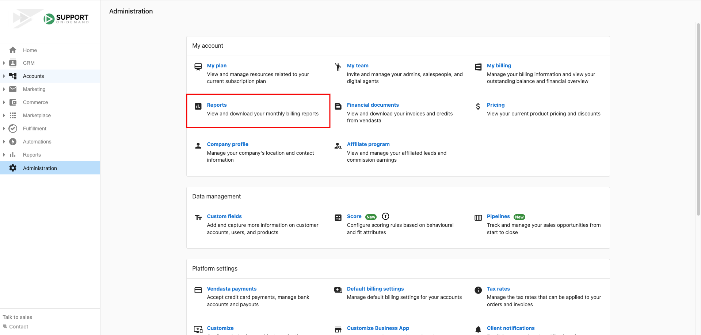
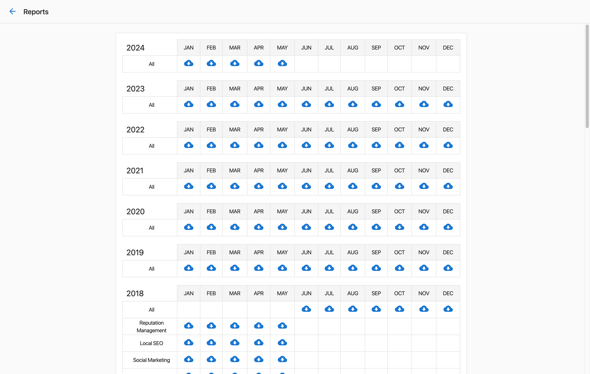
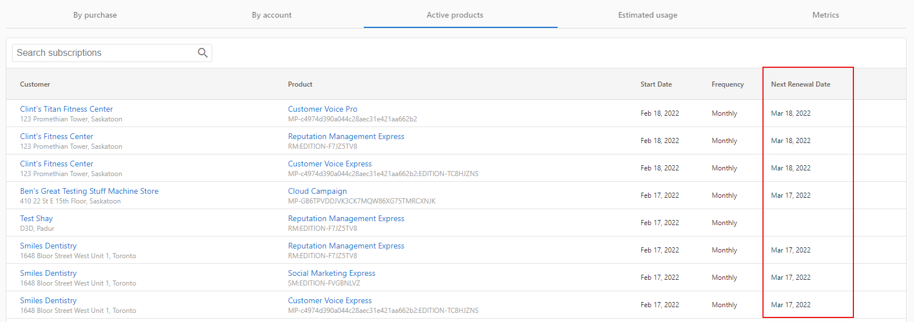

## What are Billing Reports and Data?

Billing reports and data in Partner Center provide comprehensive insights into your billing history, upcoming charges, and detailed breakdowns of your account activity. You can view current billing information, access historical reports, and export data for analysis.

## Why are Billing Reports Important?

Billing reports help you:
- Track your spending and subscription costs
- Plan for upcoming expenses
- Analyze product performance and usage
- Maintain accurate financial records
- Access tax information for compliance

## What You Can Do with Billing Reports

| Feature | Description |
|---------|-------------|
| **View Billing Reports** | Access historical billing data and tax information |
| **Check Upcoming Charges** | See what you'll be billed for in the next cycle |
| **Export CSV Data** | Download detailed billing data for analysis |
| **Monitor Active Products** | Track renewal dates and subscription status |

## How to Access Billing Reports

### Finding Your Billing Reports

You can find your Billing Reports in **Partner Center > Administration > Reports**.

:::note Tax Information
You can also find the sales tax collected reporting in this same location.
:::

### Exporting Billing Data as CSV

Partner Center admins who have access to Billing Reports can download billing data from Partner Center.

#### How to Download CSV Reports

1. Go to **Administration > Reports**
2. Click on  beneath the month you want the report for

#### What's Included in CSV Reports

The resulting spreadsheet will include:
- Business details such as company name, address, and phone number
- Market name  
- Product name
- Activation date
- Expiry date

## How to View Upcoming Billing Charges

### Locating Upcoming Charges

You can easily locate upcoming charges by following these steps:

1. Navigate to **Partner Center > Administration > Click on My Billing**
2. Under the **Active Products** tab, you'll see a list of all active apps and services along with a column showing the **Next Renewal date**

### Video Walkthrough

<iframe 
  src="https://drive.google.com/file/d/1zvrpVHOGw78wZVtj514SAh_0G2Y0ZXE9/preview" 
  width="100%" 
  height="480" 
  allowFullScreen
></iframe>

## Understanding Your Billing Data

### Active Products Overview

The Active Products section shows:
- All currently active applications and services
- Monthly renewal amounts for each product
- Next renewal dates for subscription planning
- Product status and billing frequency

### Historical Billing Information

Your billing reports contain:
- Monthly invoices and charges
- Product activation and deactivation history
- Tax information and compliance data
- Detailed breakdowns by account and product

## Billing Data Export Options

### CSV Export Benefits

Exporting billing data as CSV allows you to:
- Import data into accounting software
- Create custom reports and analysis
- Track spending trends over time
- Maintain detailed financial records
- Share billing information with stakeholders

### Export File Contents

Each exported CSV file includes comprehensive billing details organized by:
- Business account information
- Product and service details
- Billing dates and amounts
- Market and territory information

## FAQs

Where can I find my billing reports?

You can find your Billing Reports in **Partner Center > Administration > Reports**. This section also includes sales tax collected reporting.

How do I see what I'll be charged next month?

Navigate to **Partner Center > Administration > My Billing** and click on the **Active Products** tab. This will show all active apps and services with their next renewal dates and amounts.

Can I export my billing data?

Yes! Partner Center admins with access to Billing Reports can download CSV files by going to **Administration > Reports** and clicking the export icon beneath the month you want to download.

What information is included in the CSV export?

The CSV export includes business details (company name, address, phone), market name, product name, activation date, and expiry date for each billing item.

How often are billing reports updated?

Billing reports are generated monthly. Current month activity is reflected in the Active Products tab, while historical data is available in the Reports section.

Can I access tax information in my billing reports?

Yes, sales tax collected reporting is available in the same location as your billing reports under **Partner Center > Administration > Reports**.

How far back can I access billing reports?

Historical billing reports are maintained in your Partner Center account. The exact retention period may vary, but you can access reports for previous months through the Reports section.

Who can access billing reports and export data?

Only Partner Center admins who have access to Billing Reports can view and download billing data. Check with your account administrator if you need access to these features.

