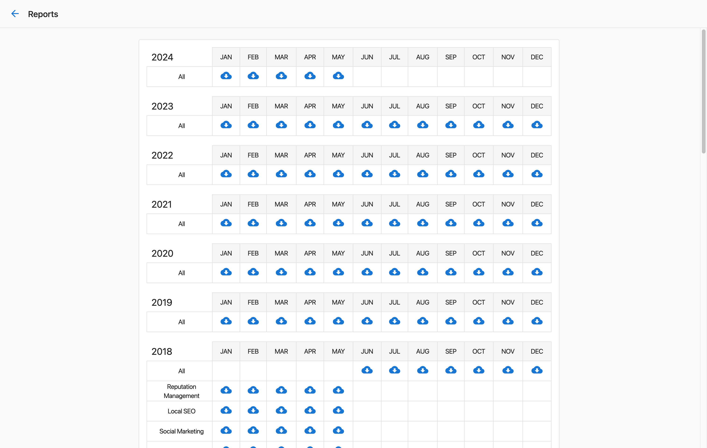

# Export billing data as a CSV spreadsheet

Partner Center admins who has access to Billing Reports can download billing data from Partner Center.

To download a CSV, go to **Administration > Reports** > click on  beneath the month you want the report for. The resulting spreadsheet will include:

- Business details such as company name, address, and phone number
- Market name
- Product name
- Activation date
- Expiry date

