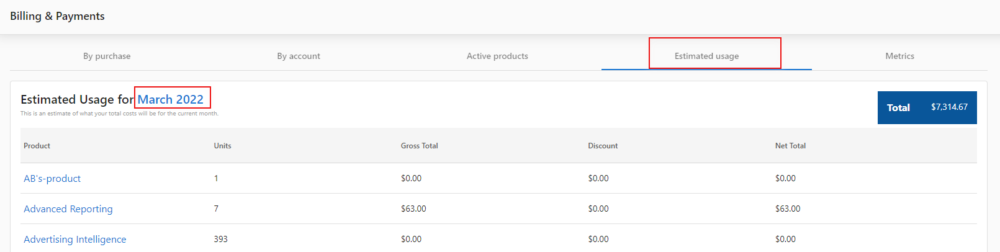

Each of the following options can be accessed from **Partner Center > Administration > My Billing**.

## Billing Contact

The **Billing Contact** button allows you to set your company's information as it will appear on invoices. This includes company name, business address, and contact.

## Payment Method

The **Payment Method Edit** button will allow you to change your payment method. You can add additional payment methods as well as remove any that are currently saved. We currently accept Visa, Mastercard, and Amex.

## Billing Metrics

On the **Metrics** tab, you can view a breakdown of how the markets and products you're selling are performing for the month. This is useful for analyzing which products are your best performers, allowing you to ramp up attention to those that are doing best, or to focus on improving products that aren't performing as well as expected.

This screen is broken down as follows:

- **Market** - The market the product is assigned to. This is only available when the **Group by market** option is selected.
- **Product** - The product the row pertains to.
- **Churn** - The percentage of accounts that have had the product deactivated that month.
- **Retention** - The percentage of accounts that have retained their subscription to that product since the previous month.
- **Starting Balance** - The number of accounts that had the product active at the start of the month
- **Activations** - The number of new activations of the product since the start of the month.
- **Total Billable** - The sum of the starting balance and activations that month.
- **Deactivations** - The number of subscriptions for the product that have expired or been canceled.

## Estimated Usage

The **Estimated Usage** tab breaks down how much you'll pay at the end of the month based on the products currently active. Keep in mind that this estimate does not include any charges that pertain to managed services.

**Can I export the estimated usage?**

Yes, you can!

In Partner Center, navigate to **Administration > My Billing**, click on the **Estimated Usage** tab, then click on the current month highlighted in blue to download a CSV of product usage in the current month.

- This only shows active products and costs, not estimated usage within products.
- Estimated usage view and estimated usage CSV downloads are different in values.
- Estimated usage view in Partner Center displays the monthly estimated cost for the partner whereas the CSV download only counts up to the current date (download date) consumption.

## Active Subscriptions

The **Active Subscriptions** tab is designed to show you which products are part of the current billing cycle. It allows you to easily see which products were active on an account during the month, as well as when those products will expire (if they are set to).

### By Account

Under the heading 'By Account' you can see the number of currently activated paid or free products under each Account as well as the monthly renewal total for that account. Clicking on an account will allow you to see the breakdown by product and which day of the month any given product is set to renew.

### By Purchase

When you activate a product for an account (except for "one-time" products), that product will be scheduled to renew automatically based on its billing frequency (i.e., monthly or yearly).

If you cancel a product before its renewal date, that product will continue to remain active until that date, at which time it will deactivate automatically.

At the beginning of each calendar month, we'll invoice you for all of the products that were activated or had automatically renewed in the previous calendar month.

### Example

If you activate Reputation Management for an account on June 24th, it will be scheduled to renew on July 24th, and we'll invoice you for that one month of access (i.e., June 24th to July 23rd) at the beginning of July.

If you cancel Reputation Management before its renewal date of July 24th, it will remain active until July 24th, but we won't invoice you at the beginning of August.

If you don't cancel Reputation Management before its renewal date of July 24th, it will automatically renew, it will be scheduled to renew again automatically on August 24th, and we'll invoice you for that one month of access (i.e., July 24th to August 23rd) at the beginning of August.

## FAQs

### Q: What payment methods are accepted?

A credit card is required on file for all partners. We currently accept Visa, Mastercard, and Amex. For further concerns, feel free to direct them to billingsupport@vendasta.com.

### Q: How will I be invoiced?

Billing reports for the previous month are generated on the 1st of the month. Invoices are then sent to you by the 10th of the month.

The monthly invoice contains the following:

- One-time Snapshot Reports at $2 each.
- Software and service fees for activated products (monthly, yearly, and one-time).
- Monthly and one-time Digital Ad campaign fees, if applicable.
- Digital Advertising fees are pre-charged prior to any work beginning.

To get a mid-month estimate on your upcoming invoice, check **Partner Center > Administration > Billing > Estimated Usage**. Need to double-check your cost of goods and services? Swing over to **Pricing** on the Administration page.

Pro Tip: Digital Agency is billed on a single line item and all markets are invoiced together by default. If you require a deeper accounting breakdown, please contact your Account Representative to discuss your options further.

Please note that when activating products billed monthly, you will receive a full month of service even if you cancel. Because of this, we do not prorate pricing.

### Q: Will I be automatically charged?

Yes. Each month, we will send your agency invoice(s) that include your subscription and any active products and services. We will then charge the credit card on file.

If you have a dispute with your current invoice, please contact billingsupport@vendasta.com prior to the Due Date in the top-right corner.

### Q: What currency do you bill in?

Our prices reflect USD. If you're an agency outside of the U.S. and have questions about our pricing, please contact us.

### Q: Are there any separate email-sending fees?

Not at all! With Vendasta, you can send an unlimited amount of emails on campaigns at no charge. However, you can supercharge your prospecting efforts with Snapshot Report, which costs $2/account.

### Q: How will my first invoice be processed?

Your onboarding fee, if applicable, will be charged immediately.

Monthly invoices will be emailed around the **1st** of the month:

- Subscription is billed for the **current** month
- (For Invoiced partners, software fees are charged for the **previous** month)

**Important:** Your first invoice will also have a prorated subscription fee for your signing month plus a full subscription for the following month.

### Q: Is the wholesale cost of products charged on a per-client basis?

Our products are charged on a per-account basis, not per user. For example, you can activate Reputation Management once for the business *Joe's Flowers*, but grant unlimited access to everyone who works for Joe.

### Q: What if my product activation fails, will I still be charged?

The wholesale billing for instant billed partners happens when the product activation is initiated. In the event that your product activation fails, either due to an activation error or a billing error, the system will automatically trigger a refund for the product activation in question.

For monthly billed, or invoiced partners, the failed product activation will not be calculated on your monthly invoice.