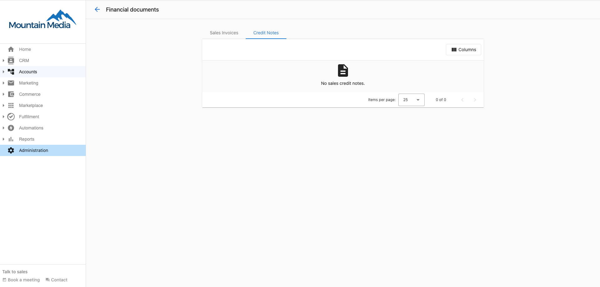

A Credit note is a receipt issued by Vendasta to a Partner who has canceled a product or service(s) and is offered 'credits' that can be used to offset future purchases.

Your credit note history can be found in **Partner Center > Administration > Financial Documents > Credit notes.**

