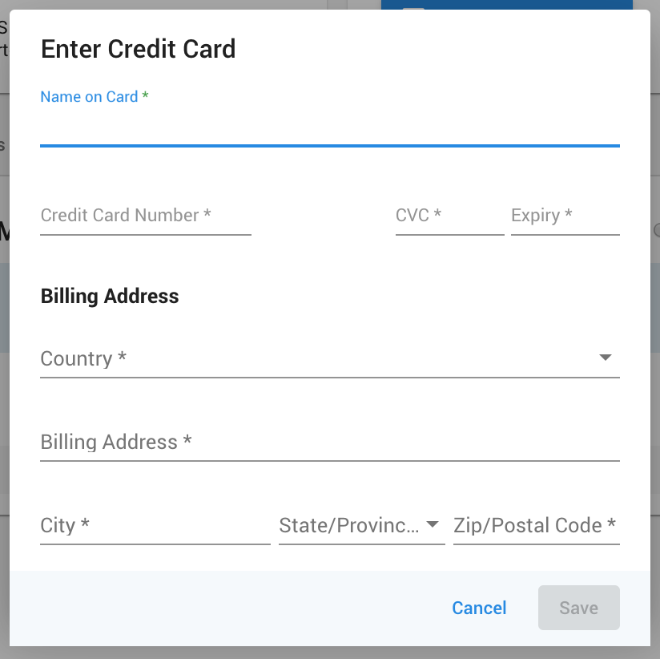
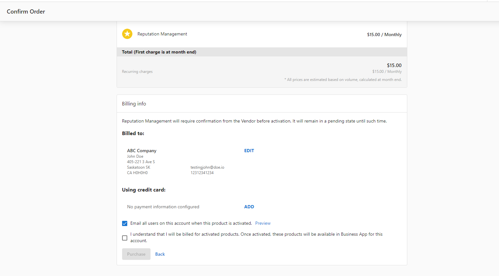
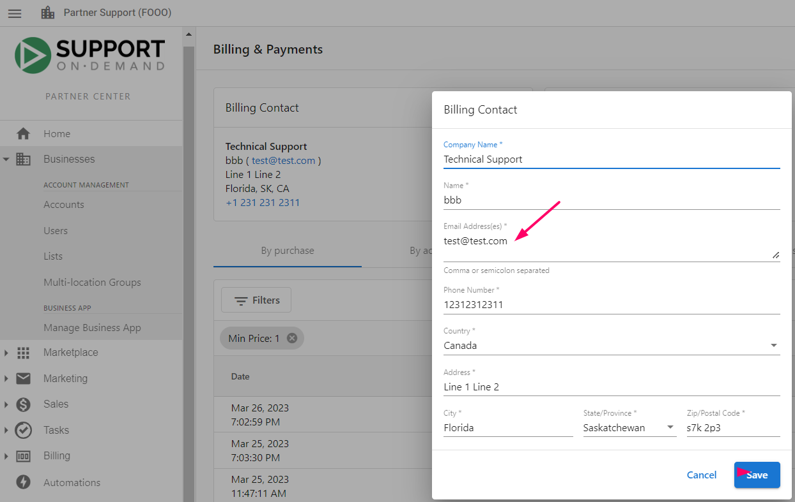

## What is Payment Methods and Billing Setup?

Payment methods and billing setup in Partner Center allows you to manage all aspects of your payment information and billing contacts. This includes adding credit cards, updating billing information, changing invoice email addresses, and retrying failed payments.

## Why is Managing Payment Methods Important?

Properly configured payment methods and billing information ensure:
- Uninterrupted service for your products and subscriptions
- Accurate billing and invoicing
- Proper communication regarding billing matters
- Quick resolution of payment issues

## What You Can Do with Payment Methods

| Action | Description |
|--------|-------------|
| **Add Payment Method** | Add your credit card information for making purchases |
| **Update Billing Information** | Modify your billing contact details and company information |
| **Change Invoice Email** | Update where invoices are sent |
| **Retry Failed Payments** | Manually retry payments that have failed |
| **Manage Payment Issues** | Resolve declined card issues and payment problems |

## How to Set Up Payment Methods

### Adding Your First Credit Card

In order to make purchases on the Vendasta platform, you are required to add your payment information to the platform.

To add your credit card to Partner Center:

1. Navigate to **Administration > My Billing > Add Payment Method**

### Adding Complete Billing Information

If you have not added your billing information, you can do so under **Partner Center > Administration > My Billing**.

#### Step 1: Add Billing Contact

1. From the My Billing page, select **Add Billing Contact**

2. Fill in the form, ensuring all fields with an asterisk (*) have been completed
3. Once done, hit **Save**

#### Step 2: Add Payment Method

1. After adding billing contact information, select **Add Payment Method**
2. This will show the payment method form:

3. Complete the form and select **Save**

:::note Card Declined Issues
If you receive a message saying the card has been declined, the likely cause is that your credit card company is blocking the transaction because it is an international payment. Please contact your credit card company and ask them to allow all transactions from Vendasta Technologies Inc.

:::

## How to Update Existing Information

### Updating Billing Information

Should you need to update your billing info after it's been entered:

1. Navigate to **Partner Center > Administration > My Billing**
2. Click **Edit** on the section you wish to update

:::tip
If you update your card when confirming an order in Partner Center it will also update the billing information in **My Billing**.
:::

### Changing Invoice Email Address

Updating the email address that we send invoices to is as easy as updating the Billing Contact information:

1. Go to **Partner Center > Administration > My Billing > Edit Billing contact**

## How to Manage Payment Issues

### Multiple Credit Cards

**Can multiple credit cards be added to Partner Center?**

No, there can only be **one credit card** added to Partner Center. You can add or edit your payment method by going to **Administration > My Billing > Add Payment Method**.

Any attempt to add a second card will overwrite the previous one.

### Retrying Failed Payments

**Can I retry a payment?**

Yes, you can retry a failed payment:

1. Go to **Partner Center > Administration > My billing**
2. Click on the three dots next to the purchase you wish to pay for
3. Select **retry**

:::note
The system takes some time to update the status to "Succeeded" if the payment succeeds.
:::

## Payment Method Requirements

### Accepted Payment Methods

- A credit card is required on file for all partners
- We currently accept Visa, Mastercard, and Amex
- For further concerns, contact billingsupport@vendasta.com

### International Payments

If your credit card company blocks international transactions:
- Contact your credit card company
- Ask them to allow all transactions from Vendasta Technologies Inc.
- This will resolve most card declined issues

## FAQs

Can I use multiple credit cards for different purchases?

No, Partner Center only supports one credit card at a time. Any new card you add will replace the previous one. However, you can update your payment method before making specific purchases if needed.

What happens if my payment fails?

If a payment fails, you'll receive a notification. You can manually retry the payment by going to **Partner Center > Administration > My billing**, clicking the three dots next to the failed purchase, and selecting **retry**.

How do I know if my billing information is complete?

Complete billing information includes both a billing contact (company information) and a payment method (credit card). Both sections must be filled out to make purchases and receive proper invoices.

Can I change my billing information after setting it up?

Yes, you can update your billing information at any time by going to **Partner Center > Administration > My Billing** and clicking **Edit** on the section you want to modify.

Why was my card declined?

The most common reason for card declines is that your credit card company is blocking international transactions. Contact your credit card company and ask them to allow transactions from Vendasta Technologies Inc.

How do I change where my invoices are sent?

To change your invoice email address, update your Billing Contact information by going to **Partner Center > Administration > My Billing > Edit Billing contact**.

