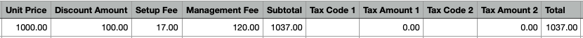
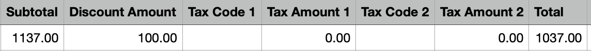

## What are Special Features and Credits?

Special features and credits in Partner Center include management fees visibility, credit notes for canceled services, and vCash virtual credits that can be applied to any Vendasta purchase. These features provide transparency in billing and flexible payment options.

## Why are These Features Important?

Understanding special billing features helps you:
- Track additional fees associated with products
- Manage credits from canceled services
- Apply virtual credits to reduce costs
- Maintain accurate financial records
- Optimize your spending with available credits

## What You Can Do with Special Features

| Feature | Description |
|---------|-------------|
| **Management Fees** | View additional fees associated with certain products |
| **Credit Notes** | Access credits from canceled products or services |
| **vCash Credits** | Use virtual credits for any Vendasta purchase |
| **Credit History** | Track all credits and fees over time |

## Management Fees

### What are Management Fees?

Management fees are charges that apply to certain Vendasta products. These fees appear as separate line items on your invoice, making it easier to identify the additional costs associated with specific products.

### How to View Management Fees

#### On Your Receipt

Management fees will appear as separate line items on your receipt:

#### In the "By Purchase" Tab

You can view management fees in the "By purchase" tab of your billing section:

#### In the "By Account" Tab

You can also see management fees in the "By account" tab, which organizes charges by business account:

### Downloading Management Fee Reports

To download a detailed CSV report that includes management fees:

1. Go to the "By purchase" tab
2. Click on the CSV download option

#### Understanding the CSV Report Format

The CSV report will show your management fees in the following format:

### Changes to Management Fee Display (October 2022)

In October 2022, we updated how management fees are displayed in your billing information.

#### Current Format (October 2022 and newer)

Management fees are now displayed separately from product charges, making it easier to identify these costs:

#### Previous Format (Before October 2022)

Prior to October 2022, management fees were combined with the product charges:

### PDF Invoices

Your monthly PDF invoice will also show management fees as separate line items:

## Partner Credit Notes

### What are Credit Notes?

A Credit note is a receipt issued by Vendasta to a Partner who has canceled a product or service(s) and is offered 'credits' that can be used to offset future purchases.

### How to Access Credit Notes

Your credit note history can be found in **Partner Center > Administration > Financial Documents > Credit notes**.

### Using Credit Notes

Credit notes represent:
- Refunds for canceled products or services
- Credits that can be applied to future purchases
- Adjustments to your account balance
- Documentation for financial record keeping

## vCash: Virtual Credits

### What is vCash?

**vCash** is virtual credit you can use for purchases in the Vendasta ecosystem. You can now use vCash on *any* purchase.

**Examples of what you can use vCash for:**
- Purchase of Reputation Management
- Your subscription fees
- Marketplace purchases
- Any purchase across the Vendasta system

[Click here to see full terms and conditions](http://vendasta.com/vcash-terms-and-conditions/).

### How to Check Your vCash Balance

If you have vCash, you can find your balance by browsing [Partner Center > Administration > My Billing > Billing & Payments](https://partners.vendasta.com/billing/by-purchase).

### How to Use vCash

When completing a purchase, you'll see the following notice if you have a vCash balance:

Your vCash balance will be automatically applied to the purchase. If you do not have enough to cover the entire purchase, the available vCash credit will be applied, and you will only be charged the remainder.

### vCash Application Rules

- vCash is automatically applied to eligible purchases
- If your vCash balance is less than the purchase amount, the remaining balance will be charged to your payment method
- vCash can be used for any product or service in the Vendasta ecosystem
- Credits are applied in the order they were issued

## Managing Credits and Fees

### Credit Tracking

All credits and fees are tracked in your Partner Center:
- Management fees appear as separate line items
- Credit notes are accessible through Financial Documents
- vCash balances are shown in your billing section
- Historical data is maintained for record keeping

### Financial Record Keeping

Use these features to:
- Track all additional costs and credits
- Maintain accurate financial records
- Apply available credits to reduce costs
- Monitor fee structures for different products

## FAQs

What are management fees and why do I see them?

Management fees are additional charges that apply to certain Vendasta products. They appear as separate line items on your invoice to provide transparency about the additional costs associated with specific products.

How do I access my credit notes?

Your credit note history can be found in **Partner Center > Administration > Financial Documents > Credit notes**. Credit notes are issued when you cancel products or services and receive credits for future use.

What is vCash and how do I use it?

vCash is virtual credit that can be used for any purchase in the Vendasta ecosystem. It's automatically applied to eligible purchases, and you can check your balance in **Partner Center > Administration > My Billing > Billing & Payments**.

Can I control when vCash is applied to purchases?

vCash is automatically applied to eligible purchases. If you have a vCash balance, it will be used first, and any remaining amount will be charged to your payment method.

How do I download reports that include management fees?

Go to the "By purchase" tab in your billing section and click the CSV download option. The resulting report will include management fees as separate line items.

When did the management fee display change?

In October 2022, we updated how management fees are displayed. They now appear as separate line items instead of being combined with product charges, making it easier to identify these costs.

Can I use vCash for subscription renewals?

Yes, vCash can be used for any purchase in the Vendasta ecosystem, including subscription renewals, new product purchases, and marketplace items.

Do credit notes expire?

Credit note terms may vary. Check your specific credit note details or contact support for information about expiration dates and usage terms.

