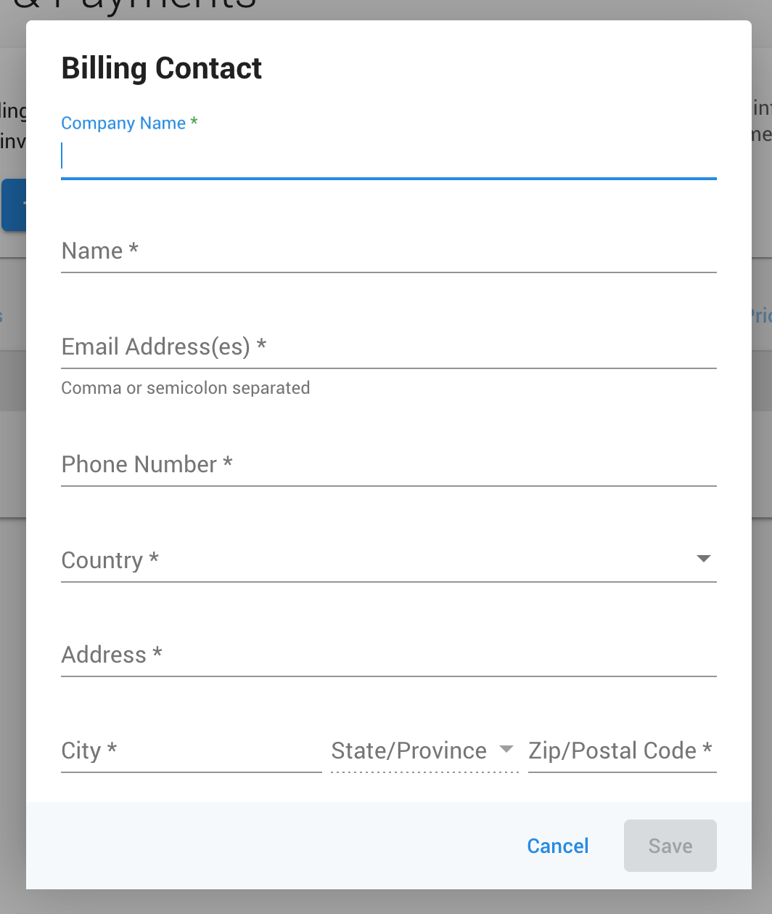
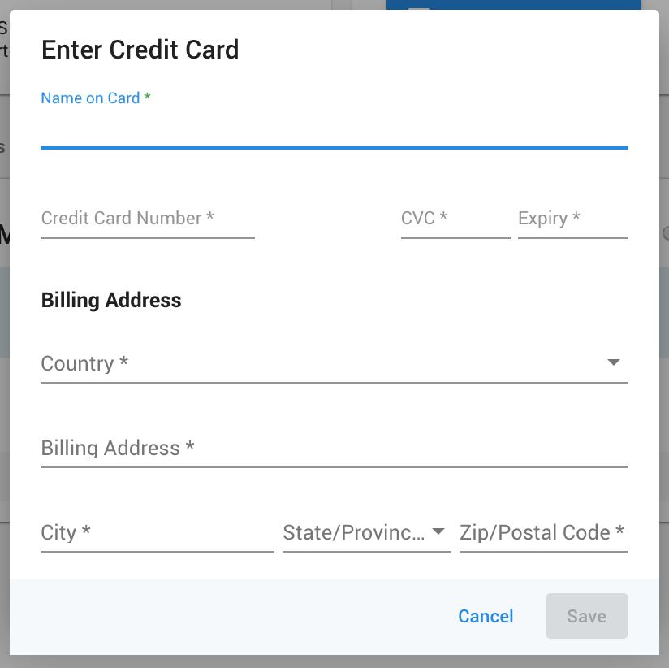
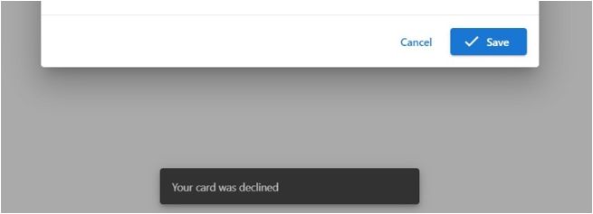
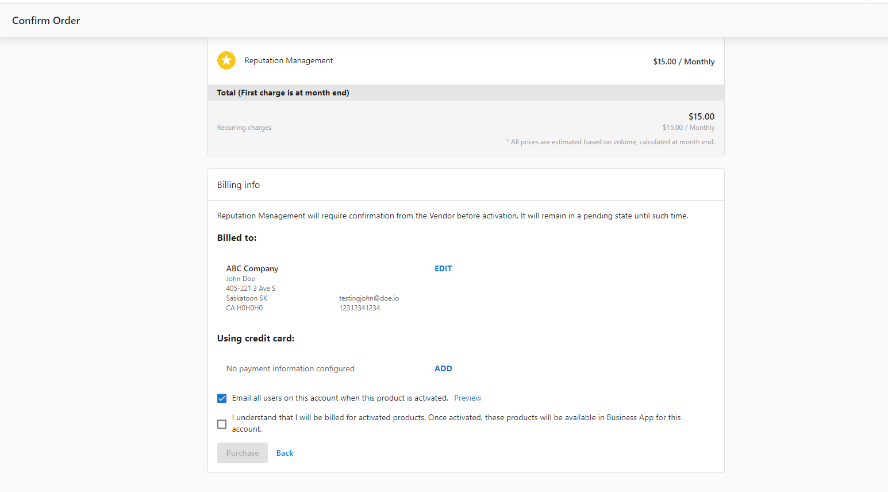

You can access your billing information by navigating to **Partner Center > Administration > My Billing**. Here, you can update your existing billing information, or add it if you have not already.

## Adding billing information

If you have not added your billing information, you can do so under **Partner Center > Administration > My Billing**. From here, select **Add Billing Contact**.

Fill in the form, ensuring all fields with an asterisk (*) have been completed. Once done, hit **Save**.

You will now be able to access the second card. Here, select **Add Payment Method**. This will show the following form:

Once complete, select **Save**.

:::note
If you receive a message saying the card has been declined, the likely cause is that your credit card company is blocking the transaction because it is an international payment. Please contact your credit card company and ask them to allow all transactions from Vendasta Technologies Inc.
:::

## Updating existing info

Should you need to update your billing info after it's been entered, you can do so by navigating back into **Partner Center > Administration > My Billing**. Here, click **Edit** on the section you wish to update.

If you update your card when confirming an order in Partner Center it will also update the billing information in **My Billing.**

