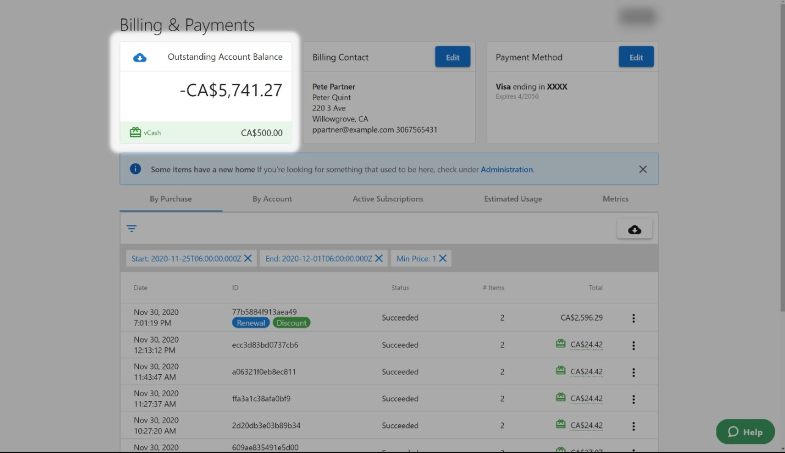
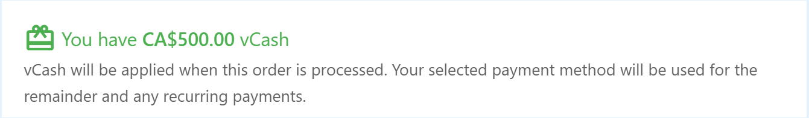

**vCash** is virtual credit you can use for purchases in the Vendasta ecosystem. And now, you can use vCash on *any* purchase.

- Want to use it toward that purchase of Reputation Management? *You've got it!*
- Want to use it toward your subscription? *Say no more.*
- Want to purchase something in the Marketplace or across the Vendasta system? *vCash is there for you.*

[Click here to see full terms and conditions](http://vendasta.com/vcash-terms-and-conditions/).

### **Where can I see my vCash balance?**

If you have vCash, you can find your balance by browsing [Partner Center > Administration > My Billing > Billing & Payments](https://partners.vendasta.com/billing/by-purchase).

### **How do I use vCash?**

When completing a purchase, you'll see the following notice if you have a vCash balance:

Your vCash balance will be automatically applied to the purchase. If you do not have enough to cover the entire purchase, the available vCash credit will be applied, and you will only be charged the remainder.