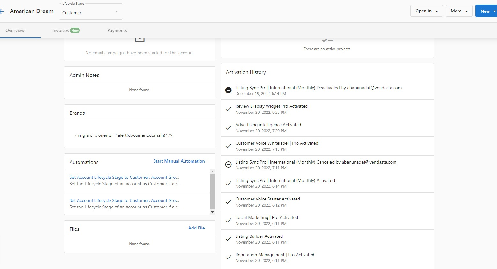

Vendasta's billing model gives you the freedom to activate and cancel products at any time of the month, and still get your money's worth.

## How the Billing model works

When you activate a product for an account (except for "one-time" products), that product will be scheduled to renew automatically based on its billing frequency (i.e., monthly or yearly).

If you cancel a product before its renewal date, that product will continue to remain active until the next renewal date, at which time it will deactivate automatically.

**Example:**

If you activate Reputation Management for an account on June 24th, you get charged instantly and it will be scheduled to renew on July 24th.

If you cancel Reputation Management before its renewal date of July 24th, it will remain active until July 24th, and deactivate automatically.

If you don't cancel Reputation Management before its renewal date of July 24th, it will automatically renew, it will be scheduled to renew again automatically on August 24th, and we'll charge you for that one month of access upon renewal.

## How to find the renewal date for a product

When you activate a product, you will see the renewal date at that time.

You can also find the renewal date for a product on the **Account Details** page within Partner Center.

{/* Note: The original image for renewal date couldn't be downloaded */}

## How to cancel a product for an account

Whenever a client churns, you'll need to shut down their products. Cancel the product, and that product will be automatically scheduled to deactivate on its renewal date, at which time the system will revoke that client's access and remove their data.

To cancel a product:

1. Go to **Partner Center > Accounts > Manage Accounts.**
2. Select an account.
3. Click the three dots beside a product and select **Cancel Product**.

## How to find the deactivation date for a product

When you cancel a product, you will see the deactivation date at that time.

You can also find the deactivation date on the **Activation History** page on the account page:

## How to undo a cancellation

To undo the cancellation of a product before the deactivation date:

1. Go to **Partner Center > Accounts > Manage Accounts.**
2. Select an account.
3. Click the three dots beside the product and select **Undo Cancellation**.