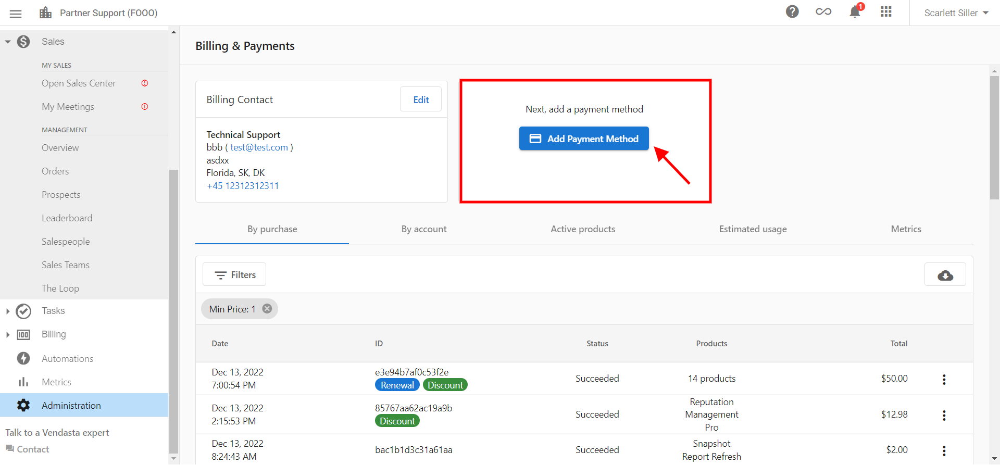

In order to make purchases on the Vendasta platform, you are required to add your payment information to the platform.

To add your credit card to Partner Center, navigate to **Administration** > **My Billing** > **Add Payment Method**.

