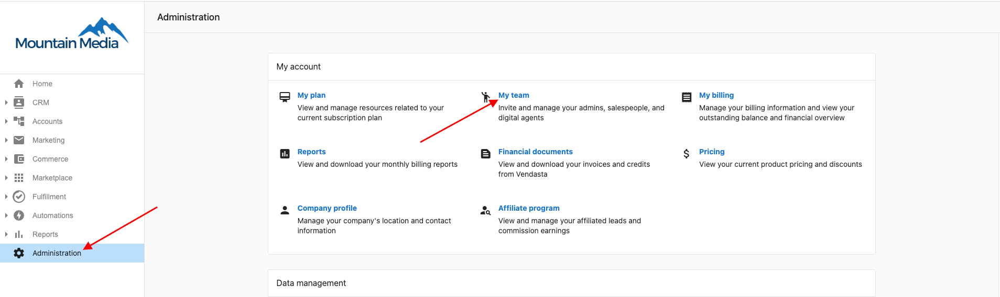
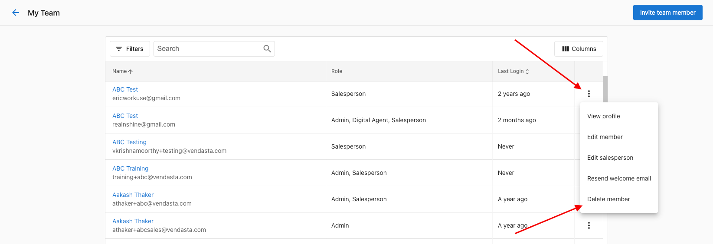
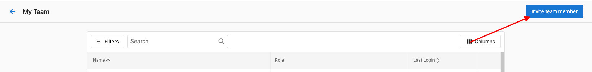

Currently, there is no option to update/edit an admin's email address in Partner Center. The best option is to create a new admin profile using the new desired email address and then delete the old admin profile if it's no longer needed.

Navigate to the **Administration tab > My Team** to create/delete an admin profile.

To delete a team member, click the three dots next to the team member's name, and select **Delete Member.**

To add a new team member, select **Invite Team Member** from the top right-hand corner of the screen.

