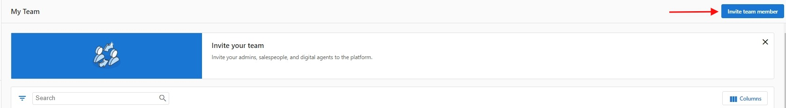

Partner Center Admins access the platform via [partners.vendasta.com](https://partners.vendasta.com). It's a best practice to add all of your agency's key decision-makers, managers, and fulfillment teams as Admins.

**Note:** Be sure to check how many Team Member seats your account has available, as you may be charged for additional seats if you go over your limit of free seats. 

:::note
You can restrict Admins from certain actions in Partner Center, such as creating additional Admins, accessing billing reports, customizing the platform, customizing the marketplace, and managing salespeople.
:::

[Skip to the walkthrough video](#walkthrough-video)

To create a Partner Center Admin:

1. Go to **Partner Center > Administration > [My Team](https://partners.vendasta.com/my-team)**.
2. Click **Invite Team Member** in the upper right corner of the screen. 
   :::note
   If you do not see the **Invite Team Member** button, you do not possess permission to create new Admins. Please contact a separate Admin at your organization with these permissions, or have them contact our Support On-Demand team.
   :::
   
   

3. Complete the Create Admin User form: 
   a. Enter the Admin's first name, last name, and email.
   b. Select the permissions you want to grant the Admin. [Learn more](https://support.vendasta.com/hc/en-us/articles/4414504562711-Partner-Center-Admin-Permissions-What-does-each-permission-do)
   c. Select which Markets the Admin should have access to.
4. Once you've confirmed that the information entered is correct, click **Send**.

Once a new Partner Center Admin is created, they will receive a Welcome Email at the email address you entered while creating the team member. The Welcome Email contains a link that allows the Admin to set their password and sign in to Partner Center.

## Walkthrough Video {#walkthrough-video}

<iframe src="https://drive.google.com/file/d/1P_aIclwB3EKyh_q6wZ8pi52tyl9J2W7m/preview" width="640" height="480" allowFullScreen></iframe>

  <a 
    style={{ 
      fontSize: '16px', 
      fontWeight: 'bold', 
      color: '#ffffff', 
      backgroundColor: '#33ace2', 
      textDecoration: 'none', 
      borderRadius: '5px', 
      padding: '10px 30px 9px 30px', 
      border: '1px solid #33ACE2', 
      display: 'inline-block', 
      textAlign: 'center' 
    }} 
    href="https://partners.vendasta.com/manage-admins" 
    target="_blank" 
    rel="noopener"
  >
    Create Admins
  </a>

