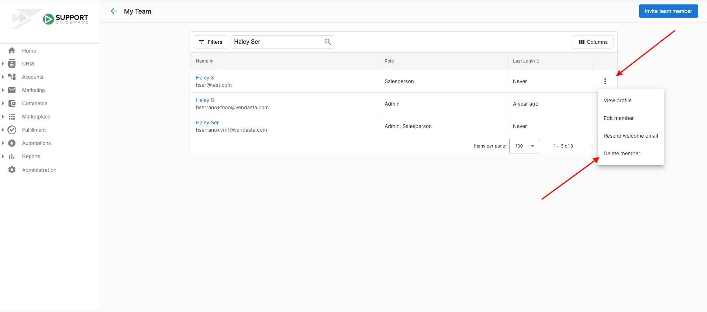

:::caution
Please note: Once an Admin is deleted, it cannot be restored.
:::

## Delete a Partner Center Admin

1. Go to **Partner Center** > **Administration** > **My Team**
2. Click the  icon next to the **Admin** you want to delete > Select **Delete member.**
3. Things to remember while deleting is if the member needs to be deleted or the Admin role needs to be deleted. If a member is not required to be an Admin anymore, then the Admin role can be denied but checking off the Admin role and NOT delete the member itself.

- It's not possible to delete the user you are currently logged in as.

  <a
    href="https://partners.vendasta.com/my-team"
    target="_blank"
    rel="noopener"
    style={{
      fontSize: '16px',
      fontWeight: 'bold',
      color: '#ffffff',
      backgroundColor: '#33ace2',
      textDecoration: 'none',
      borderRadius: '5px',
      padding: '10px 30px 9px 30px',
      border: '1px solid #33ACE2',
      display: 'inline-block',
      textAlign: 'center'
    }}
  >
    Delete an Admin
  </a>

