import Tabs from '@theme/Tabs';
import TabItem from '@theme/TabItem';

On the **My Team** page, you can see and manage your whole team at a glance, including Admins, Salespeople, and Digital Agents (Task Manager users).

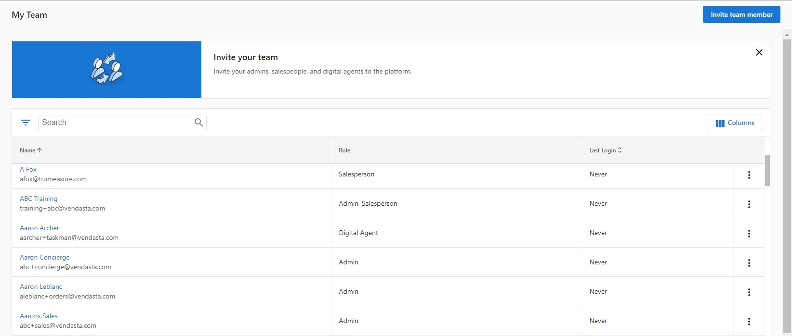

You can access the page from **Partner Center** > **Administration** > [**My Team**](https://partners.vendasta.com/my-team). On this page, you can see a list of your team members, along with their roles and last login date. 

## Creating Team Members

You can create different types of team members depending on their role: Partner Center Admins, Salespeople, or Digital Agents. Each role has different access levels and permissions.

### Create a Partner Center Admin

Partner Center Admins access the platform via [partners.vendasta.com](https://partners.vendasta.com). It's a best practice to give the majority of your internal team *some* level of admin access. 

:::note
You can restrict Admins from certain actions in Partner Center, such as creating additional Admins, accessing billing reports, customizing the platform, customizing the marketplace, and managing salespeople.
:::

To create a Partner Center Admin:

1. Go to **Partner Center > Administration > [My Team](https://partners.vendasta.com/my-team)**.
2. Click **Invite Team Member** in the upper right corner of the screen.
   :::note
   If you do not see the **Invite Team Member** button, you do not possess permission to create new Admins. Please contact a separate Admin at your organization with these permissions, or have them contact our support team.
   :::
   
   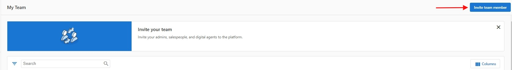

3. Complete the Create Admin User form:
   1. Enter the Admin's first name, last name, and email.
   2. Select the permissions you want to grant the Admin. 
   3. Select which Markets the Admin should have access to.
4. Once you've confirmed that the information entered is correct, click **Send**.

:::tip Learn more about permissions
Permissions let you get really granular with who has access to what in Partner Center. 
[Learn more about permissions](./permissions.mdx)
:::

Once a new Partner Center Admin is created, they will receive a Welcome Email at the email address you entered while creating the team member. The Welcome Email contains a link that allows the Admin to set their password and sign in to Partner Center.

### Create a Salesperson {#create-a-salesperson}

To create a Salesperson:

1. In Partner Center go to **Administration > My Team** > select **Invite Team Member** in the top right-hand corner of the screen.
2. Fill in the First Name, Last Name, and email address.
3. Select the **Salesperson** option under Role.
4. Then, select the **Market** you want the Salesperson to access.
5. Ensure that **Send Welcome Email to the user** has been checked.
6. Click **Send.**

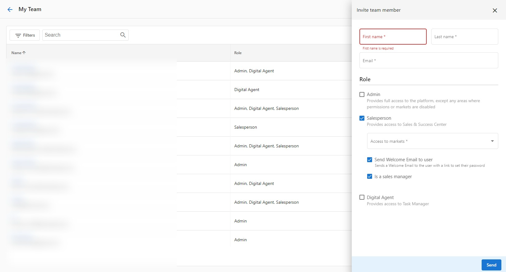

### Walkthrough Video {#walkthrough-video}

<iframe src="https://drive.google.com/file/d/1P_aIclwB3EKyh_q6wZ8pi52tyl9J2W7m/preview" width="640" height="480" allowFullScreen></iframe>

## Viewing and Editing Team Members

You can view detailed information about team members and make changes to their profiles, roles, and permissions.

### View a team member's profile

- Click on a team member's name, OR click on the menu icon at the end of the row, then click **View profile**.

### Edit a team member

1. Click on the menu icon at the end of the row, then click **Edit member**.
2. In the side panel, edit the team member's name, email address, or role.

:::note
If you deselect a role, the team member will lose the permissions associated with that role.
:::

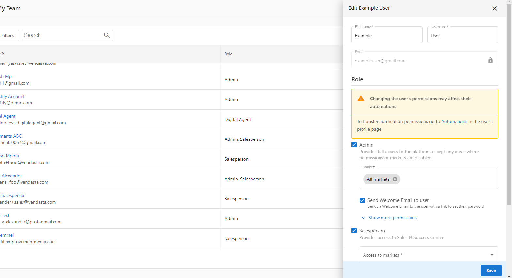

## Deleting Team Members

You can remove team members from your organization when they no longer need access. Before deleting, consider whether you need to remove the entire member or just a specific role.

:::danger
Once an Admin is deleted, it cannot be restored. Before deleting a team member, determine if the member needs to be deleted or if just the Admin role needs to be removed. If a member is not required to be an Admin anymore, then the Admin role can be removed by unchecking the Admin role and NOT deleting the member itself.
:::

### Delete a team member

1. Go to **Partner Center** > **Administration** > **My Team**
2. Click the icon next to the **Admin** you want to delete > Select **Delete member.**

:::info
It's not possible to delete the user you are currently logged in as.
:::

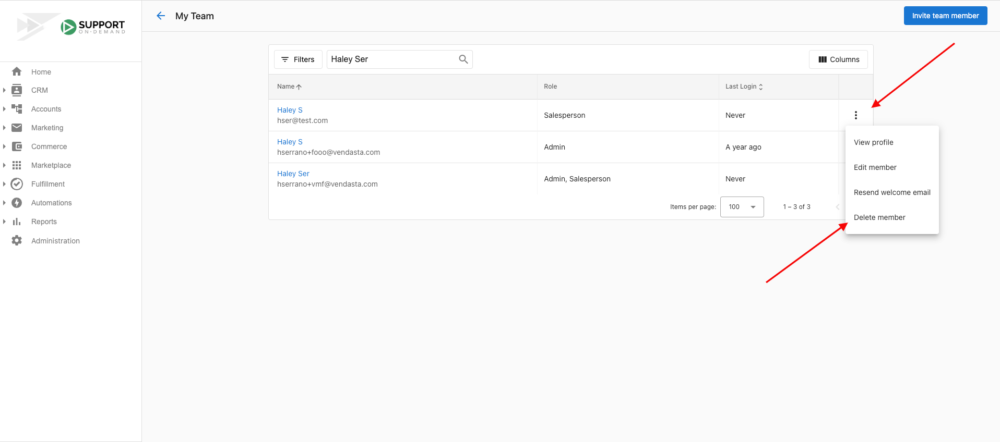

## Managing Team Member Accounts

You can manage team member accounts by resetting passwords and resending welcome emails to help team members access the platform.

### Reset password

There are two ways to reset passwords:

<Tabs>
<TabItem value="own-password" label="Reset your own password">

You can reset your own admin password by clicking your name in the top right corner of Partner Center and clicking **Edit Profile**, scroll down to Password section, enter your current and new password. Hit Save.

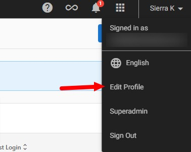

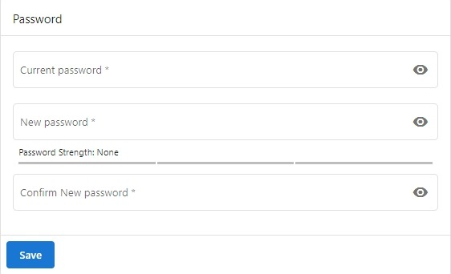

</TabItem>
<TabItem value="team-member-password" label="Reset passwords for team members">

To help team members reset their passwords, you can resend their welcome email which contains a link to set their password:

1. Go to **Partner Center** > **Administration** > **My Team**
2. Click the menu icon (⋮) next to the team member's name
3. Select **Resend welcome email**

The team member will receive an email with instructions to set or reset their password.

</TabItem>
</Tabs>

## Seat Limits

Seats are people at your company who will be able to use Vendasta. This can include salespeople, marketers, fulfilment professionals, and administrators. Be sure to check how many Team Member seats your subscription tier has available, as you may be charged for additional seats if they go over their limit of free seats. This is usually displayed in a banner at the top of the 'My Team' page.

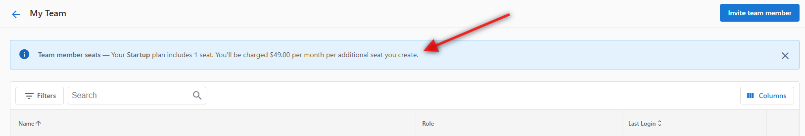

## Frequently Asked Questions

How can I add additional Partner Center Admins?

Partner Center admins can be created through Partner Center under **Partner Center > Administration > My Team**.

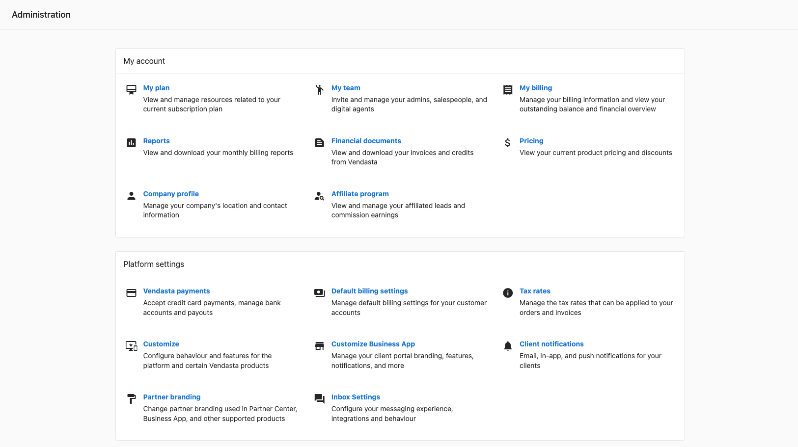

Once in this area, you can use the '**Invite Team Member**' button and fill out the form to create a new Partner Center Admin.

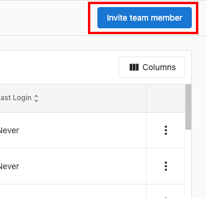

Can I change a Partner Center admin's email address?

Currently, there is no option to update/edit an admin's email address in Partner Center. The best option is to create a new admin profile using the new desired email address and then delete the old admin profile if it's no longer needed.

Navigate to the **Administration tab > My Team** to create/delete an admin profile.

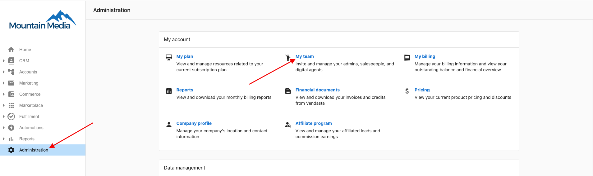

To delete a team member, click the three dots next to the team member's name, and select **Delete Member.**

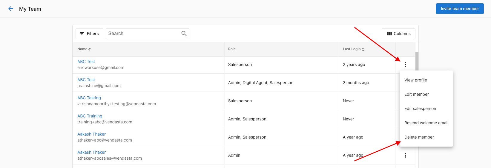

To add a new team member, select **Invite Team Member** from the top right-hand corner of the screen.

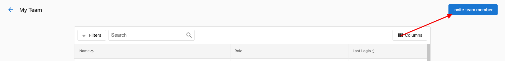

How many seats do I get on a Free Trial?

Partners on a Free Trial will have a limited number of seats to prevent fraudulent activity:
- Admin - 5 seats
- Salesperson - 5 seats
- Digital Agents - 5 seats

This is to ensure that only legitimate users are accessing the platform and that there is no abuse of the free trial.

What do I do when my team members cannot log in?

If your team members are having issues logging in, there are several steps you can take to help resolve the problem.

### Check if they've received their login details

When you create a new user in the platform, they should automatically receive an email with their login details. Ask them to check their email (including spam/junk folders) for a message from Vendasta containing their login credentials.

### Ensure they're using the correct login URL

Make sure your team members are using the correct login URL. The login URL is typically in the format: `https://partners.vendasta.com`.

### Reset their password

If your team member has forgotten their password, you can help them reset it:

1. Go to your company's login page
2. Click on "Forgot Password"
3. They'll need to enter the email address associated with their account
4. They'll receive an email with instructions to reset their password

### Contact Support

If the above steps don't resolve the issue, please contact Vendasta Support for further assistance. Be ready to provide the following information:

- The user's email address
- When the user was created
- What error messages (if any) they're receiving when trying to log in
- Screenshots of any error messages
- Whether this is a new issue or if they were able to log in previously

Where can I find team member user activity?

1. Go to Partner Center > Administration > My Team
2. Click View Profile for the user you want to review
3. Navigate to the "User activity" tab

You'll be able to see events such as:
- Successful logins
- Failed login attempts
- Password resets

