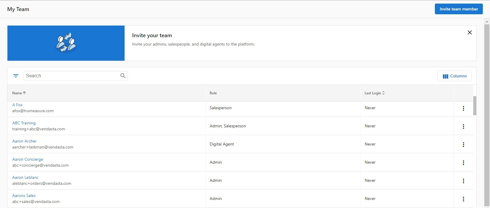
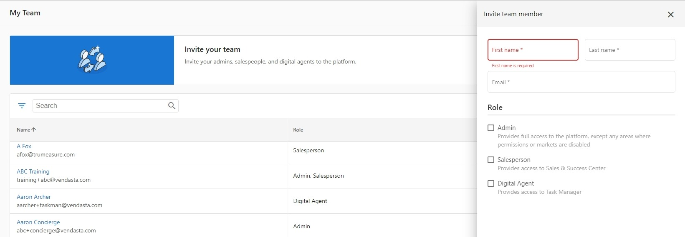
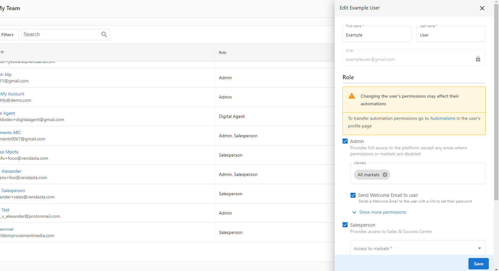
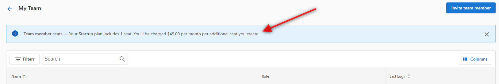

On the **My Team** page, you can see and manage your whole team at a glance, including admins (Partner Center users), Salespeople, and Digital Agents (Task Manager users).

### How does the My Team page work?

You can access the page from **Partner Center** > **Administration** > [**My Team**](https://partners.vendasta.com/my-team).

On this page, you can see a list of your team members, along with their roles and last login date. You can also perform the following actions:

### Add a team member to the platform

1. Click **Invite team member**.
2. Enter a name and email address for the team member.
3. Select a role(s) for the team member.
4. Select which permissions the team member should have.
5. Click **Send**.

### View a team member's profile

- Click on a team member's name, OR click on the menu icon at the end of the row, then click **View profile**.

### Edit a team member

1. Click on the menu icon at the end of the row, then click **Edit member**.
2. In the side panel, edit the team member's name, email address, or role.

:::note
If you deselect a role, the team member will lose the permissions associated with that role.
:::

### Delete a team member

- Click on the menu icon at the end of the row, then click **Delete member**.

### Seat Limits

Seats are people at your company who will be able to use Vendasta. This can include salespeople, marketers, fulfilment professionals, and administrators. Be sure to check how many Team Member seats your subscription tier has available, as you may be charged for additional seats if they go over their limit of free seats. This is usually displayed in a banner at the top of the 'My Team' page.

Partners on Freemium and Free Trial will have seat limits to prevent fraudulent activity:

- Admin - 5 seats
- Salesperson - 5 seats
- Digital Agents - 5 seats